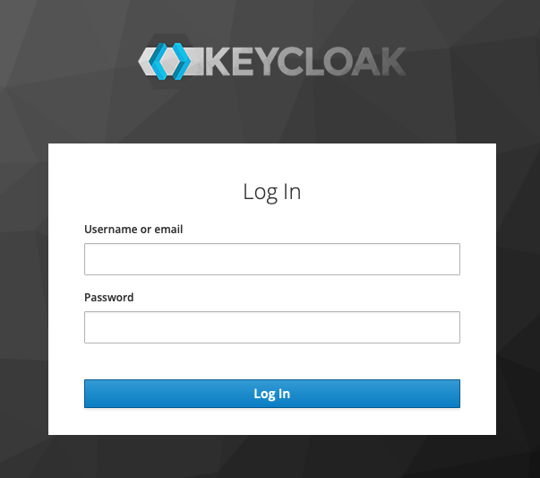
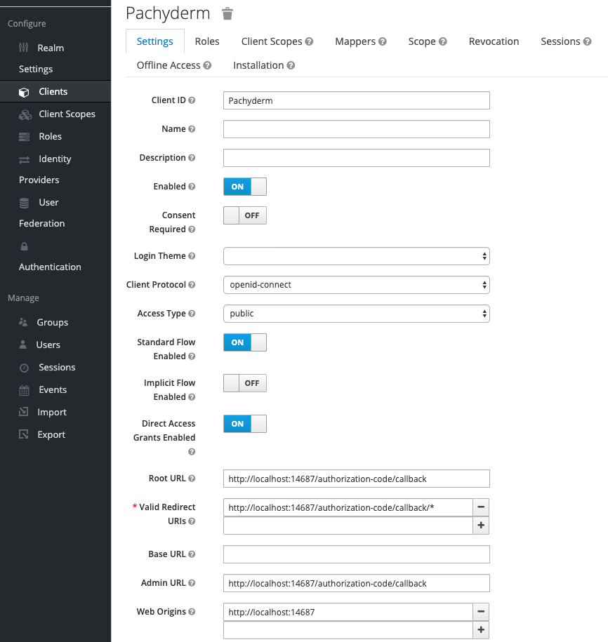

# Configure Pachyderm with Keycloak

Keycloak is an open-source identity management solution that supports
OIDC and provides authentication and authorization. When using Keycloak
with Pachyderm, Keycloak is responsible for authorizing user access to
your data that is stored in Pachyderm through identity and access tokens.
For more information about Keycloak support for OIDC, see
[Keycloak Documentation](https://www.keycloak.org/docs/latest/securing_apps/#openid-connect-2).

## Prerequisites

Before you can configure Pachyderm to work with Keycloak, you need to
have the following configured:

* Pachyderm Enterprise 1.11.x or later. The enterprise token must be
  activated by running `pachctl enterprise activate`.
  Check the status of your license by running:

  ```bash
  pachctl enterprise get-state
  ```

  For more information, see [Activate Pachyderm Enterprise Edition](../../../deployment/#activate-pachyderm-enterprise-edition).

* Keycloak must be running in your environment:

  If you are just testing Keycloak with Pachyderm, you can run
  Keycloak in Minikube on your machine:

  ```bash
  docker run -p 8080:8080 -e KEYCLOAK_USER=admin -e KEYCLOAK_PASSWORD=admin quay.io/keycloak/keycloak:10.0.1
  ```

  **System Response:**

  ```bash
  Unable to find image 'quay.io/keycloak/keycloak:10.0.1' locally
  10.0.1: Pulling from keycloak/keycloak
  e96e3a1df3b2: Pull complete
  1b99828eddf5: Pull complete
  ...

  19:08:49,501 INFO  [org.wildfly.extension.undertow] (ServerService Thread Pool -- 63) WFLYUT0021: Registered web context: '/auth' for server 'default-server'
  19:08:49,793 INFO  [org.jboss.as.server] (ServerService Thread Pool -- 46) WFLYSRV0010: Deployed "keycloak-server.war" (runtime-name : "keycloak-server.war")
  ```

  In the above command, we use Keycloak version 10.0.1. You might need to
  update this version to the latest Keycloak build. The user and password
  are both set to `admin`. Booting Keycloak might take some time.

  If you are deploying in production, see [Keycloak Documentation](https://www.keycloak.org/getting-started).

## Configure Keycloak

After you have installed Pachyderm and Keycloak, follow the steps
below to configure the two components to work together.

!!! note
    If you have used a different authentication type before,
    you need to disable authentication before configuring
    Keycloak. Run `pachctl auth deactivate`.

To configure Pachyderm with Keycloak, complete the following steps:

1. Go to the **Keycloak Administration Console** by pointing your browser to
`http://localhost:8080/auth/`and logging in with your user and password.
If you have boot Keycloak in Docker as described above, use `admin` as
login and password.

   

1. If you do not have one already, add a new realm. Otherwise, proceed to
the next step.

   A realm is a logically isolated group, similar to a tenant. By default,
   Keycloak predefines a `Master` realm for administrative purposes. You need
   to create a new realm for Pachyderm.

1. If you do not have any users to whom you want to grant access to Pachyderm,
create a user by clicking **Users > Add user** and filling out the required
fields. Otherwise, proceed to the next step.

   1. Set up a password for this user by clicking **Credentials** and typing
   your password information.

      You might want to set the temporary password toggle to off so that your
      password does not expire.

1. Create a client for Pachyderm:

   1. Click **Clients > Create**.
   1. Specify a client ID. For example, *Pachyderm*.
   1. Set the **Client Protocol** to **openid-connect**.
   1. Set the **Root URL** to `http://<ip>:14687/authorization-code/callback`.
      For example:

      ```bash
      http://localhost:14687/authorization-code/callback
      ```

      You can configure additional settings, such as require consent and so on,
      as needed, but this minimal configuration is everything you need to make
      Keycloak work with Pachyderm.

      

1. Go to terminal and forward the pachd pod to the OIDC port. If you have not
change default settings, it is port `14687`:

   1. Get the `pachd` pod ID:

      ```bash
      kubectl get pod
      ```

      **Example system response:**

      ```bash
      dash-5768cb7d98-j6cgt    2/2     Running   0          4h2m
      etcd-56d897697-xzsqr     1/1     Running   0          4h2m
      pachd-79f7f68c65-9qs8g   1/1     Running   0          4h2m
      ```

   1. Forward the `pachd` pod to the OIDC port:

      **Example:**

      ```bash
      kubectl port-forward pachd-79f7f68c65-9qs8g 14687
      ```

1. Enable Pachyderm authentication:

   (This needs to be verified)

   ```bash
   pachctl auth activate
   ```

1. Copy the link printed in the output to a web browser.

   The link prompts you to your Pachyderm realm login.
   Use your credentials to log in.

1. If you have enabled **Request consent**, grant access to
the realm by clicking **Yes**.

   You should be now logged to Pachyderm with your OIDC user.

1. Verify Pachyderm authentication config by running:

   ```bash
   pachctl auth get-config
   ```

1. Check your identity by running:

   ```bash
   pachctl auth whoami
   ```
