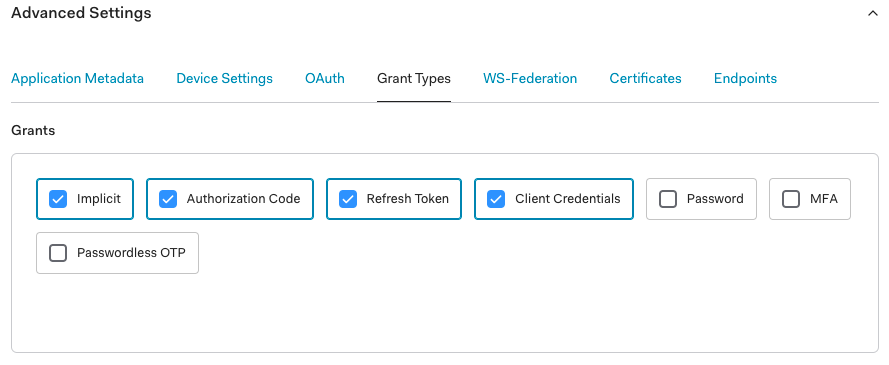

# Pachyderm Integration with Identity Providers

!!! Note
    Before connecting your IdP to Pachyderm, verify that
    the [User Access Management](../index.md/#activate-user-access-management) feature is on by running `pachctl auth whoami`.
    The command should return `You are "pach:root" (i.e., your are the **Root User** with `clusterAdmin` privileges). Run `pachctl auth use-auth-token` to login as a Root User.

Enable your users to authenticate to Pachyderm by logging into their Identity Provider by
following those 3 steps:

1. Register the Pachyderm Application with your IdP.
1. Set up your Idp-Pachyderm connector.
1. Apply your connector.

Your users should now be able to [log in](./login.md).

We chose to illustrate those steps with a real life example, 
by using Auth0 as our Identity Provider ([Auth0](https://auth0.com/) is an online authentication platform that
users can use to log in to various applications).

However, Pachyderm's Identity Service is based on [Dex](https://dexidp.io/docs/) 
and can therefore provide connectors to a large [variety of IdPs](https://dexidp.io/docs/connectors/) (LDAP, GitHub, SAML, OIDC, Google, OpenShift...). 
Use the IdP of your choice.
// TODO provide links to vatious IDPs connectors config files ...

For now, let's configure Pachyderm so that our
Pachyderm users can log in through Auth0.

## 1- Register a Pachyderm Application with your IdP
If you do not have an Auth0 account, sign up for one
at https://auth0.com and create your Pool of Users 
(although this step might be done later).

Then, complete the following steps:

1. Log in to your Auth0 account.
1. In **Applications**, click **Create Application**.
1. Type the name of your application, such as **Pachyderm**.
1. In the application type, select **Regular Web Application**.
1. Click **Create**.
1. Go to the application settings.
1. Scroll down to **Application URIs**.
1. In the **Allowed Callback URLs**, add the Pachyderm callback link in the
   following format:

    ```
    http://<ip>:30658/callback
    ```

    The IP address is the address of your Pachyderm host. For example,
    if you are running Pachyderm in Minikube, you can find the IP
    address by running `minikube ip`. 

1. Scroll down to **Show Advanced Settings**.
1. Select **Grant Types**.
1. Verify that **Implicit**, **Authorization Code**, **Refresh Token**, and
    **Client Credentials** are selected.

   

!!! Note
    For this Auth0 example, we have created a user in Auth0 in **User Management/Users**.
    We will login to Pachyderm as this user once our IdP connection is completed.
    

## 2- Set up an Idp-Pachyderm connector configuration file
To configure your Idp-Pachyderm integration, **create a connector configuration file** corresponding to your IdP. 

!!! Info
    For a list of available connectors and their configuration options, see [Dex documentation](https://dexidp.io/docs/connectors/).

In the case of our integration with Auth0, we will use an oidc connector with the following parameters:

!!! Note
    Pachyderm supports the JSON and YAML formats for its connector files. 

//TODO update new config fields (id, name, type added to config) when new alpha.12 is out

See our oidc connector example in JSON and YAML formats below.
=== "oidc-dex-connector.json"

    ``` json
    {
    "issuer": "https://dev-k34x5yjn.us.auth0.com/",
    "clientID": "hegmOc5rTotLPu5ByRDXOvBAzgs3wuw5",
    "clientSecret": "7xk8O71Uhp5T-bJp_aP2Squwlh4zZTJs65URPma-2UT7n1iigDaMUD9ArhUR-2aL",
    "redirectURI": "http://<ip>:30658/callback"
    }
    ```

=== "oidc-dex-connector.yaml"

    ``` yaml
        connectors:
        - type: oidc
        id: auth0
        name: Auth0
        version: 1
        config:
            # Canonical URL of the provider, also used for configuration discovery.
            # This value MUST match the value returned in the provider config discovery.
            #
            # See: https://openid.net/specs/openid-connect-discovery-1_0.html#ProviderConfig
            issuer: https://dev-k34x5yjn.us.auth0.com/

            # Connector config values starting with a "$" will read from the environment.
            clientID: hegmOc5rTotLPu5ByRDXOvBAzgs3wuw5
            clientSecret: 7xk8O71Uhp5T-bJp_aP2Squwlh4zZTJs65URPma-2UT7n1iigDaMUD9ArhUR-2aL

            # Dex's issuer URL + "/callback"
            redirectURI: http://<id>:30658/callback
    ```

You will need to replace the following placeholders with relevant values:

- `issuer` — The domain of your application (here in Auth0). For example,
`https://dev-k34x5yjn.us.auth0.com/`. **Note the trailing slash**.

- `client_id` — The Pachyderm **Client ID** (here in Auth0). The client ID
consists of alphanumeric characters and can be found on the application
settings page.

- `client_secret` - The Pachyderm client secret (here in Auth0) located
on the application settings page.

- `redirect_uri` - This parameter should match what you have added
to **Allowed Callback URLs** when registering Pachyderm on your IdP website.

View a [sample config](https://dexidp.io/docs/connectors/oidc/) in Dex documentation.

## 3- Apply your Idp-Pachyderm connector
Once your Pachyderm application is registered with your IdP (here Auth0), 
and your IdP-Pachyderm connector config file created (here with the Auth0 parameters), **connect your IdP to Pachyderm** by running the following command:

```shell
$ pachctl idp create-connector --id auth0 --name Auth0 --type oidc --config -oidc-dex-connector.json
```
The connector creation command in json requires the following arguments:
- id: The unique identifier of your connector (string).
- name: Its full name (string).
- type: The type of connector (oidc, saml,    //TODO other?). 
- config: Path to your configuration file.
- version (optional):The version of your connector (integer - default to 0 when creating a new connector)

//TODO Update when those fields are included in the json file itself in alpha.12?

or
```shell
$ pachctl idp create-connector --config -oidc-dex-connector.yaml
```
Check your connector's parameters by running:
```shell
$ pachctl idp get-connector <your connector id: auth0>
```

Per default, the `version` field of the connector is set to 0 when created.
However, you can set its value to a different integer.

You will specifically need to increment this value when updating your connector.
```shell
$ pachctl idp update-connector auth0 --version 1
```
or
```shell
$ pachctl idp update-connector --config -oidc-dex-connector.yaml
```
!!! Info
    Run `pachct idp --help` for a full list of commands.
    In particular, those commands let you create, update, delete, list, or get a specific connector.

The users registered with your IdP are now ready to [Log in to Pachyderm](./login.md)