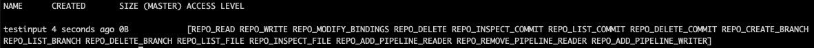

# Authorization using Role-Based Access Control
!!! Note
    Before ----, verify that
    the [User Access Management](//TODO link to activate auth ) feature is on by running `pachctl auth whoami`.
    The command should return `You are "pach:root"
    (i.e., your are the **Root User** with `clusterAdmin` privileges).
    Run `pachctl auth use-auth-token` to login as a Root User.

Pachyderm authorization system implements a **Role Based Access Control** model (RBAC).
The access control is based on **Roles**  assigned to **Users**, granting them a set of permissions on Pachyderm's **Ressources** (**Role Bindings**). 

In this page we will:

- List Pachyderm's Type of Users, Ressources, and Roles.
- Detail how Users are granted permissions on Pachyderm Ressources.
- Take a look at Users revocation.


## Users Types
Pachyderm defines 4 type of User: 

- A **Root User**: This special user created when Auth is activated. The root user **always has clusterAdmin permissions on the cluster**.

- An **IdP User**: Any user or group of users authenticated by your Identity Provider to access Pachyderm.

- A **Robot User**: A Service account used for third party applications/systems integrating with Pachyderm APIs/Clients.

- A **Pipeline User**: An internal Service Account used for Pipelines when interacting with Pachyderm ressources.


## Resources
Pachyderm has 3 types of resources: **Repositories**, **Projects** and **Clusters**.

Clusters contain one to many projects, and projects contain one to many repositories.

## Roles
Pachyderm has 4 predefined roles (//TODO more for projects) granting privileges to its Resources.
Those Roles are listed in such an order that any following Role adds a set of permissions to its predecessor.

- **repoReader**: Can consume data from a repo, but cannot edit them.
repoReader can execute commands such as `pachctl get file` and
`pachctl list file`, as well as create pipelines that use data
from this repo. 

- **repoWriter**: Can read and modify data in a repository by
adding, deleting, or updating the files in the repo. The
`repoWriter` role can perform operations such as `pachctl put file` or
`pachctl delete commit`...

- **repoOwner**: Additionaly to having the repoReader and the repoWriter Roles,
a RepoOwner can grant permission to users on the Repository.

- **clusterAdmin**: A clusterAdmin can perform any
action on the cluster including appointing other clusterAdmins.
By default, the activation of Auth (`pachctl auth activate`) creates a Root User
with irrevocable ClusterAdmin rights.

!!! Note
    When Pachyderm Auth is not enabled,
    all users are clusterAdmins.


## Role Binding
This chapter will detail how to 
- Grant/modify permissions (Roles) on given Resources to a User (Idp or Robot User).
- Remove all permissions on a Ressource from a User (Idp or Robot User).

!!! Note "Default Privileges"
- The case of the Root User: The activation of the Authentication and Authorization feature generates a Root User with unalterable and unrevokable clusterAdmin privileges. 
- The case of the Robot User: Robot users do not have any permission by default. They will need to be set by a clusterAdmin.
- The case of the Pipeline User: In Pachyderm, **you do not explicitly grant users access to pipelines**, they get set for you when you create or update a pipeline. 

!!! Warning "Rules to keep in mind"
    - The creator of a repo becomes its **repoOwner**.
    - To update a pipeline, you must have at least `repoReader`-level access to all pipeline inputs
        and `repoWriter`-level access to the pipeline output. 
        This is because pipelines read from their input repos and write
        to their output repos.
    - When a user subscribes a pipeline to a repo, Pachyderm sets
        that user as an `repoOwner` of that pipeline's output repo.
        If additional users need access to the output repository,
        the initial `repoOwner` of a pipeline's output repo, or a `clusterAdmin`,
        needs to grant that user access to the repo.
    - You cannot grant a pipeline more access than you have yourself.
      
### 1 - Set Roles to Users

- A **clusterAdmin** can grant admin privileges to a cluster or any lower level access on ressources to other users.
- A **repoOwner** of a given repository (or a **clusterAdmin** as mentioned above) can set any level of access to "their" repo to users by running the command:

```shell
$ pachctl auth set <ressource> <ressource name> <role> <prefix:username>
```

To keep using our Auth0 example and illustrate the attribution of a given Role to a User,
let's have our `Root User` (with default clusterAdmin privileges) give access to a repo to our `one-pachyderm-user@gmail.com` user:
1. Connect as our Root User again.
1. Create a repo named `testinput` containing one text file.
1. Grant access on this repo to our user `one-pachyderm-user@gmail.com` registered with our IdP (Auth0).
1. See what happens when `one-pachyderm-user@gmail.com` tries to write in the repo without the proper writing access.

- 1- Connect as our Root User:
    ```shell
    $ pachctl auth use-auth-token
    ```
    You will be asked to re-enter your Root token.

- 2- Create a Repo:
    ```shell
    $ mkdir -p ./testinput 
    $ printf "this is a test" >./testinput/test.txt
    $ pachctl create repo testinput
    $ cd testinput && pachctl put file testinput@master -f test.txt

    ```
    A quick `pachctl list repo` will list your new repo and display your access level on that repo as a **clusterAdmin**.
    

- 3- Grant access on this repo to our user `one-pachyderm-user@gmail.com`:
    For example, let's give our user a **repoReader** access to the repo `testinput`.

    ```shell
    $ pachctl auth set repo testinput repoReader user:one-pachyderm-user@gmail.com
    ```
    ... and take a quick look at his access level:
    ```shell
    $ pachctl auth get repo testinput
    ```
    The command returns the list of users granted access to this repo and their associated access level. 
    ```
    user:one-pachyderm-user@gmail.com: [repoReader]
    pach:root: [repoOwner]
    ```

    !!! Note
        Note that the user `one-pachyderm-user@gmail.com` has a prefix `user`.
        Pachyderm defines 4 prefixes depending on the type of user:
            - robot
            - user
            - group
            - pipeline (as mentioned above, this prefix will not be used in the context of granting privileges to users. However, it does exist. We are listing it here to give an exhauxtiv list of all prefixes.)

- 4- Have `one-pachyderm-user@gmail.com` try to add a file to `testinput` without proper writing access:
    ```shell
    # Login as `one-pachyderm-user@gmail.com`
    $ pachctl auth login
    # Try to write into testinput repo
    $ printf "this is another test" >./testinput/anothertest.txt
    $ cd testinput && pachctl put file testinput@master -f anothertest.txt
    ```
    The command returns an error message:
    ```
    user:one-pachyderm-user@pachyderm.io is not authorized to perform this operation - needs permissions [REPO_WRITE] on REPO testinput
    ```

!!! Info
    Use `--help` to display the list of all available commands, arguments, and flags of the command `pachctl auth set`.

!!! Note
    To alter a user's privileges, simply re run the `pachctl auth set` command above with a different set of Roles. ??TODO illustrate 2 ways. a modification and an annulation

## Configure Group Access

If you have a group of users configured in an identity provider,
you can grant access to a Pachyderm repository to all users
in that group.

!!! note
    This functionality is experimental and supported only
    through the command line. The changes will not be
    visible in the UI.

To configure group access for SAML providers, you need to set the `group_attibute` in
the `id_providers` field of your authentication config:


### Example

