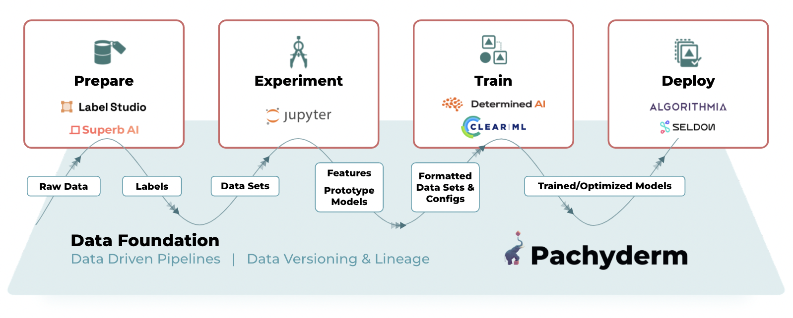

# Pachyderm Examples
[Pachyderm Examples](https://github.com/pachyderm/examples){target=_blank} (Follow the link to access the Examples repo directly in GitHub) is a curated list of general examples or integration highlights that use Pachyderm and partners' products to accomplish various tasks. Additionally, you will find a selection of didactical tutorials illustrating key concepts of Pachyderm. They might be useful when designing your first pipeline.

!!! Warning
        For **Educational Purposes** ONLY. Those examples might not be production-ready.

!!! Note
     - All integration examples below are marked with a `integration`. 
     - All example containing a notebook version are marked with a `notebook`.
## Getting Started

If you haven't used Pachyderm before, start here:

- [Open CV](https://docs.pachyderm.com/latest/getting_started/beginner_tutorial/){target=_blank}: This example does edge detection using OpenCV. This is our canonical starter demo.  We'll get you started running Pachyderm locally in just a few minutes.

You already have a Pachyderm cluster running? 

- Try our [Boston Housing Prices](https://github.com/pachyderm/examples/tree/master/housing-prices){target=_blank} - A simple machine learning pipeline to train a regression model on the Boston Housing Dataset using scikit-learn, and predict the value of homes.
- Or install our [Notebook extension](https://docs.pachyderm.com/latest/how-tos/jupyterlab-extension/#pachyderm-jupyterlab-mount-extension){target=_blank} then run: 

    - [JupyterLab Pachyderm Mount Extension Tutorial](https://github.com/pachyderm/examples/blob/master/Mount%20Extension%20Demo.ipynb){target=_blank}`notebook` - A notebook showing how to use the JupyterLab Pachyderm Mount Extension to mount Pachyderm data repositories into your Notebook environment.
    - our [Intro to Pachyderm Tutorial](https://github.com/pachyderm/examples/blob/master/Intro%20to%20Pachyderm%20Tutorial.ipynb){target=_blank}`notebook` - A **notebook introduction to Pachyderm**, using the pachctl command line utility to illustrate the basics of Pachyderm data repositories and pipelines.

## Integration

Pachyderm integrates with a variety of solutions in the ML Tech Stack, and provides examples for the following partners:

- [Algorithmia](https://algorithmia.com/)
- [Clear ML](https://clear.ml/){target=_blank}
- [Label Studio](https://labelstud.io/){target=_blank}
- [ML Flow](https://mlflow.org/){target=_blank}
- [Seldon](https://go.seldon.io){target=_blank}
- [Superb AI](https://www.superb-ai.com/){target=_blank}
- [Toloka](https://toloka.ai/){target=_blank}
- [Weights and Biases](https://wandb.ai/site){target=_blank}

### Data Labeling

- [Label Studio Integration](https://github.com/pachyderm/examples/tree/master/label-studio){target=_blank}`integration`. 
- [Superb AI Integration](https://github.com/pachyderm/examples/tree/master/superb-ai){target=_blank}`integration` - Version labeled image datasets created in Superb AI Suite using a cron pipeline.
- [Toloka Integration](https://github.com/Toloka/toloka-pachyderm){target=_blank}`integration`  - Uses Pachyderm to create crowdsourced annotation jobs for news headlines in Toloka, aggregate the labeled data, and train a model.

### Machine Learning

- [Boston Housing Prices (Intermediate)](https://github.com/pachyderm/examples/tree/master/housing-prices-intermediate){target=_blank} - Extends the original Boston Housing Prices example to show a multi-pipeline DAG and data rollbacks.
- [Breast Cancer Detection](https://github.com/pachyderm/examples/tree/master/breast-cancer-detection){target=_blank} - A breast cancer detection system based on radiology scans scaled and visualized using Pachyderm.
- [Market Sentiment](https://github.com/pachyderm/examples/tree/master/market-sentiment){target=_blank} - Train and deploy a fully automated financial market sentiment BERT model. As data is manually labeled, the model will automatically retrain and deploy.
- [Apache Spark - MLflow Integration](https://github.com/winderai/pachyderm-mlflow-spark){target=_blank} `integration` - End-to-end example demostrating the full ML training process of a fraud detection model with Spark, MLlib, MLflow, and Pachyderm.

### ML Experiment Tracking

- [Weights and Biases](https://github.com/pachyderm/examples/tree/master/weights_and_biases){target=_blank}`integration` - Log pipelines running in Pachyderm to Weights and Biases.
- [ClearML Integration](https://github.com/JimmyWhitaker/pach_clearml){target=_blank}`integration` - Log Pachyderm experiments to ClearML's experiment monitoring platform, using Pachyderm Secrets.

### Model Deployment

- [Pachyderm - Seldon](https://github.com/winderai/pachyderm-seldon){target=_blank} - Community example showing monitoring and provenance for machine learning models with Pachyderm and Seldon.
- [Seldon (Market Sentiment)](https://github.com/pachyderm/examples/tree/master/seldon){target=_blank} - Deploy the model created in the Market Sentiment example with Seldon Deploy.
- [Algorithmia Integration ](https://github.com/pachyderm/examples/tree/master/algorithmia){target=_blank}`integration` - Deploy the model created in the Market Sentiment example with Algorithmia.

## Tutorials
In this section, you will find tutorials focused on a particular concept or a feature. Use them to deepen your understanding of one of those subjects:

### Pipeline Inputs
A pipeline input can have one or multiple [PFS inputs](../../concepts/pipeline-concepts/datum/#pfs-input-and-glob-pattern){target=_blank}. In the latter case, Pachyderm provides a variety of options to aggregate several PFS inputs together.

- Inner and Outer Joins Input
A join is a special type of pipeline input that enables you to combine files that reside in separate Pachyderm repositories and match a particular naming pattern.  

[Inner and Outer joins 101 - A simplified retail use case](https://github.com/pachyderm/pachyderm/tree/master/examples/joins){target=_blank}

- Group Input
A group is a special type of pipeline input that enables 
you to group files that reside in one or separate Pachyderm
repositories and match a particular naming pattern. 

[Group 101 - An Introductory example](https://github.com/pachyderm/pachyderm/tree/master/examples/group){target=_blank}
### Spouts

A spout is a special type of pipeline that you can use to ingest
streaming data .

- [Spout101](https://github.com/pachyderm/pachyderm/tree/master/examples/spouts/spout101){target=_blank}

- Advanced -  This is a simple example of using Pachyderm's spouts with RabbitMQ to process messages and write them to files.
This spout reads messages from a single configurable RabbitMQ queue. 
Take a look; there is a little more to it, including a fault tolerance mechanism: [Pachyderm's integration of spouts with RabbitMQ](https://github.com/pachyderm/pachyderm/tree/master/examples/spouts/go-rabbitmq-spout){target=_blank} `integration`

### err_cmd

The `err_cmd` parameter in a Pachyderm pipeline enables
you to specified actions for failed datums. When you do not
need all the datums to be successful for each run of your
pipeline, you can configure this parameter to skip them and
mark the job run as successful.

[Skip Failed Datums in Your Pipeline](https://github.com/pachyderm/pachyderm/tree/master/examples/err_cmd){target=_blank}

## Word Count (Map/Reduce)

Word count is basically the "hello world" of distributed computation. This example is great for benchmarking in distributed deployments on large swaths of text data.

[Word Count](https://github.com/pachyderm/pachyderm/tree/master/examples/word_count){target=_blank}

## Lazy Shuffle pipeline

This example demonstrates how lazy shuffle pipeline i.e. a pipeline that shuffles, combines files without downloading/uploading can be created. These types of pipelines are useful for an intermediate processing step that aggregates or rearranges data from one or many sources.

[Lazy Shuffle pipeline](https://github.com/pachyderm/pachyderm/tree/master/examples/shuffle){target=_blank}

___________________ waiting on feeback as to what to make of those:

- [Use Transactions with Hyperparameter Tuning](https://github.com/pachyderm/pachyderm/tree/master/examples/transactions)
- [Periodic Ingress from MongoDB](https://github.com/pachyderm/pachyderm/tree/master/examples/db)
- [R, Python, or Julia - Iris flower classification](https://github.com/pachyderm/pachyderm/tree/master/examples/ml/iris)
- [Neon - Sentiment Analysis](https://github.com/pachyderm/pachyderm/tree/master/examples/ml/neon)
- [TensorFlow - pix2pix](https://github.com/pachyderm/pachyderm/tree/master/examples/ml/tensorflow)
- [Hyperparameter Tuning](https://github.com/pachyderm/pachyderm/tree/master/examples/ml/hyperparameter)
- [Spark Example](https://github.com/pachyderm/pachyderm/tree/master/examples/spark/pi)
- [GATK - Variant Calling](https://github.com/pachyderm/pachyderm/tree/master/examples/gatk)

###  S3 gateway 
- Pachyderm - Seldon integration: Version Controlled Models¶

    In this example, we showcased how we can integrate Pachyderm's end-to-end pipelines,
    leveraging our data lineage capabilities, 
    with [Seldon-Core's deployment platform of ML models](https://www.seldon.io/tech/products/core/){target=_blank}.

    1. In this first simple example, we train a data-driven model using Pachyderm (LogisticRegression on the Iris dataset with sklearn),
    expose the model's artifacts through Pachyderm's [S3 gateway](https://docs.pachyderm.com/latest/reference/s3gateway_api/){target=_blank}, and serve this model in production using Seldon-core. https://github.com/SeldonIO/seldon-core/blob/master/examples/pachyderm-simple/index.ipynb

        !!! Highlights
            You can trace the model artifact's lineage right back to the version of the data that it was trained on.  

    1. CD for an ML process: In this example, we automate the provisioning of a Seldon deployment using Pachyderm pipelines when new training data enters a Pachyderm repository. 
    https://github.com/SeldonIO/seldon-core/blob/master/examples/pachyderm-cd4ml/index.ipynb

        !!! Highlights 
            - **Provenance** - The traceability of the model artifact's lineage all the way to the data provides the ability to do post-analysis on models performing poorly.  
            - **Automation** -  A new deployment in production is triggered when new model artifacts are exposed to Pachyderm's [S3 getaway](https://docs.pachyderm.com/latest/reference/s3gateway_api/){target=_blank}.
