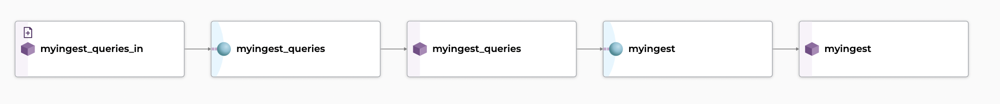
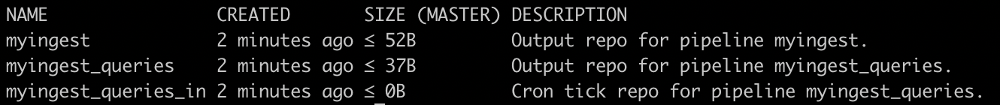

# Data Warehouse Integration

!!! Warning
    SQL Ingest is an [experimental feature](../../../contributing/supported-releases/#experimental){target=_blank}.

Part of your data might live in databases requiring some level of integration with your warehouse to retrieve and inject them into Pachyderm.

Our **SQL ingest** tool provides a seamless connection between databases and Pachyderm,  allowing you to import data from a SQL database into Pachyderm-powered pipelines. By bringing data-driven pipelines, versioning & lineage to structured data, we are allowing Data Science teams to easily combine structured and unstructured data.

Specifically, we help you connect to a remote database of your choice and pull the result of a given query at regular intervals in the form of a CSV or a JSON file.  

## Use SQL Ingest
Pachyderm's SQL Ingest uses [jsonnet pipeline specs](../../pipeline-operations/jsonnet-pipeline-specs) with the following parameters to automatically create the pipelines that access, query, and materialize the results of a SQL query to a data warehouse. The outputted results can take the form of CSV or JSON files. Check the [Formatting section](#formats-and-sql-datatypes) at the bottom of the page for specific details on formats and SQL Datatypes.

Pass in the following parameters and get your results committed to an output repo, ready for the following downstream pipeline:
```shell
pachctl update pipeline --jsonnet https://raw.githubusercontent.com/pachyderm/pachyderm/{{ config.pach_branch }}/src/templates/sql_ingest_cron.jsonnet \
  --arg name=myingest \
  --arg url="mysql://root@mysql:3306/test_db" \
  --arg query="SELECT * FROM test_data" \
  --arg hasHeader=false \
  --arg cronSpec="@every 30s" \
  --arg secretName="mysql-creds" \
  --arg format=json 
```

Where the parameters passed to the jsonnet pipeline spec are:

| Parameter &nbsp; &nbsp; &nbsp;   | Description | 
| ------------- |-------------| 
| `name`        | The name of output repo in which your query results will materialize.|
| `url`         | The [connection string to the database](#database-connection-url).|  
| `query`       | The SQL query that will be run against your database. |
| `hasHeader`   | Adds a header to your CSV file if set to `true`. Ignored if `format="json"` (JSON files always display (header,value) pairs for each returned row). Defaults to `false`. <br><br>Pachyderm creates the header after each element of the comma separated list of your SELECT clause or their aliases (if any). <br>For example `country.country_name_eng` will have `country.country_name_eng` as header while `country.country_name_eng as country_name` will have `country_name`. |
| `cronSpec`    | How often to run the query. For example `"@every 60s"`.|
| `format`      | The type of your output file containing the results of your query (either `json` or `csv`).|
| `secretName`  | The kubernetes secret name that contains the [password to the database](#database-secret).|

!!! Example 

    In this example, we are leveraging Snowflake's support for queries traversing semi-structured data (here, JSON).

    - Find the [documentation for the support of semi-structured data in Snowflake](https://docs.snowflake.com/en/user-guide/semistructured-concepts.html#:~:text=Snowflake%20provides%20native%20support%20for,fast%20and%20efficient%20SQL%20querying.){target=_blank} here. 

    - The query in the following example will use the WEATHER schema in the public test database SNOWFLAKE_SAMPLE_DATA in the COMPUTE_WH warehouse. The column V of the table DAILY_14_TOTAL stores JSON files.

        Note the references to the JSON dataset elements by their hierarchical paths in the query:

          ```shell
          pachctl update pipeline --jsonnet https://raw.githubusercontent.com/pachyderm/pachyderm/{{ config.pach_branch }}/src/templates/sql_ingest_cron.jsonnet  \
          --arg name=mysnowflakeingest \
          --arg url="snowflake://username@VCNYTW-MH64356/SNOWFLAKE_SAMPLE_DATA/WEATHER?warehouse=COMPUTE_WH" \
          --arg query="select T, V:city.name, V:data[0].weather[0].description as morning, V:data[12].weather[0].description as pm FROM DAILY_14_TOTAL LIMIT 1" \
          --arg hasHeader=true \
          --arg cronSpec="@every 30s" \
          --arg secretName="snowflakesecret" \
          --arg format=json
          ```


!!! Note
    `pachctl update pipeline` will create pipelines if none exist, or update your existing pipelines otherwise.


When the command is run, the database will be queried on a schedule defined in your `cronSpec` parameter and a result file committed to the output repo named after `name`.

### Database Secret
Before you create your SQL Ingest pipelines, make sure to create a [generic secret](../../advanced-data-operations/secrets/#create-a-secret) containing your database password in the field `PACHYDERM_SQL_PASSWORD`.

!!! Example
    ```yaml
    apiVersion: v1
    kind: Secret
    metadata:
      name: mysql-creds
    data:
      "PACHYDERM_SQL_PASSWORD": "cm9vdA==" # base64 encoded
    ```

!!! Info "TL;DR"
    - Run the following command to generate your secret:

        `kubectl create secret generic <secret-name>  --from-literal=PACHYDERM_SQL_PASSWORD=<password-to-warehouse> --dry-run=client --output=json > yourwarehousesecret.json`

    - Then apply it to your Pachyderm cluster:

        `pachctl create secret -f yourwarehousesecret.json`

    - The list returned by `kubectl get secret` should feature the secret name. 

### Database Connection URL
Pachyderm's SQL Ingest will take an URL as its connection string to the database of your choice.

The URL is structured as follows:
```shell
<protocol>://<username>@<host>:<port>/<database>?<param1>=<value1>&<param2>=<value2>
```

Where:

| Parameter     | Description | 
| ------------- |-------------| 
| **protocol**   | The name of the database protocol. <br> As of today, we support: <br>- `postgres` and `postgresql` : connect to Postgresql or compatible (for example Redshift).<br>- `mysql` : connect to MySQL or compatible (for example MariaDB). <br>- `snowflake` : connect to Snowflake. |
| **username**  | The user used to access the database.|
| **host**      | The hostname of your database instance.|
| **port**      | The port number your instance is listening on.|
| **database**  | The name of the database to connect to. | 


!!! Attention "Snowflake users, you will need a variant of the URL above."
     Pachyderm supports two connection URL patterns to  query Snowflake: 

      - `snowflake://username@<account_identifier>/<db_name>/<schema_name>?warehouse=<warehouse_name>`
      - `snowflake://username@hostname:port/<db_name>/<schema_name>?account=<account_identifier>&warehouse=<warehouse_name>`

     where:

      - The *[`account_identifier`](https://docs.snowflake.com/en/user-guide/admin-account-identifier.html){target=_blank}* takes one of the following forms for most URLs:

        - Option 1 - [Account Name](https://docs.snowflake.com/en/user-guide/admin-account-identifier.html#option-1-account-name-in-your-organization){target=_blank}:`organization_name`-`account_name`
        - Option 2 - [Account Locator](https://docs.snowflake.com/en/user-guide/admin-account-identifier.html#option-2-account-locator-in-a-region){target=_blank}: `account_locator`.`region`.`cloud`
    
        In both cases, if you are used to connecting to Snowflake via an URL such as `https://account_identifier.snowflakecomputing.com`, you can use the full domain name `account_identifier.snowflakecomputing.com` in the url.

      - And *`db_name`/`schema_name`* are respectively the Database Name and the Schema (namespace) targeted.
      - Additionally, a *[`warehouse`](https://docs.snowflake.com/en/user-guide/warehouses.html#virtual-warehouses){target=_blank}*, or “compute resource” is required for all queries. Pass your warehouse as a parameter to the url: `warehouse=<warehouse_name>`

     Here is an example of connection string to Snowflake: 

     `"snowflake://username@GVCNYTW-MH64356/SNOWFLAKE_SAMPLE_DATA/WEATHER?warehouse=COMPUTE_WH"`


!!! Note 
    - The password is not included in the URL.  It is retrieved from a [kubernetes secret](#database-secret) or file on disk at the time of the query.
    - The additional parameters (`<param1>=<value1>`) are optional and specific to the driver.
    For example, Snowflake requires to pass the warehouse as a parameter `warehouse=<your-warehouse>`.

## How Does This Work?

SQL Ingest's jsonnet pipeline specs [**`sql_ingest_cron.jsonnet`**](https://github.com/pachyderm/pachyderm/blob/{{ config.pach_branch }}/src/templates/sql_ingest_cron.jsonnet) creates two pipelines:


- A **[Cron Pipeline](../../../concepts/pipeline-concepts/pipeline/cron/#cron-pipeline)** `myingest_queries` triggering at an interval set by `cronSpec` and outputting a file `/0000` in its output repo `myingest_queries`. `/0000` contains a timestamp and the SQL statement set in `query`.
- The following pipeline `myingest` takes the `/0000` file as input and runs the query against the database set in `url`. The query's result is then materialized in a file (JSON or CSV) of the same name `/0000` committed to the output repo `myingest`.

!!! Note
    The name of each pipeline and related input and output repos are derived from the `name` parameter. In the example above, we have set `--arg name=myingest`.

The same base image [pachctf](https://hub.docker.com/repository/docker/pachyderm/pachtf){target=_blank} is used in both pipelines.

Check the visual representation of the SQL Ingest DAG created above in Console: 



In your terminal:

- The list of the DAG's pipelines (`pachctl list pipeline`) looks like this:

     

- 3 repos are created:

     

## How To Inspect The Result Of A Query?

You have run a query using SQL Ingest. How do you inspect its result?

- Check what the query looked like:

    ```shell
    pachctl get file myingest_queries@master:/0000
    ```
    ```
    -- 1643235475
    SELECT * FROM test_data
    ```

- Read the file written to the output repo `myingest`:

    ```shell
    pachctl list file myingest@master
    ```
    ```
    NAME  TYPE SIZE
    /0000 file 52B
    ```

    ```shell
    pachctl get file myingest@master:/0000
    ```
    ```yaml
    {"mycolumn":"hello world","id":1}
    {"mycolumn":"hello you","id":2}
    ```

## Formats and SQL DataTypes 

The following comments on formatting reflect the state of this release and are subject to change.

### SQL datatypes supported

We support the following SQL datatypes. Some of those Data Types are specific to a database.

| Dates/Timestamps | Varchars | Numerics | Booleans |
|------------------|---------|----------|----------|
|`DATE` <br> `TIME`<br> `TIMESTAMP`<br> `TIMESTAMP_LTZ`<br> `TIMESTAMP_NTZ`<br> `TIMESTAMP_TZ`<br> `TIMESTAMPTZ`<br> `TIMESTAMP WITH TIME ZONE`<br> `TIMESTAMP WITHOUT TIME ZONE` |`VARCHAR`<br> `TEXT`<br> `CHARACTER VARYING`|`SMALLINT`<br> `INT2`<br> `INTEGER`<br> `INT`<br> `INT4`<br> `BIGINT`<br> `INT8`<br>`FLOAT`<br> `FLOAT4`<br> `FLOAT8`<br> `REAL`<br> `DOUBLE PRECISION`<br>`NUMERIC`<br> `DECIMAL`<br> `NUMBER`|`BOOL`<br>`BOOLEAN`|

### Formatting

- All **numeric** values are converted into strings in your CSV and JSON. 

    !!! Warning
            - Note that infinite (Inf) and not a number (NaN) values will also be stored as strings in JSON files. 
            - Use this format `#.#` for all decimals that you plan to egress back to a database.

    ***Examples***

    |Database|CSV|JSON|
    |--------|---|----|
    | 12345 | 12345 | "12345" |
    | 123.45 | 123.45 | "123.45" |

- **Date/Timestamps** 

    ***Examples***

    |Type|Database|CSV|JSON|
    |----|--------|---|----|
    |Date|2022-05-09|2022-05-09T00:00:00|"2022-05-09T00:00:00"|
    |Timestamp ntz|2022-05-09 16:43:00|2022-05-09T16:43:00|"2022-05-09T16:43:00"|
    |Timestamp tz|2022-05-09 16:43:00-05:00|2022-05-09T16:43:00-05:00|"2022-05-09T16:43:00-05:00"|

- **Strings**

    Keep in mind when parsing your CSVs in your user code that we escape `"` with `""` in CSV files.

    ***Examples***

    |Database|CSV|
    |--------|---|
    |"null"|null|
    |\`""\`|""""""|
    |""|""|
    |nil||
    |`"my string"`|"""my string"""|
    |"this will be enclosed in quotes because it has a ,"|"this will be enclosed in quotes because it has a ,"|

