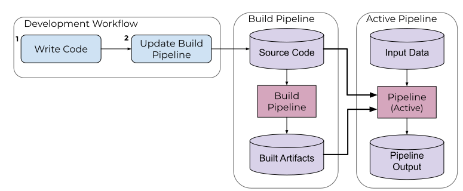

# Build Pipelines

A build pipeline is a useful feature when iterating on the code in your pipeline. They allow you to bypass the Docker build process and submit your code directly to the pipeline. In essence, build pipelines automate Steps 2-5 of the [pipeline workflow](working-with-pipelines.md). A diagram of the build pipeline process is shown below.



!!! note
      Build pipelines are not currently supported in Pachyderm Hub.

Functionally, the build pipeline relies on a base Docker image that remains unchanged during the development process. Any code written for the pipeline is copied into this container, installs requirements and updates the code in the pipeline before running it.

Using this feature requires a modification of the pipeline spec's `transform` object with options for the following fields:

- `path`: An optional string specifying where the source code is relative to the pipeline spec path (or the cwd if the pipeline is fed into `pachctl` via stdin.)
- `language`: An optional string specifying what language builder to use (see below.) Only works with official builders. If unspecified, `image` will be used instead.
- `image`: An optional string specifying what builder image to use, if a non-official builder is desired. If unspecified, the `transform` object's `image` will be used instead.

Below is a Python example of a build pipline.

```json
{
  "pipeline": {
    "name": "map"
  },
  "description": "A pipeline that tokenizes scraped pages and appends counts of words to corresponding files.",
  "transform": {
    "build": {
      "language": "python",
      "path": "./source"
    }
  },
  "input": {
    "pfs": {
      "repo": "scraper",
      "glob": "/*"
    }
  }
}
```

A build pipeline can be submitted the same way as any other pipeline, for example:

```bash
pachctl update pipeline -f <pipeline name>
```

## How it works

When submitted, the following actions occur:

1. All files (code, etc.) are copied from the build path to a PFS repository, `<pipeline name>_build`, which we can think of as the source code repository. In the case above, everything in `./source` would be copied to to the PFS `<pipeline name>_build` repository.

1. Starts a pipeline called `<pipeline name>_build` that reads the files uploaded and runs the `build.sh` script to pull dependencies and compile any requirements from the source code.

1. Creates (or updates if it already exists) the running pipeline `<pipeline name>` with the the newly creates source files and built assets.

!!! note
      You can optionally specify a `.pachignore` file, which uses [ohmyglob](https://github.com/pachyderm/ohmyglob) entries to prevent certain files from getting pushed to this repo.

The updated pipeline contains the following PFS repos mapped in as inputs:

1. `/pfs/source` - source code that is required for running the pipeline. There are language-specific requirements on the structure of this source code mentioned in the [Python Builder](#python-builder) section.

1. `/pfs/build` - any artifacts resulting from the build process.

1. `/pfs/<input(s)>` - any inputs specified in the pipeline specification.

## Builders
The builder is responsible for determining what Docker image is used for the base image and what steps to run during the pipeline build and deployment. If a builder has a standard implementation (currently `python` and `go`), then only the `transform.build.language` needs to be set, as it has impelmentations for `build.sh` and `run.sh`. The order of preference is:

1. `transform.build.language`
1. `transform.build.image`
1. `transform.image`

If `transform.buil.language` is not specified, then the build pipeline is non-standard and uses the `transform.build.image` container (and subsequently the `transform.build` if `transform.build.image` is not provided). In a non-standard implementation, the convention is to provide `build.sh` and `run.sh` scripts to fulfill the build pipeline requirements. 

Similarly, a build pipeline by default will run `sh /pfs/build/run.sh` by default. If a `transform.cmd` is specified, it will take precedence over `run.sh`.

### Python Builder

The Python builder requires a file structure similar to the following:

```tree
./map
├── source
│   ├── requirements.txt
│   ├── ...
│   └── main.py
└── build-pipeline.json
```
There must exist a `main.py` which acts as the entrypoint for the pipeline. Optionally, a `requirements.txt` can be used to specify pip packages that will be installed during the build process. Other supporting files in the directory will also be copied and available in the pipeline if they are not excluded by the `.pachignore`.

The `build.sh` and `run.sh` files are optional, as the Python Builder already contains these scripts. However, if the base image is modified, they must be provided.

### Go Builder

The Go Builder follows the same format as the [Python Builder](#python-builder). There must be a main source file in the source root that imports and invokes the intended code.

### Creating a Builder

For languages other than Python and Go, or customizations to the official builders, users can author their own builders. Builders are somewhat similar to buildpacks in design, and follow a convention over configuration approach. A builder needs 3 things:

- A Dockerfile to bake the image specified in the build pipeline spec.
- A `build.sh` in the image workdir, which acts as the entry-point for the build pipeline.
- A `run.sh`, injected into `/pfs/out` via `build.sh`. This will act as the entry-point for the executing pipeline. By convention, `run.sh` should take an arbitrary number of arguments and forward them to whatever executes the actual user code.

The build file structure would have the following format: 
```tree
./project
├── source
│   ├── requirements.txt
│   ├── main.py
│   ├── build.sh
│   └── run.sh
└── build-pipeline.json
```

A custom builder can be used by setting `transform.build.image` in a pipeline spec. The official builders can be used for reference; they're located in [here](https://github.com/pachyderm/pachyderm/tree/master/etc/pipeline-build).
