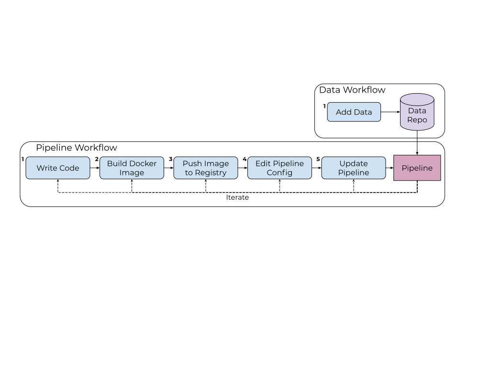

# Developer Workflow

In general, the developer workflow for Pachyderm involves adding 
data to versioned data repositories, creating pipelines to 
read from those repositories, executing the pipeline's code, and writing the pipeline's output to other data repositories.
Both the data and pipeline can be iterated on independently with Pachyderm
handling the code execution according to the pipeline specfication.
The workflow steps are shown below.

## Data Workflow - Load Your Data into Pachyderm

Adding data to Pachyderm is the first step towards building data-driven pipelines. There are multiple ways to add data to a Pachyderm repository:

* By using the `pachctl put file` command
* By using a special type of pipeline, such as a [spout](../../concepts/pipeline-concepts/pipeline/spout/) or [cron](../../concepts/pipeline-concepts/pipeline/cron/) 
* By using one of the Pachyderm's [language clients](../../reference/clients/)
* By using a compatible S3 client

For more information, see [Load Your Data Into Pachyderm](../basic-data-operations/load-data-into-pachyderm/).

## Pipeline Workflow - Processing Data in Pachyderm

The fundamental concepts of Pachyderm are very powerful, but the manual build steps mentioned in the [pipeline workflow](working-with-pipelines.md) can become cumbersome during rapid-iteration development cycles. We've created a few helpful developer workflows and tools to automate steps that are error-prone or repetitive:

* The [push images flag](push-images-flag.md) or `--push-images` is a optional flag that can be passed to the `create` or `update` pipeline command. This option is most useful when you need to customize your Docker image or are iterating on the Docker image and code together, since it tags and pushes the image before updating the pipeline. 
* [CI/CD Integration](ci-cd-integration.md) provides a way to incorporate Pachyderm functions into the CI process. This is most useful when working with a complex project or for code collaboration. 

