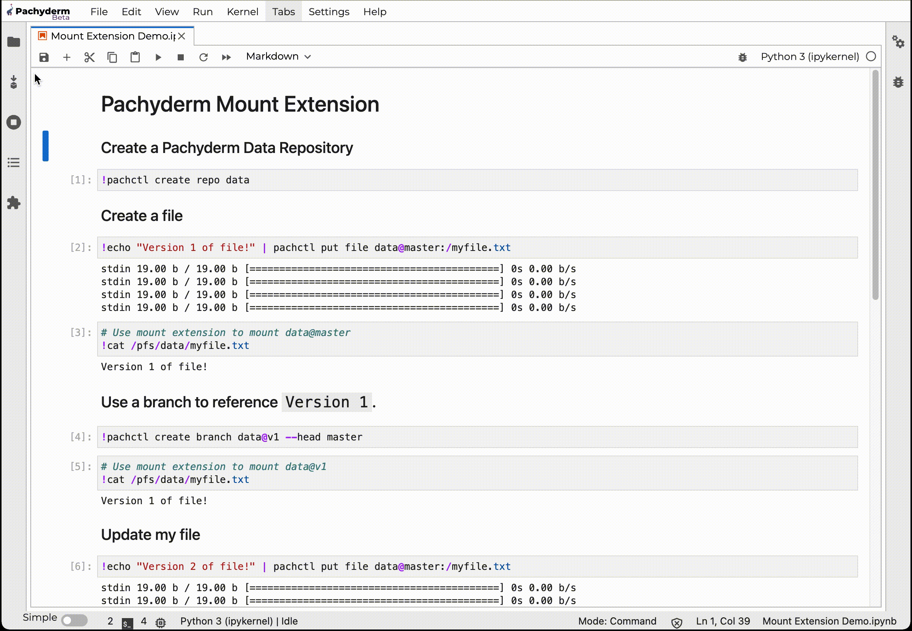
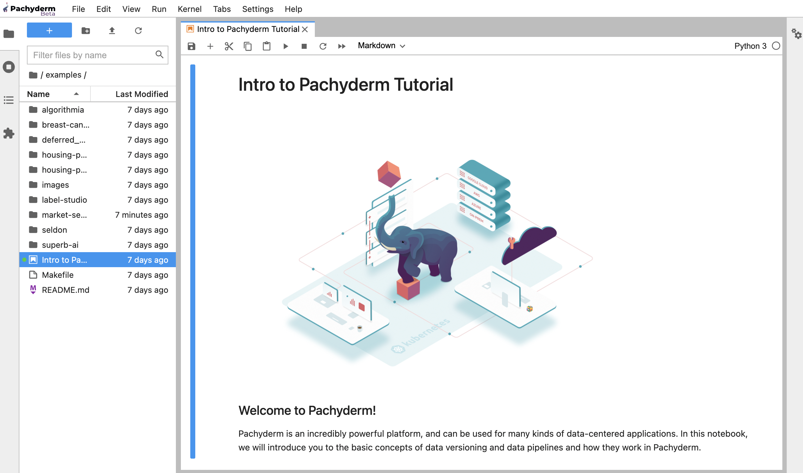

# JupyterHub Mount Extension

For Data Scientists whose data are stored in Pachyderm, the extension provides a seamless way to:

- Connect your Notebook to a Pachyderm cluster.
- Browse, explore, analyze data stored in Pachyderm directly from your Notebook.
- Run and test out your pipeline code before creating your image. 

**[Pachyderm Mount Extension](https://pypi.org/project/jupyterlab-pachyderm/){target=_blank}** is an add-on/plugin to JupyterHub / JupyterLab that extends the original functionality of your notebook environment, **allowing users of notebooks to mount and unmount Pachyderm data repositories to the file system of their machine or their container**.

!!! Note
     - **Prerequisites**: 

        You already have a Pachyderm cluster running to connect your JupyterLab or JupyterHub. Find Pachyderm installation instructions in the [Deploy/Manage](../../../deploy-manage/deploy/) section of our documentation.

     - **Versions**:

         - Use Pachyderm Mount Extension v?? with Pachyderm 2.1.x and higher. //TBD
         - We recommend JupyterLab >= 3.0.
     
---------------------------- WIP -----------------------------
How do I know what version of Pachyderm is compatible with what version of the extension?
---------------------------------------------------------------


!!! Info
     - The extension mounts data at `/pfs` similar to how a pipeline would see data when running a job.
     - All mounted repositories are **read-only**.
     - The extension requires FUSE. 
     - We apply the `/` globbing pattern to all directories/files in all mounted repo@branch. ?? Does this make sense??

## Install The Mount Extension

The deployment instructions for Pachyderm Mount Extension come in three flavors, depending on where (*Locally or in a VM* ) and what (*JupyterLab or JupyterHub*) you want to deploy it on.

Pick the option that fits your use case:

- Deploy the extension [in a VM](#in-a-container):
    - Deploy in [JupyterLab's container](#deploy-the-extension-in-jupiterLab-container).
    - Deploy on [JupyterHub running in Kubernetes](#deploy-the-extension-on-jupyterHub-running-in-kubernetes).
- Deploy the extension [locally](#on-your-machine) on a JupyterLab installed on your machine.
### 1- In A Container
#### 1.1- Base Image

Depending on your setup, you might choose to use our pre-built image containing the extension or add the extension to your image. We will go through each of those two options:

- You can use Pachyderm's pre-built image [`pachyderm/notebooks user](https://hub.docker.com/r/pachyderm/notebooks-user/tags){target=_blank}:

    !!! Note
        Find the latest available tag of the image `pachyderm/notebooks user in DockerHub to get the latest copy of the extension.

        Our image comes with a pre-installed suite of packages, including:

        - The extension `jupyterlab-pachyderm`.
        - Our Command-Line Tool `pachctl`.
        - FUSE
        - Additionally, it pre-creates the `/pfs` directory files that will be mounted to and grants ownership to the JupyterLab USER.

        The image is based on a GPU-enabled version of [jupyter/base-notebook¶](https://jupyter-docker-stacks.readthedocs.io/en/latest/using/selecting.html#jupyter-base-notebook).


- Or, add the following to your Jupyterlab Dockerfile, then re-build your image:

    !!! Note
        Replace the following `${PACHCTL_VERSION}` with the version of `pachctl` that matches your cluster's, and update `<version>` with the release number of the extension.

    ```shell
    # This runs the following section as root, if adding to an existing Dockerfile, take care to set the user back to whatever you need.
    USER root

    # This is the directory files will be mounted to, mirroring how pipelines are run.
    RUN mkdir -p /pfs 

    # If you are not using "jovyan" as your notebook user, replace the user here.
    RUN chown $NB_USER /pfs

    # Fuse is a requirement for the mount extension
    RUN apt-get clean && RUN apt-get update && apt-get -y install curl fuse 

    # Install Pachctl - Set the version of Pachctl that matches your cluster deployment.
    RUN curl -f -o pachctl.deb -L https://github.com/pachyderm/pachyderm/releases/download/v${PACHCTL_VERSION}/pachctl_${PACHCTL_VERSION}_amd64.deb
    RUN dpkg -i pachctl.deb

    # This sets the user back to the notebook user account (ie. Jovyan)
    USER $NB_UID

    # Replace the version here with the version of the extension you would like to install from https://pypi.org/project/jupyterlab-pachyderm/
    RUN pip install jupyterlab-pachyderm==<version>
    ```

    Then, [build, tag, and push your image](../../../how-tos/developer-workflow/working-with-pipelines/#step-2-build-your-docker-image).

#### 1.2-a Deploy The Extension In JupiterLab Container

If you are using our pre-built image, update the tag version of the image `pachyderm/notebooks user in the script below, then run:

```shell
docker run -it -p 8888:8888 -e GRANT_SUDO=yes --user root --device /dev/fuse --privileged --entrypoint /opt/conda/bin/jupyter pachyderm/notebooks-user:31d95f869ead4c96aaede284f8d3804020a8d370 lab --allow-root 
```

Click on the link provided in the stdout of your terminal to run JupyterLab in a browser, then jump to the [`Connect Your JupyterLab Extension To Your Pachyderm Cluster`](#connect-your-jupyterlab-extension-to-your-pachyderm-cluster) section.

#### 1.2-b Deploy The Extension On JupyterHub Running In Kubernetes

!!! Info
    Find the complete installation instructions of JupyterHub on Kubernetes in [Jupyterhub for Kubernetes documentation](https://zero-to-jupyterhub.readthedocs.io/en/latest/#setup-jupyterhub){target=_blank}.


- As a FUSE requirement, add the following to your **Jupyterhub helm chart values.YAML** file to enable root in the `singleuser` containers:

    !!! Note
        Update `singleuser.image.name` and `singleuser.image.tag` to match your user image.

    ```yaml
    singleuser:
        defaultUrl: "/lab"
        cmd:   "start-singleuser.sh"
        image:
            name: pachyderm/notebooks-user
            tag: 624337360beaff8514be329386f3ca554fc7a34d
        uid:   0
        fsGid: 0
        extraEnv:
            "GRANT_SUDO": "yes"
            "NOTEBOOK_ARGS": "--allow-root"
            "JUPYTER_ENABLE_LAB": "yes"
            "CHOWN_HOME": "yes"
            "CHOWN_HOME_OPTS": "-R"
    hub:
        extraConfig:
            enableRoot: |
                from kubernetes import client
                def modify_pod_hook(spawner, pod):
                    pod.spec.containers[0].security_context = client.V1SecurityContext(
                        allow_privilege_escalation=True,
                        run_as_user=0,
                        privileged=True,
                        capabilities=client.V1Capabilities(
                            add=['SYS_ADMIN']
                        )
                    )
                    return pod
                c.KubeSpawner.modify_pod_hook = modify_pod_hook
    ```


- Run the following commands to install Jupyterhub:

    ```shell
    helm repo add jupyterhub https://jupyterhub.github.io/helm-chart/
    helm repo update

    helm upgrade --cleanup-on-fail \
    --install jupyter jupyterhub/jupyterhub \
    --values values.yaml
    ```

    !!! Note 
        This may take a while if you are pulling from a large Docker image.


- Find the IP address you will use to access the JupyterHub as described in these [Helm installation instructions](https://zero-to-jupyterhub.readthedocs.io/en/latest/jupyterhub#setup-jupyterhub) (Step 5 and 6) and open Jupyterlab.

- Click on the link provided in the stdout of your terminal to run JupyterLab in a browser, then jump to the [`Connect Your JupyterLab Extension To Your Pachyderm Cluster`](#connect-your-jupyterlab-extension-to-your-pachyderm-cluster) section.

- Run the following command to refresh the mount server:

    ``` shell
    umount /pfs
    ```
### 2- On Your Machine

- Prerequisites

    - [Install `pachctl`](../../../getting_started/local_installation/#install-pachctl){target=_blank} :
    Make sure that the version of `pachctl` matches the version of your cluster.
 
    - [Have 'pachctl' and your Cluster Communicate](../../../getting_started/local_installation/#have-pachctl-and-your-cluster-communicate){target=_blank} .

    - [Install FUSE](h../../../how-tos/basic-data-operations/export-data-out-pachyderm/mount-repo-to-local-computer/#prerequisites){target=_blank} . Choose the instructions that fit your environment.
    
    - [Test your mount](../../../how-tos/basic-data-operations/export-data-out-pachyderm/mount-repo-to-local-computer/#mounting-repositories-in-read-only-mode){target=_blank} :
     Create a repo containing a file on its master branch, then mount the HEAD on a local directory of your choice. 
    
        !!! Example
            ```shell
            pachctl create repo images
            pachctl put file images@master:liberty.png -f http://imgur.com/46Q8nDz.png
            pachctl mount images --repos images@master
            ```
            The image should be visible in your directory `images` in this example.    
    
    - Create a `/pfs` directory owned by the Notebook USER:

        !!! Example "Example on Debian-based Linux"
            Run the following commands to create the mount directory and install FUSE:

            ```shell
            # Install FUSE
            sudo apt-get update && apt-get -y install curl fuse
            # Create the directory your data will be mounted into and grant your USER access
            sudo mkdir -p /pfs
            sudo chown $USER /pfs
            ```

 
- Install the extension in the python environment where you have [installed Jupyterlab](https://jupyter.org/install){target=_blank} 

    ```shell
    pip install jupyterlab
    pip install jupyterlab-pachyderm==<version>
    ```
    !!! Note
        Replace `<version>` with your chosen [version of the extension](https://pypi.org/project/jupyterlab-pachyderm/){target=_blank}.

- Start your JupyterLab
    ```shell
    jupyter-lab
    ```

If you are using the same USER to run JupyterLab, the Mount Extension, and have granted that USER access to `/pfs`, you are all set. You should see your existing repos [ready to be mounted](#use-jupyterlab-mount-extension) in your Notebook and can start experimenting.


## Connect The Extension To Your Pachyderm Cluster

You have a running JupyterLab instance, and you have installed the extension, you now want to connect Your JupyterLab/JupyterHub instance to your cluster.

We made this pretty straightforward. Fill in the `pachcd-address` and port number "<pachd_address>:31400" in the form ... WIP remove instructions below and add instructions to connect to the Login UI once ready.

    !!! Example

            Note: Replace pachd_address value with your own Pachyderm instance.

            ```shell
            echo '{"pachd_address": "<pachd_address>:31400", "source": 2}' | pachctl config set context "nostalgic-camel" --overwrite && pachctl config set active-context "nostalgic-camel"

            pachctl auth login --no-browser

            pachctl auth whoami
            ```


## Use The Extension

Once your JupyterLab is up and connected to your cluster:

- Click on the Pachyderm mount extension in the far left tab bar.

 You should see the repositories ready to be mounted from your Pachyderm instance.
 

 WIP Insert print screens here and quicl explation of how to select repo@branch??? Or simple add a note to mention that you can select any branch of a repo... 

- If you used our pre-built image `pachyderm/notebooks-user`, use our examples library and start experimenting! 

WIP Examples have been removed from our default image?

!!! Note 
     We have included a selection of data science examples running on Pachyderm, from a market sentiment NLP implementation using a FinBERT model to pipelines training a regression model on the Boston Housing Dataset. In the `/examples` directory, you will also find integration examples with open-source products, such as labeling or model serving applications.
 
From the landing page of JupyterLab, in the `/examples` directory, click on the **Intro to Pachyderm Tutorial**. Follow along to learn the basics of Pachyderm (repos, pipelines, commits, etc...) from your familiar Jupyter notebook. 

 

!!! Note 
     This Tutorial uses Pachyderm's CLI `pachctl`. Feel free to use 'python-pachyderm' instead. ????????
