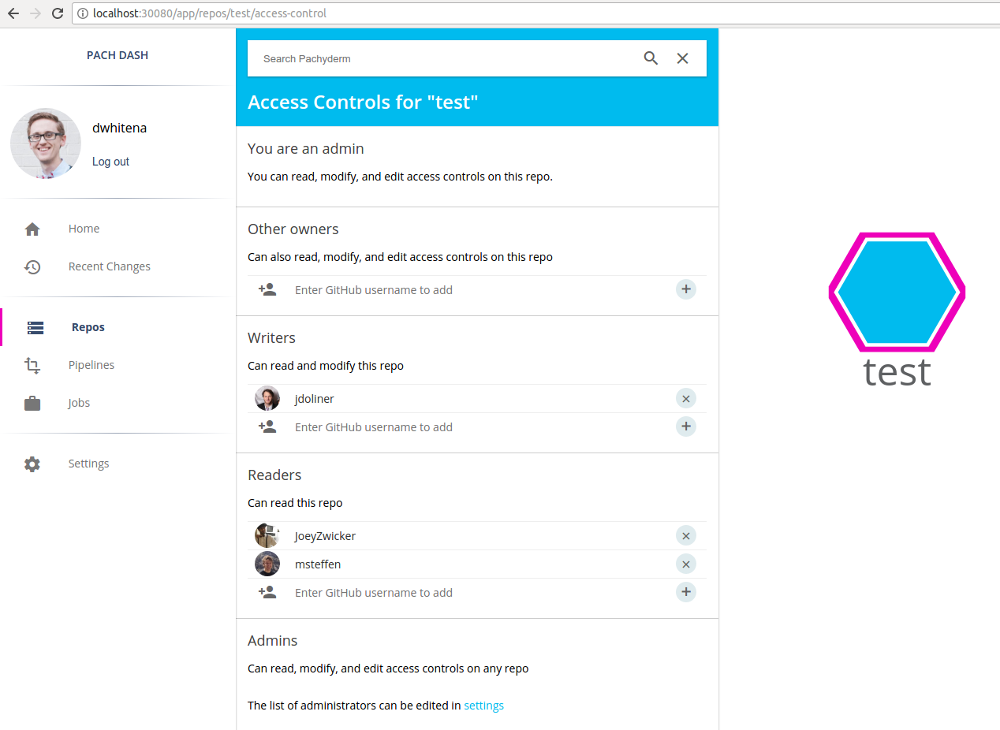

# Access Controls

The access control features of Pachyderm Enterprise let you create and manage various users that interact with your Pachyderm cluster.  You can restrict access to individual data repositories on a per user basis and, as a result, restrict the subscription of pipelines to those data respositories.  

These docs will guide you through:

1. [Activating access control features (aka "auth" features).](#activating-access-control)
2. [Logging into Pachyderm.](#logging-into-pachyderm)
3. [Managing/updating user access to data repositories.](#managing-and-updating-user-access)

We will also discuss:

- [The behavior of pipelines when using access control](#behavior-of-pipelines-as-related-to-access-control)
- [The behavior of a cluster when access control is de-activated or an enterprise token expires](#activation-code-expiration-and-de-activation)

## Activating access control

First, you will need to make sure that your cluster has Pachyderm Enterprise Edition activated (you can follow [this guide](deployment.md) to activate Enterprise Edition).  The status of the Enterprise features can be verified by accessing the Pachyderm dashboard or with `pachctl` as follows:

```
$ pachctl enterprise get-state
ACTIVE
```

Next, we need to activate the Enterprise access control features. This can be done [in the dashboard](#activating-access-controls-with-the-dashboard) or with [pachctl auth activate](#activating-access-controls-with-pachctl).  However, before executing that command, we should decide on at least one user that will have admin priviledges on the cluster. Pachyderm admins will be able to modify the scope of access for any non-admin users on the cluster.  All users in Pachyderm are identified by their GitHub usernames.  

### Activating access controls with the dashboard

To activate access controls via the Pachyderm dashboard, go to the settings page where you should see a "Activate Access Controls" button. Click on that button. You will then be able to enter one or more Github users as cluster admins and activate access controls:


After activating access controls, you should see the following screen asking you to login to Pachyderm:


### Activating access controls with pachctl

To activate access controls on a cluster and set the GitHub user `dwhitena` as an admin, we would execute the following `pachctl` command:

```
$ pachctl auth activate --admins=dwhitena
```

Your Pachyderm cluster can have more than one admin if you like, but you need to supply at least one with this command.  To add multiple admins, You would just need to specify them here as a comma separated list. 

## Logging into Pachyderm

Now that we have activated access control, we can login to our cluster. When using the Pachyderm dashboard, you will need to [login on the dashboard](#login-on-the-dashboard), and, when using the `pachctl` CLI, you will need to [login via the CLI](#login-using-pachctl).  

### Login on the dashboard

Once you have authorized access controls for Pachyderm, you will need to login to use the Pachyderm dashboard as shown above in [this section](#activating-access-controls-with-the-dashboard). To login, click the "Get GitHub token" button. You will then be presented with an option to "Authorize Pachyderm" (assuming that you haven't authorized Pachyderm on GitHub previously). Once you authorize Pachyderm, you will be presented with a Pachyderm user token:


Copy and paste this token back into the Pachyderm login screen and press enter.  You are now logged in to Pachyderm, and you should see your Github avatar and an indication of your user in the upper left hand corner of the dashboard:
  


### Login using `pachctl`

You can use the `pachctl auth login <username>` to login via the CLI.  When we execute this command, `pachctl` will provide us with a GitHub link to authenticate ourselves as the provided GitHub user, as shown below:

```
$ pachctl auth login dwhitena
(1) Please paste this link into a browser:

https://github.com/login/oauth/authorize?client_id=d3481e92b4f09ea74ff8&redirect_uri=https%3A%2F%2Fpachyderm.io%2Flogin-hook%2Fdisplay-token.html

(You will be directed to GitHub and asked to authorize Pachyderm's login app on Github. If you accept, you will be given a token to paste here, which will give you an externally verified account in this Pachyderm cluster)

(2) Please paste the token you receive from GitHub here:

```

When visiting this link in a browser, you will be presented with an option to "Authorize Pachyderm" (assuming that you haven't authorized Pachyderm via GitHub previously). Once you authorize Pachyderm, you will be presented with a Pachyderm user token:


Copy and paste this token back into the terminal, as requested by `pachctl`, and press enter.  You are now logged in to Pachyderm!  

## Managing and updating user access

Let's suppose that we create a repository call `test` when we are logged into Pachyderm as the user `dwhitena`.  Because, the user `dwhitena` created this repository, `dwhitena` will have full read/write access to the repo.  This can be confirmed on the dashboard by navigating to or clicking on the repo `test`.  The results repo details will show your current access to the repository:


You can also confirm your access via the `pachctl auth get ...` command:

```
$ pachctl auth get dwhitena test`
OWNER
```

An OWNER of `test` or a cluster admin can then set other user's scope of access to the repo.  This can be done via the `pachctl auth set ...` command or via the dasboard.  For example, to give the GitHub users `JoeyZwicker` and `msteffen` READER (but not WRITER or OWNER) access to `test` and `jdoliner` WRITER (but not OWNER) access, we can click on `Modify access controls` under the repo details in the dashboard.  This will allow us to easily add the users one by one:



In Pachyderm, the heirarchy of users is as follows:

- An OWNER can read and write to/from a repo, and they can add/remove other OWNER, READER, or WRITER users to/from a repo.
- A WRITER can read and write to/from a repo.
- A READER can read from a repo.

## Behavior of pipelines as related to access control

In Pachyderm, you don't explicitly set the scope of access for users on pipelines.  Rather, pipelines infer access from the repositories that are input to the pipeline, as follows:

- An OWNER, WRITER, or READER of a repo may subscribe a pipeline to that repo.
- When a user subscribes a pipeline to a repo, they will be set as an OWNER of that pipeline's output repo.
- The initial OWNER of a pipeline's output repo (or an admin) needs to set the scope of access for other users to that output repo.  

## Activation code expiration and de-activation

When an enterprise activation code expires, an auth-activated Pachyderm cluster goes into an "admin only" state.  In this state, only admins will have access to data that is in Pachyderm.  This safety measure keeps sensitive data protected, even when an enterprise subscription becomes stale. As soon as the enterprise activation code is updated (via the dashboard or via `pachctl enterprise activate ...`), the Pachyderm cluster will return to it's previous state.

When access controls are de-activated on a Pachyderm cluster via `pachctl auth deactivate`, the cluster returns to being a non-access controlled Pachyderm cluster.   That is, 

- All ACLs are deleted.
- The cluster returns to being a blank slate in regards to access control.  Everyone that can connect to Pachyderm will be able to access and modify the data in all repos.
- There will no longer be a concept of users (i.e., no one will be able to login to Pachyderm).
