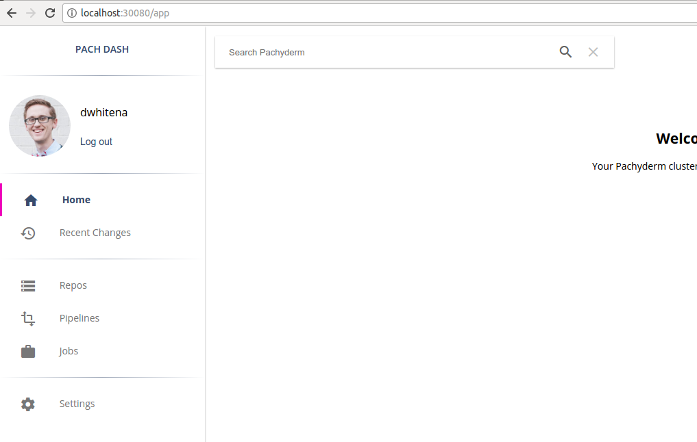

# Understanding Pachyderm access controls

If access controls are activated, each data repository, or repo,
in Pachyderm has an Access Control List (ACL) associated with it.
The ACL includes:

- `READERs` - users who can read the data versioned in the repo.
- `WRITERs` - users with `READER` access who can also submit
additions, deletions, or modifications of data into the repo.
- `OWNERs` - users with READER and WRITER access who can also
modify the repo's ACL.

Currently, Pachyderm accounts correspond to GitHub users, who
authenticate to Pachyderm by using OAuth integration with
GitHub. Pachyderm user accounts are identified within
Pachyderm by using their GitHub usernames.

By default, Pachyderm defines one hardcoded group called `admin`.
Users in the `admin` group can perform any
action on the cluster including appointing other admins.
Furthermore, only the cluster admins can manage a repository
without ACL.

## Enabling access control

Before you enable access controls, make sure that
you have activated Pachyderm Enterprise Edition
as described in [this guide](./deployment.html).

To enable access controls, complete the following steps:

1. Verify the status of the Enterprise
features by opening the Pachyderm dashboard in your browser or
by running the following `pachctl` command:

   ```
   $ pachctl enterprise get-state
   ACTIVE
   ```

1. Activate the Enterprise access control features by completing
the steps in one of these sections:

   * [Activating Access Control in the Dashboard](#activating-access-controls-with-the-dashboard)
   * [Activating Access Control in pachctl](#activating-access-controls-with-pachctl)

### Activating access controls with the dashboard

To activate access controls in the Pachyderm dashboard,
complete the following steps:

1. Go to the Settings page.
1. Click the **Activate Access Controls** button.
After you click the button, Pachyderm enables you to add GitHub users
as cluster admins and activate access control:


After activating access controls, you should see the following screen
that asks you to log in to Pachyderm:


### Activating access controls by using `pachctl`

To activate access controls by using `pachctl`, run the following
command:

```
$ pachctl auth activate --admins=<user>
```

If you want the Pachyderm cluster to have more than one admin,
specify them as a comma-separated list.

## Logging in to Pachyderm

After you activate access control, log in to your cluster either
through the dashboard or CLI. The CLI and the dashboard have
independent login workflows:

- [Log in to the dashboard](#login-on-the-dashboard).
- [Log in by using the CLI](#login-using-pachctl).

### Log in to the dashboard

After you have authorized access controls for Pachyderm, you
need to log in to use the Pachyderm dashboard as shown above
in [this section](#activating-access-controls-with-the-dashboard).

To log in to the dashboard, complete the following steps:

1. To log in, click the **Get GitHub token** button. If you
have not previously authorized Pachyderm on GitHub, an option
to **Authorize Pachyderm** appears. After you authorize
Pachyderm, a Pachyderm user token appears:


1. Copy and paste this token back into the Pachyderm login
screen and press **Enter**. You are now logged in to Pachyderm,
and you must see your GitHub avatar and an indication of your
user in the upper left-hand corner of the dashboard:




### Log in to the CLI

To authenticate by using `pachctl`, run the following
command:

1. Log in with your user name:

   ```bash
   pachctl auth login <username>
   ```

   When you run this command, `pachctl` provides
   you with a GitHub link to authenticate as the provided
   GitHub user.

   **Example:**

   ```bash
   $ pachctl auth login dwhitena
   (1) Please paste this link into a browser:

   https://github.com/login/oauth/authorize?client_id=d3481e92b4f09ea74ff8&redirect_uri=https%3A%2F%2Fpachyderm.io%2Flogin-hook%2Fdisplay-token.html

   (You will be directed to GitHub and asked to authorize Pachyderm's login app on Github. If you accept, you will be given a token to paste here, which will give you an externally verified account in this Pachyderm cluster)

   (2) Please paste the token you receive from GitHub here:
   ```

   If you have not previously authorized Pachyderm on GitHub, an option
   to **Authorize Pachyderm** appears. After you authorize Pachyderm,
   a Pachyderm user token appears:

   

   1. Copy and paste this token back into the terminal and press enter.

   You are now logged in to Pachyderm!

## Manage and update user access

You can manage user access in the UI and CLI.
For example, when you log in to Pachyderm as the user `dwhitena`, you
have a repository called `test`.  Because the user `dwhitena` created
this repository, `dwhitena` has full read and write access to the repo.
You can confirm this on the dashboard by navigating to or clicking on
the repo `test`:


Alternatively, you can confirm your access by running the
`pachctl auth get ...` command.

**Example:**

```
$ pachctl auth get dwhitena test`
OWNER
```

An OWNER of `test` or a cluster admin can then set other user’s
scope of access to the repo by using
the `pachctl auth set ...` command or through the dashboard.

For example, to give the GitHub users `JoeyZwicker` and
`msteffen` `READER`, but not `WRITER` or `OWNER`, access to
`test` and `jdoliner`, `WRITER`, but not `OWNER`, access,
click on **Modify access controls** under the repo details
in the dashboard. This functionality allows you to add
the users easily one by one:


## Behavior of pipelines as related to access control

In Pachyderm, you do not explicitly set the scope of access
for users on pipelines. Instead, pipelines infer access from
the repositories that are input to the pipeline, as follows:

- An `OWNER`, `WRITER`, or `READER` of a repo can subscribe a
pipeline to that repo.
- When a user subscribes a pipeline to a repo, they are
set as an `OWNER` of that pipeline's output repo.
- The initial `OWNER` of a pipeline's output repo, or an admin,
needs to set the scope of access for other users to that output repo.

## Manage the Activation Code

When an enterprise activation code expires, an auth-activated
Pachyderm cluster goes into an `admin-only` state. In this
state, only admins have access to data that is in Pachyderm.
This safety measure keeps sensitive data protected, even when
an enterprise subscription becomes stale. As soon as the enterprise
activation code is updated by using the dashboard or CLI, the
Pachyderm cluster returns to its previous state.

When you deactivate access controls on a Pachyderm cluster
by running `pachctl auth deactivate`, the cluster returns
its original state that including the
following changes:

- All ACLs are deleted.
- The cluster returns to being a blank slate in regards to
access control. Everyone that can connect to Pachyderm can access
and modify the data in all repos.
- No users are present in Pachyderm, and no one can log in to Pachyderm.
