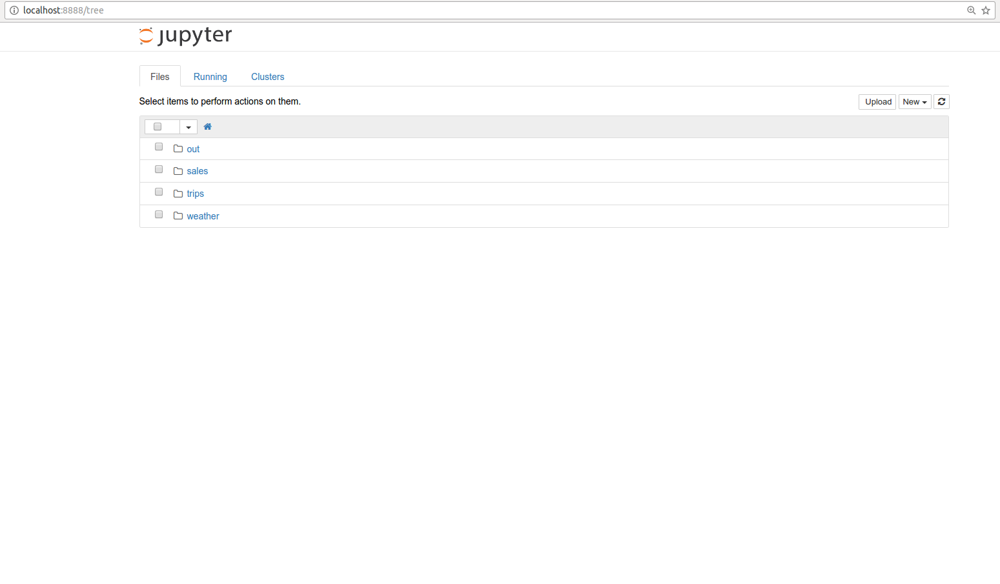
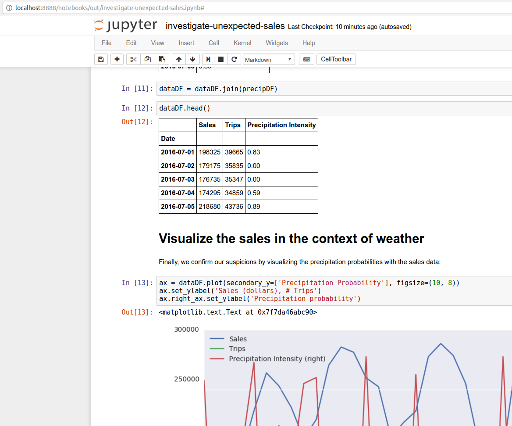

# Jupyter Notebook using versioned Pachyderm Data

In the following example, we will explore attaching a Jupyter server to Pachyderm and manipulating data in Pachyderm's data versioning.  Specifically, we will attach our Jupyter server to three different repositories used in an example Pachyderm pipeline:

- **trips** - This repo is populated with a daily file that records the number of bicycle trips recorded by NYC's citibike bike sharing company on that particular day (data from [here](https://www.citibikenyc.com/system-data)).
- **sales** - This repo includes a single CSV file called `sales.csv`.  `sales.csv` is updated daily by a pipeline that processes each file in `trips` to calculate sales for the day.  Note, here we are using a fictional multiplier, $5/trip, to calculate daily "sales" (i.e., these are not actually the sales figures for citibike).
- **weather** - This repo is populated daily with a JSON file representing the weather forecast for that day from [forecast.io](https://darksky.net/forecast/40.7127,-74.0059/us12/en).

We attach to the trips and weather repos at commit number 30, which corresponds to the data versioned on 7/31/2016. We did this, because on 7/30/2016 and 7/31/2016 we saw a sharp drop in our sales, and we want to try and understand, interactively, why we might have seen this drop in sales.

By attaching to these separate points in our DAG (trips, weather, and sales) we can bring our data together at a particular commit (i.e., a particular point in history), without explicitly planning a pipeline stage that takes these repos as input.

Here is the process:

1) Create the data we are going to access with Jupyter:

```
make prep
```

2) Determine the output commit we are going to access with Jupyter:

```
pachctl flush-commit -f trips/master/30
```

and replace the `<output-commitid>` in `jupyter.json` with the sales repo commitid shown. 

3) Deploy a Jupyter Notebook using a Pachyderm "service":

Note the `jupyter.json` file in this directory. We use a standard jupyter docker image, and run the Jupyter notebook webserver as part of the Pachyderm Transform. 

Just like a normal Pachyderm Job, a container is created with a specific version of any data sets loaded into the container's filesystem.  In this case we'll see data under `/pfs/trips`, `/pfs/weather`, and `/pfs/sales` at the commits specified in the job specification.

To deploy the service:

```
pachctl create-job -f jupyter.json
```

4) Access Jupyter at `http://localhost:8888` in a browser.  You will see that you have access to the three repos mentioned above plus `/pfs/out`:



5) Open the `/pfs/out` location in the Jupyter file browser, then select `Python 2` under `New` in the upper right hand corner of Jupyter to create a new Jupyter notebook.  You can then explore, manipulate, and visualize PFS data to your heart's content.  See [our example notebook](investigate-unexpected-sales.ipynb) for some inspiration.


