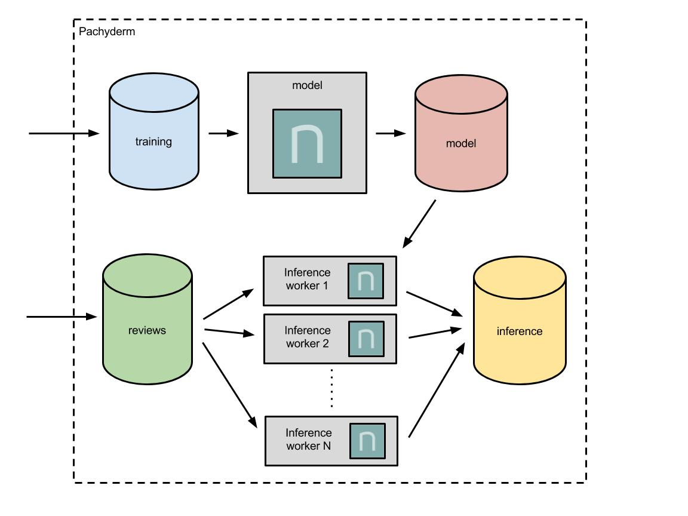

# ML pipeline using Nervana Neon and Pachyderm



This machine learning pipeline integrates Nervana Neon training and inference into a production scale pipeline using Pachyderm.  In particular, this pipeline trains and utilizes a model that predicts the sentiment of movie reviews, based on data from IMDB.

## Getting Started

- Clone this repo or download the files for the example.
- Download the training data [here](https://s3-us-west-2.amazonaws.com/wokshop-example-data/labeledTrainData.tsv).

## Deploying Pachyderm

See the [Pachyderm docs](http://docs.pachyderm.io/en/latest/) for details. Note, this demo requires `pachctl` 1.4.0+.  

## Deploying the pipeline

1. Create the necessary data "repositories":

    ```sh
    $ pachctl create-repo training
    $ pachctl create-repo reviews
    ```

2. Create the pipeline:

    ```sh
    $ pachctl create-pipeline -f pipeline.json
    ```

## Running model training

Because we have already deployed the pipeline, the training portion of the pipeline will run as soon as data is committed to the training data repo.  The training data in TSV format can be obtained [here](https://s3-us-west-2.amazonaws.com/wokshop-example-data/labeledTrainData.tsv).

```sh
$ pachctl put-file training master labeledTrainData.tsv -c -f labeledTrainData.tsv
```

The training should take about 10-15 minutes depending on your environment.

## Running model inference

Once the model is trained and a persisted version of the model is output to the `model` repo.  Sentiment of movie reviews can be run by committing movie reviews to the `reviews` repository as text files.  Example review files are included in [test](test).  These look like:

```
Naturally in a film who's main themes are of mortality, nostalgia, and loss of innocence it is perhaps not surprising that it is rated more highly by older viewers than younger ones. However there is a craftsmanship and completeness to the film which anyone can enjoy. The pace is steady and constant, the characters full and engaging, the relationships and interactions natural showing that you do not need floods of tears to show emotion, screams to show fear, shouting to show dispute or violence to show anger. Naturally Joyce's short story lends the film a ready made structure as perfect as a polished diamond, but the small changes Huston makes such as the inclusion of the poem fit in neatly. It is truly a masterpiece of tact, subtlety and overwhelming beauty.
```

Once this is committed to the `reviews` repo as `1.txt`:

```sh
$ pachctl put-file reviews master 1.txt -c -f 1.txt
```

The inference stage of the pipeline will run and output results to the master branch of the `inference` repo.
