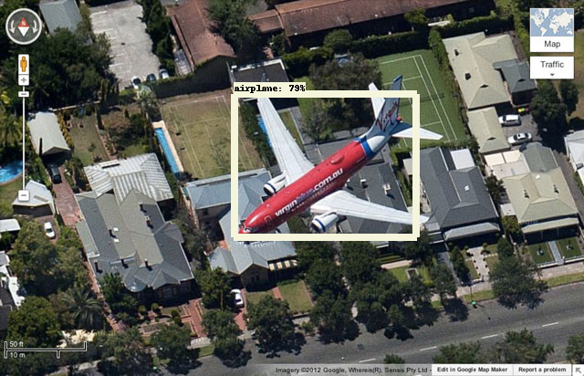

# Object detection

This example uses the [Tensorflow Object Detection API](https://github.com/tensorflow/models/tree/master/object_detection) to detect objects in input images.  To get the object detection example pipeline up and running:

```sh
$ pachctl create-repo training
$ pachctl create-repo images
$ wget http://download.tensorflow.org/models/object_detection/ssd_mobilenet_v1_coco_11_06_2017.tar.gz
$ tar -xvf ssd_mobilenet_v1_coco_11_06_2017.tar.gz
$ cd ssd_mobilenet_v1_coco_11_06_2017
$ pachctl put-file training master -c -f frozen_inference_graph.pb
$ cd ../
$ pachctl create-pipeline -f model.json  
$ pachctl create-pipeline -f detect.json
```

Then, as you commit `*.jpg` images into the `images` repo, the pipelines will output detected objects in the images:

```sh
$ cd images
$ pachctl put-file images master -c -f airplane.jpg
```


