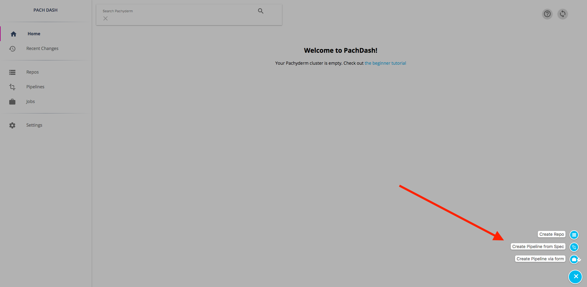
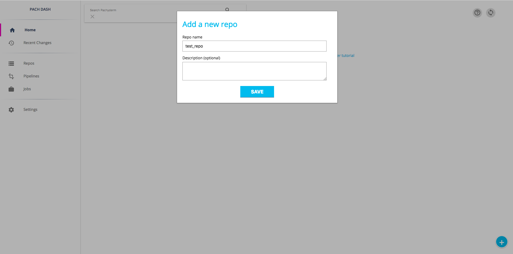
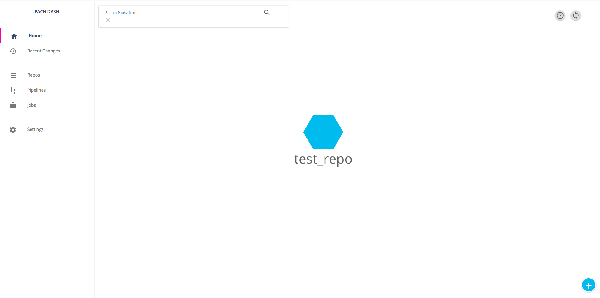
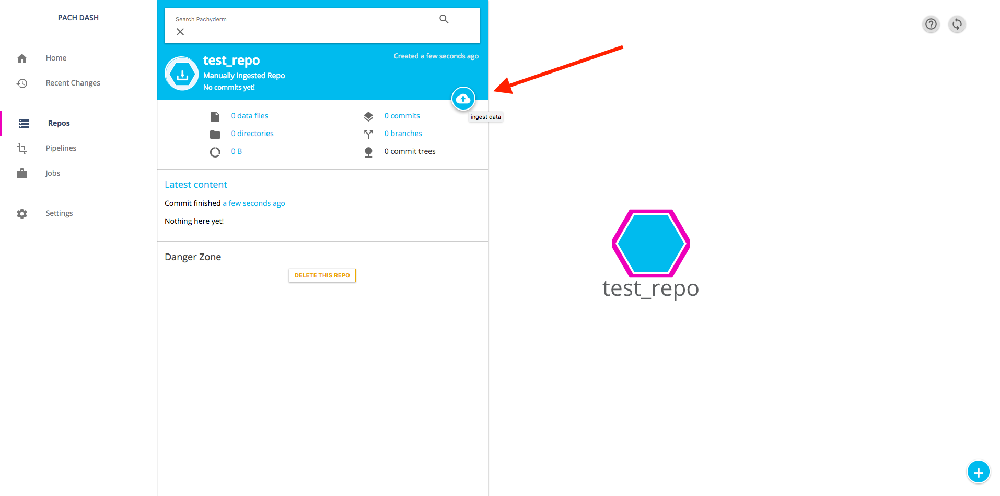
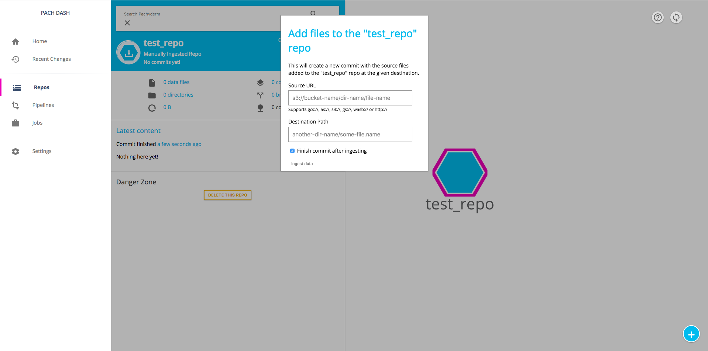

# Getting Your Data into Pachyderm

Data that you put (or "commit") into Pachyderm ultimately lives in an object
store of your choice (S3, Minio, GCS, etc.).  This data is content-addressed by
Pachyderm to build our version control semantics for data and is therefore not
"human-readable" directly in the object store.  That being said, Pachyderm
allows you and your pipeline stages to interact with versioned data like you
would in a normal file system.

## Jargon associated with putting data in Pachyderm

### "Data Repositories"

Versioned data in Pachyderm lives in repositories (again think about something
similar to "git for data").  Each data "repository" can contain one file,
multiple files, multiple files arranged in directories, etc.  Regardless of the
structure, Pachyderm will version the state of each data repository as it
changes over time. 

### "Commits"

Regardless of the method you use to get data into Pachyderm (CLI, language client, etc.), 
the mechanism that is used is a "commit" of data into a data
repository. In order to put data into Pachyderm, a commit must be "started" (aka
an "open commit").  Data can then be put into Pachyderm as part of that open commit and will be available once the commit is "finished" (aka a "closed commit").

## How to get data into Pachyderm

In terms of actually getting data into Pachyderm via "commits," there are
a few options:

- [Via the `pachctl` CLI tool](#pachctl): This is the great option for testing, development, 
  integration with CI/CD, and for users who prefer scripting.
- [Via one of the Pachyderm language clients](#pachyderm-language-clients): This option is ideal for Go, Python,
  or Scala users who want to push data to Pachyderm from services or
  applications written in those languages. Actually, even if you don't use Go,
  Python, or Scala, Pachyderm uses a protobuf API which supports many other
  languages, we just haven’t built the full clients yet.
- [Via the Pachyderm dashboard](#the-pachyderm-dashboard): The Pachyderm Enterprise dashboard provides a
  very convenient way to upload data right from the GUI. You can find out more
  about Pachyderm Enterprise Edition [here](../enterprise/overview.html).

### pachctl

To get data into Pachyderm using `pachctl`, you first need to create one or
more data repositories to hold your data:

```sh
$ pachctl create-repo <repo name>
```

Then, to put data into the created repo, you use the `put-file` command. Below
are a few example uses of `put-file`, but you can see the complete
documentation [here](../pachctl/pachctl_put-file.html).

If there is an open commit, `put-file` will add files to that commit. This example will add two files to a new commit, then close the commit:

```sh
# first start a commit
$ pachctl start-commit <repo> <branch>

# put <file1> in the <repo> on <branch>
$ pachctl put-file <repo> <branch> </path/to/file1> -f <file1>

# put <file2> in the <repo> on <branch>
$ pachctl put-file <repo> <branch> </path/to/file2> -f <file2>

# then finish the commit
$ pachctl finish-commit <repo> <branch>
```

If there is not an open commit, `put-file` will implicitly start and finish the commit. This is called an atomic commit:

```sh
$ pachctl put-file <repo> <branch> </path/to/file> -f <file> 
```

Put data from a URL:

```sh
$ pachctl put-file <repo> <branch> </path/to/file> -f http://url_path
```

Put data directly from an object store:

```sh
# here you can use s3://, gcs://, or as://
$ pachctl put-file <repo> <branch> </path/to/file> -f s3://object_store_url
```

Put data directly from another location within Pachyderm:

```sh
$ pachctl put-file <repo> <branch> </path/to/file> -f pfs://pachyderm_location
```

Add multiple files at once by using the `-i` option or multiple `-f` flags. In
the case of `-i`, the target file should be a list of files, paths, or URLs
that you want to input all at once:

```sh
$ pachctl put-file <repo> <branch> -i <file containing list of files, paths, or URLs>
```

Pipe data from stdin into a data repository:

```sh
$ echo "data" | pachctl put-file <repo> <branch> </path/to/file> -c
```

Add an entire directory or all of the contents at a particular URL (either
HTTP(S) or object store URL, `s3://`, `gcs://`, and `as://`) by using the
recursive flag, `-r`:

```sh
$ pachctl put-file <repo> <branch> -r <dir>
```

### Pachyderm Language Clients

There are a number of Pachyderm language clients.  These can be used to
programmatically put data into Pachyderm, and much more.  You can find out more
about these clients [here](../reference/clients.html).

### The Pachyderm Dashboard

When you deployed Pachyderm, the Pachyderm Enterprise dashboard was also
deployed automatically (if you followed one of our deploy guides here). You can
get a FREE trial token to experiment with this dashboard, which will let you create 
data repositories and add data to those repositories via a GUI. More information
about getting your FREE trial token and activating the dashboard can be found
[here](http://pachyderm.readthedocs.io/en/latest/enterprise/deployment.html#activate-via-the-dashboard).

In the dashboard, you can create a data repository by clicking on the + sign icon
in the lower right hand corner of the screen:



When you click "Create Repo," a box will pop up prompting you for a name and
optional description for the repo:



Once you fill in your name and click save, the new data repository will show up
in the main dashboard screen:



To add data to this repository, you can click on the blue icon representing
the repo. This will present you with some details about the repo along with an
"ingest data" icon:



You can add data from an object store or other URL by clicking this "ingest data"
icon:



