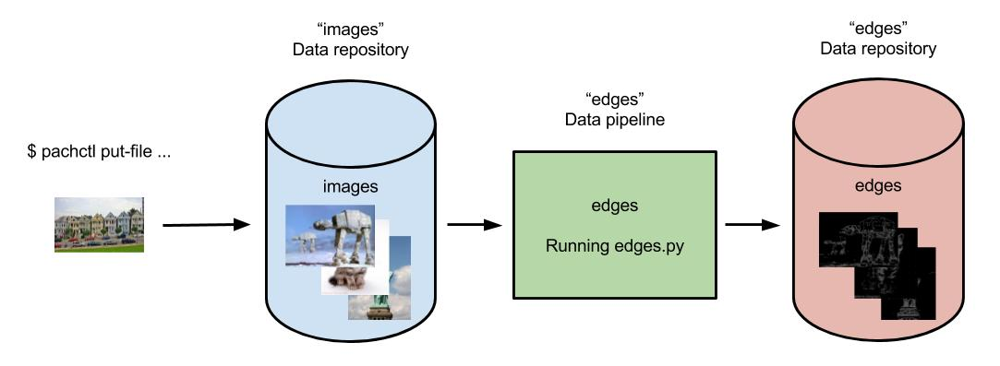

# Getting Data Out of Pachyderm

Once you've got one or more pipelines built and have data flowing through Pachyderm, you need to be able to track that data flowing through your pipeline(s) and get results out of Pachyderm. Let's use the [OpenCV pipeline](../getting_started/beginner_tutorial.html) as an example. 

Here's what our pipeline and the corresponding data repositories look like:



Every commit of new images into the "images" data repository results in a corresponding output commit of results into the "edges" data repository. But how do we get our results out of Pachyderm?  Moreover, how would we get the particular result corresponding to a particular input image?  That's what we will explore here.

## Getting files with `pachctl`

The `pachctl` CLI tool [command `get-file`](../pachctl/pachctl_get-file.html) can be used to get versioned data out of any data repository:

```sh
pachctl get-file <repo> <commit-id or branch> path/to/file
```

In the case of the OpenCV pipeline, we could get out an image named `example_pic.jpg`:

```sh
pachctl get-file edges master example_pic.jpg
```

But how do we know which files to get?  Of course we can use the `pachctl list-file` command to see what files are available.  But how do we know which results are the latest, came from certain input, etc.?  In this case, we would like to know which edge detected images in the `edges` repo come from which input images in the `images` repo.  This is where provenance and the `flush-commit` command come in handy.

## Examining file provenance with flush-commit 

Generally, `flush-commit` will let our process block on an input commit until all of the output results are ready to read. In other words, `flush-commit` lets you view a consistent global snapshot of all your data at a given commit. Note, we are just going to cover a few aspects of `flush-commit` here. 

Let's demonstrate a typical workflow using `flush-commit`. First, we'll make a few commits of data into the `images` repo on the `master` branch.  That will then trigger our `edges` pipeline and generate three output commits in our `edges` repo:

```sh
$ pachctl list-commit images
REPO                ID                                 PARENT                             STARTED              DURATION             SIZE                
images              c721c4bb9a8046f3a7319ed97d256bb9   a9678d2a439648c59636688945f3c6b5   About a minute ago   1 seconds            932.2 KiB           
images              a9678d2a439648c59636688945f3c6b5   87f5266ef44f4510a7c5e046d77984a6   About a minute ago   Less than a second   238.3 KiB           
images              87f5266ef44f4510a7c5e046d77984a6   <none>                             10 minutes ago       Less than a second   57.27 KiB           
$ pachctl list-commit edges
REPO                ID                                 PARENT                             STARTED              DURATION             SIZE                
edges               f716eabf95854be285c3ef23570bd836   026536b547a44a8daa2db9d25bf88b79   About a minute ago   Less than a second   233.7 KiB           
edges               026536b547a44a8daa2db9d25bf88b79   754542b89c1c47a5b657e60381c06c71   About a minute ago   Less than a second   133.6 KiB           
edges               754542b89c1c47a5b657e60381c06c71   <none>                             2 minutes ago        Less than a second   22.22 KiB
```

In this case, we have one output commit per input commit on `images`.  However, this might get more complicated for pipelines with multiple branches, multiple input atoms, etc.  To confirm which commits correspond to which outputs, we can use `flush-commit`.  In particular, we can call `flush-commit` on any one of our commits into `images` to see which output came from this particular commmit:

```sh
$ pachctl flush-commit images/a9678d2a439648c59636688945f3c6b5
REPO                ID                                 PARENT                             STARTED             DURATION             SIZE                
edges               026536b547a44a8daa2db9d25bf88b79   754542b89c1c47a5b657e60381c06c71   3 minutes ago       Less than a second   133.6 KiB
```

## Exporting data via `egress`

In addition to getting data out of Pachyderm with `pachctl get-file`, you can add an optional `egress` field to your [pipeline specification](../reference/pipeline_spec.html).  `egress` allows you to push the results of a Pipeline to an external data store such as S3, Google Cloud Storage or Azure Blob Storage. Data will be pushed after the user code has finished running but before the job is marked as successful.

## Other ways to view, interact with, or export data in Pachyderm

Although `pachctl` and `output` provide easy ways to interact with data in Pachyderm repos, they are by no means the only ways.  For example, you can:

- Have one or more of your pipeline stages connect and export data to databases running outside of Pachyderm.
- Use a Pachyderm service to launch a long running service, like Jupyter, that has access to internal Pachyderm data and can be accessed externally via a specified port.
- Mount versioned data from the distributed file system via `pachctl mount ...` (a feature best suited for experimentation and testing).
