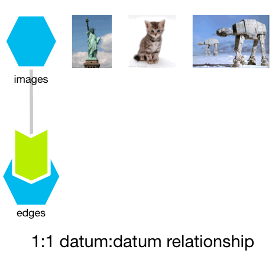
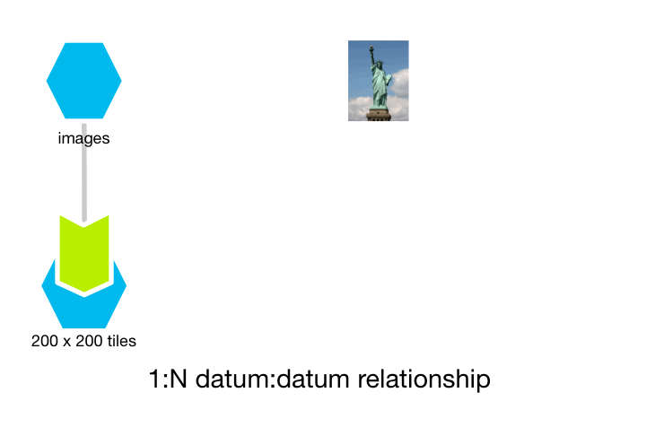
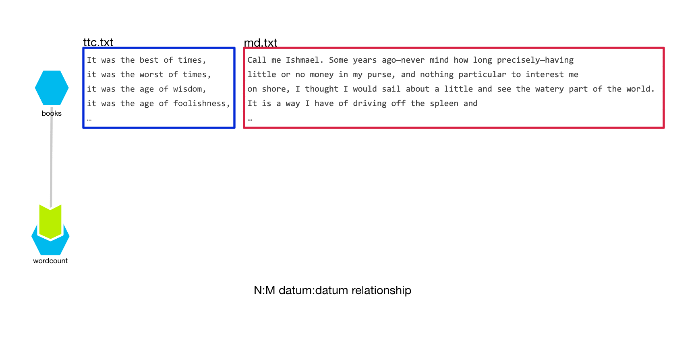
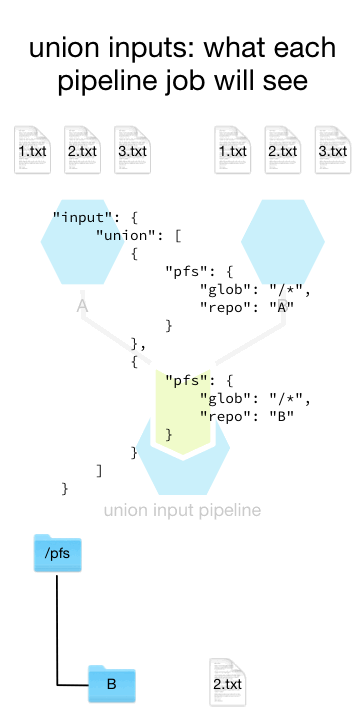
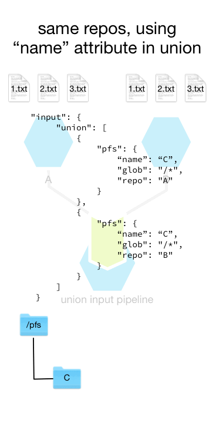

Lifecycle of a Datum
====================

Introduction
------------

Pachyderm’s idea of a “datum” in the context of parallel processing has
subtle implications for how data is written to output files. It’s
important to understand under what conditions data will be overwritten
or merged in output files.

There are four basic rules to how Pachyderm will process your data in
the pipelines you create.

-  Pachyderm will split your input into individual datums `as you
   specified <./reference/pipeline_spec.html#the-input-glob-pattern>`__
   in your pipeline spec
-  each datum will be processed independently, using `the parallelism
   you
   specified <../reference/pipeline_spec.html#parallelism-spec-optional>`__
   in your pipeline spec, with no guarantee of the order of processing
-  Pachyderm will merge the output of each pod into each output file,
   with no guarantee of ordering
-  the output files will look as if everything was done in one
   processing step

| If one of your pipelines is written to take all its input, whatever it
  may be, process it, and put the output into one file, the final output
  will be one file.
| The many datums in your pipeline’s input would become one file at the
  end, with the processing of every datum reflected in that file.

If you write a pipeline to write to multiple files, each of those files
may contained merged data that looks as if it were all processed in one
step, even if you would have specified the pipeline to process each
datum in one container via a ``parallelism_spec`` set to the default
value of 1.

This sounds a little complicated, but it breaks down simply into three
distinct relationships between the datums in your pipeline’s input
repository and in its output repository. We’ll list them, and then go
into them in detail, pointing to examples that illustrate them.

-  1 to 1: 1 unique datum in to 1 unique datum out
-  1 to many: 1 unique datum in to many unique datums out
-  Many to many: many unique datums in map to many datums out.

1:1
^^^

The best example of this is the `opencv example and beginner’s tutorial <./getting_started/beginner_tutorial.html>`__.

One datum,
in this case an image,
is transformed into another datum,
in this case, another image.

1:many or 1:N
^^^^^^^^^^^^^

A good example of this is a pipeline designed to split an image into many tiles for further analysis,
an easy extension of the `opencv example <https://pachyderm.readthedocs.io/en/stable/getting_started/beginner_tutorial.html>`__,
left as an exercise for you.
Each tile is unique in the output by necessity;
you can’t have one image stomping on another image’s tile!

    
Many:Many or N:M
^^^^^^^^^^^^^^^^

This is the most general case of a Pachyderm pipeline:
it takes many unique datums in and may write to many output files for each one.
Those output files may not be unique across datums.
That means that the results from processing many datums may be represented in a single file.
One of the things Pachyderm does is merge all those results into the single file for you.
This is what “merging” in the output from ``pachctl list-jobs`` means.

To visualize what the many-to-many case looks like,
we’ll use the `wordcount <https://github.com/pachyderm/pachyderm/tree/master/examples/word_count>`__  example.
(We’ll also use a version of `wordcount <https://github.com/pachyderm/pachyderm/tree/master/examples/word_count>`__  later on in this document.)
The illustration below shows what this might look like in action
by showing a subset of the wordcount pipeline’s output datums.
In this example,
after processing the first paragraph of each book,
*Moby Dick* (``md.txt``) and *A Tale of Two Cities* (``ttc.txt``),
we show ten example output wordcount files.

The words ``was``,
``best``,
``worst``,
``wisdom``,
and ``foolishness`` are unique to *A Tale of Two Cities* and
thus each eponymous file solely contains output from processing ``ttc.txt``.

The words ``Ishmael`` and ``money`` are unique to *Moby Dick*,
thus the files each solely contain output from processing ``md.txt``.

The files ``it``,
``the``,
and ``of`` are not unique to each text.
The pipeline will output to the word file in each container
and Pachyderm will handle merging the results,
as shown in the image.

.. important:: The order of results isn’t guaranteed.

The Pachyderm Pipeline System works with the Pachyderm File System to make sure
that files output by each pipeline are merged successfully
at the end of every commit.

Cross and union inputs
----------------------

When creating pipelines,
you can use “union” and “cross” operations to combine inputs.

`Union
input <http://docs.pachyderm.io/en/latest/reference/pipeline_spec.html#union-input>`__
will combine each of the datums in the input repos as one set of datums.
The result is that the number of datums processed is the sum of all the
datums in each repo.

For example, let’s say you have two input repos, A and B. Each of them
contain three files with the same names: 1.txt,
2.txt, and 3.txt. Each file hashes
differently, because each of the files contains different content,
despite the identical filenames. If you were to cross them in a
pipeline, the “input” object in the pipeline spec might look like this.

::

     "input": {
         "union": [
             {
                 "pfs": {
                     "glob": "/*",
                     "repo": "A"
                 }
             },
             {
                 "pfs": {
                     "glob": "/*",
                     "repo": "B"
                 }
             }
         ]
     }

If each repo had those three files at the top, there would be six (6)
datums overall, which is the sum of the number of input files. You’d see
the following datums, in a random order, in your pipeline as it ran
though them.

::

   /pfs/A/1.txt

   /pfs/A/2.txt

   /pfs/A/3.txt

   /pfs/B/1.txt

   /pfs/B/2.txt

   /pfs/B/3.txt

This is shown in the animation below.
Remember that the order in which the datums will be processed is not guaranteed;
we'll show them in a random order.

One of the ways you can make your code simpler is to use the ``name``
field for the ``pfs`` object and give each of those repos the same name.

::

     "input": {
         "union": [
             {
                 "pfs": {
                     "name": "C",
                     "glob": "/*",
                     "repo": "A"
                 }
             },
             {
                 "pfs": {
                     "name": "C",
                     "glob": "/*",
                     "repo": "B"
                 }
             }
         ]
     }

You’d still see the same six datums, in a random order, in your pipeline
as it ran though them, but they’d all be in a directory with the same
name: C.

::

   /pfs/C/1.txt  # from A

   /pfs/C/2.txt  # from A

   /pfs/C/3.txt  # from A

   /pfs/C/1.txt  # from B

   /pfs/C/2.txt  # from B

   /pfs/C/3.txt  # from B

This is shown in the animation below.
Remember that the order in which the datums will be processed is not guaranteed,
so we show them in a random order.
We also highlight the input file at the top of the image,
so it’s easier to understand when a file from a particular repo is being processed.

`Cross input <http://docs.pachyderm.io/en/latest/reference/pipeline_spec.html#cross-input>`__
is a cross-product of all the datums,
selected by the globs on the repos you’re crossing.
It provides a combination of all the datums to the pipeline that uses it as input,
treating each combination as a datum.

There are many examples that show the power of this operator:
`Combining/Merging/Joining Data <http://docs.pachyderm.io/en/latest/cookbook/combining.html#combining-merging-joining-data>`__
cookbook and
the `Distributed hyperparameter tuning <https://github.com/pachyderm/pachyderm/tree/master/examples/ml/hyperparameter>`__
example are good ones.

It’s important to remember that paths in your input repo will be
preserved and prefixed by the repo name to prevent collisions between
identically-named files. For example, let’s take those same two input
repos, A and B, each of which with the same files as above. If you were
to cross them in a pipeline, the “input” object in the pipeline spec
might look like this

::

     "input": {
         "cross": [
             {
                 "pfs": {
                     "glob": "/*",
                     "repo": "A"
                 }
             },
             {
                 "pfs": {
                     "glob": "/*",
                     "repo": "B"
                 }
             }
         ]
     }

In the case of cross inputs, you can’t give the repos being crossed
identical names, because of that need to avoid name collisions. If each
repo had those three files at the top, there would be nine (9) datums
overall, which is every permutation of the input files. You’d see the
following datums, in a random order, in your pipeline as it ran though
the nine permutations.

::

   /pfs/A/1.txt
   /pfs/B/1.txt

   /pfs/A/2.txt
   /pfs/B/1.txt

   /pfs/A/3.txt
   /pfs/B/1.txt

   /pfs/A/1.txt
   /pfs/B/2.txt

   /pfs/A/2.txt
   /pfs/B/2.txt

   /pfs/A/3.txt
   /pfs/B/2.txt

   /pfs/A/1.txt
   /pfs/B/3.txt

   /pfs/A/1.txt
   /pfs/B/2.txt

   /pfs/A/1.txt
   /pfs/B/3.txt

.. important:: You (or your code) will always see *both* input directories involved in the cross!

Output repositories
-------------------

Every Pachyderm pipeline has an output repository associated with it,
with the same name as the pipeline. `For
example <../getting_started/beginner_tutorial.html>`__, an “edges”
pipeline would have an “edges” repository you can use as input to other
pipelines, like a “montage” pipeline.

Your code, regardless of the pipeline you put it in, should place data
in a filesystem mounted under “/pfs/out” and it will appear in the named
repository for the current pipeline.

Appending vs overwriting data in output repositories
^^^^^^^^^^^^^^^^^^^^^^^^^^^^^^^^^^^^^^^^^^^^^^^^^^^^

The Pachyderm File System keeps track of which datums are being
processed in which containers, and makes sure that each datum leaves its
unique data in output files. Let’s say you have a simple pipeline,
“`wordcount <https://github.com/pachyderm/pachyderm/tree/master/examples/word_count>`__”,
that counts references to words in documents by writing the number of
occurrences of a word to an output file named for each word in
``/pfs/out``, followed by a newline. We intend to process the data by
treating each input file as a datum. We specify the glob in the
“wordcount” pipeline json accordingly, something like ``"glob": "/*"``.
We load a file containing the first paragraph of Charles Dickens’s “A
Tale of Two Cities” into our input repo, but mistakenly just put the
first four lines in the file ``ttc.txt``.

::

   It was the best of times,
   it was the worst of times,
   it was the age of wisdom,
   it was the age of foolishness,

In this case, after the pipeline runs on this single datum, ``/pfs/out``
would contain the files

::
   
   it -> 4\n
   was -> 4\n
   the -> 4\n
   best -> 1\n
   worst -> 1\n
   of -> 4\n
   times -> 2\n
   age -> 2\n
   wisdom -> 1\n
   foolishness -> 1\n

Where ``\n`` is the newline appended by our “wordcount” code
after it outputs the word count. If we were to fix ``ttc.txt``, either
by appending the missing text or replacing it with the entire first
paragraph using ``pachctl put-file`` with the ``--overwrite`` flag, the
file would then look like this

::

   It was the best of times,
   it was the worst of times,
   it was the age of wisdom,
   it was the age of foolishness,
   it was the epoch of belief,
   it was the epoch of incredulity,
   it was the season of Light,
   it was the season of Darkness,
   it was the spring of hope,
   it was the winter of despair,
   we had everything before us,
   we had nothing before us,
   we were all going direct to Heaven,
   we were all going direct the other way--
   in short, the period was so far like the present period, that some of
   its noisiest authorities insisted on its being received, for good or for
   evil, in the superlative degree of comparison only.

We would see each file in the “wordcount” repo overwritten with one line
with an updated number. Using our existing examples, we’d see a few of
the files replaced with new content

::

   it -> 10\n
   was -> 10\n
   the -> 14\n
   best -> 1\n
   worst -> 1\n
   of -> 4\n
   times -> 2\n
   age -> 2\n
   wisdom -> 1\n
   foolishness -> 1\n

The reason that the entire file gets reprocessed, even if we just append
to it, is because the entire file is the datum. We haven’t used the
``--split`` flag combined with the appropriate glob to split it into
lots of datums.

What if we put other texts in the pipeline's input repo?
Such as the first paragraph of Herman Melville’s Moby Dick, put into "md.txt".

::
   
   Call me Ishmael. Some years ago—never mind how long precisely—having
   little or no money in my purse, and nothing particular to interest me
   on shore, I thought I would sail about a little and see the watery part of the world. 
   It is a way I have of driving off the spleen and
   regulating the circulation. Whenever I find myself growing grim about
   the mouth; whenever it is a damp, drizzly November in my soul; whenever
   I find myself involuntarily pausing before coffin warehouses, and
   bringing up the rear of every funeral I meet; and especially whenever
   my hypos get such an upper hand of me, that it requires a strong moral
   principle to prevent me from deliberately stepping into the street, and
   methodically knocking people's hats off—then, I account it high time to
   get to sea as soon as I can. This is my substitute for pistol and ball.
   With a philosophical flourish Cato throws himself upon his sword; I
   quietly take to the ship. There is nothing surprising in this. If they
   but knew it , almost all men in their degree, some time or other,
   cherish very nearly the same feelings towards the ocean with me.

What happens to our word files?
Will they *all* get overwritten?
Not as long as each input file
–\ ``ttc.txt`` and ``md.txt``–
is being treated as a separate datum.
Only files that contain words that are common between the text will change,
because only the added datum will get processed.

You’ll see the data in the “wordcount” repo looking something like this:

::
   
   it -> 10\n5\n
   was -> 10\n
   the -> 14\n7\n
   best -> 1\n
   worst -> 1\n
   of -> 4\n4\n
   times -> 2\n
   age -> 2\n
   wisdom -> 1\n
   foolishness -> 1\n

During each job that is run,
each distinct datum in Pachyderm will put data in an output file.
If the file shares a name with the files from other datums,
the previously-computed output from each other datum is merged with the new output after processing the new datum.
This will happen during the appropriately-named *merge* stage after your pipeline runs.
You should not count on the data appearing in a particular order.
Before that merge occurs,
when your pipeline code is running,
you shouldn't expect an output file in the pipeline's repo have any other data in it
other than the data from processing that single datum.
You won’t see it in the output file
until all datums have been processed
and the merge is complete,
after that pipeline and the commit is finished.

What happens if we delete ``md.txt``? The “wordcount” repo would go back
to its condition with just ``ttc.txt``.

::

   it -> 10\n
   was -> 10\n
   the -> 14\n
   best -> 1\n
   worst -> 1\n
   of -> 4\n
   times -> 2\n
   age -> 2\n
   wisdom -> 1\n
   foolishness -> 1\n

What if didn’t delete ``md.txt``; we appended to it? Then we’d see the
appropriate counts change only on the lines of the files affected by
``md.txt``; the counts for ``ttc.txt`` would not change. Let’s say we
append the second paragraph to ``md.txt``:

::

   There now is your insular city of the Manhattoes, belted round by
   wharves as Indian isles by coral reefs—commerce surrounds it with her
   surf. Right and left, the streets take you waterward. Its extreme
   downtown is the battery, where that noble mole is washed by waves, and
   cooled by breezes, which a few hours previous were out of sight of
   land. Look at the crowds of water-gazers there.

The “wordcount” repo might now look like this. (We’re not using stemmed
parser, and “it” is a different word than “its”)

::

   it -> 10\n6\n
   was -> 10\n
   the -> 14\n11\n
   best -> 1\n
   worst -> 1\n
   of -> 4\n8\n
   times -> 2\n
   age -> 2\n
   wisdom -> 1\n
   foolishness -> 1\n

Pachyderm is smart enough to keep track of what changes to what datums
affect what downstream results, and only reprocesses and re-merges as
needed.

Summary
-------

To summarize,

-  Your output datums should always reflect the state of processing all the input datums in your HEAD commit,
   independent of whether those input datums were added in separate commits or
   all added at once.
-  If your downstream pipeline processes multiple input datums, putting
   the result a single file, adding or removing an input datum will only
   remove its effect from that file. The effect of the other datums will
   still be seen in that file.

You can see this in action in the `word count example <https://github.com/pachyderm/pachyderm/tree/master/examples/word_count>`__
in the Pachyderm git repo.

                                    

