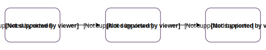
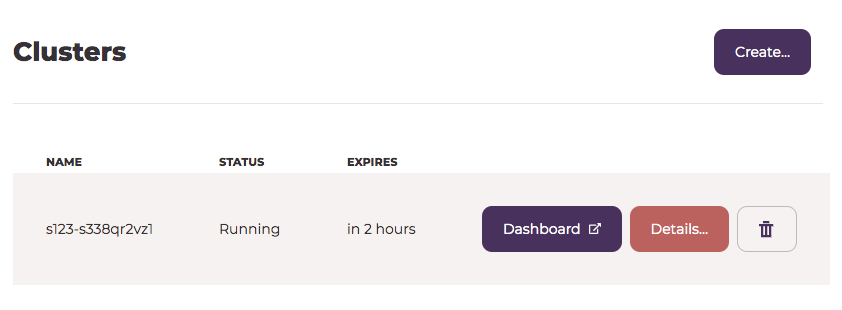

# Getting Started with Pachyderm Hub

Pachyderm Hub is a platform for data scientists where you can run
your analysis pipelines, control versions, and
track provenance of your data.

This section walks you through
the steps of creating a cluster in Pachyderm Hub so that
you do not need to worry about the underlying infrastructure
and get started using Pachyderm right away.

<!--Follow the steps below to configure your first Pachyderm pipeline or
watch the 2-minute [Getting Started Screencast](../tutorials/screencast-opencv.html).-->

**Note:** Pachyderm Hub enables you to preview Pachyderm functionality
free of charge by removing the burden of deploying Pachyderm locally
or in a third-party cloud platform. Currently, Pachyderm Hub clusters
cannot be turned into production clusters. This functionality might be
supported in later releases.

## How it Works

To get started, complete the following steps:



## Log in

Pachyderm Hub uses GitHub OAuth as an identity provider. Therefore,
to start using Pachyderm Hub, you need to log in by authorizing
Pachyderm Hub with your GitHub account. If you do not
have a GitHub account yet, create one by following the steps described
in [Join GitHub](https://github.com/join).

To log in to Pachyderm Hub, complete the following steps:

1. Go to [hub.pachyderm.io.com](https://hub.pachyderm.io).
1. Click **Try for free**.
1. Authorize Pachyderm Hub with your GitHub account by typing your
   GitHub user name and password.
1. Proceed to [Step 1](#step-1-create-a-cluster).

## Step 1: Create a Cluster

To get started, create a Pachyderm cluster on which your pipelines will run.
A Pachyderm cluster runs on top of the underlying cloud infrastructure.
In Pachyderm Hub, you can create a one-node cluster that you can use for
a limited time.

To create a Pachyderm cluster, complete the following steps:

1. If you have not yet done so, log in to Pachyderm Hub.
1. Click **Create**.
1. Type a name for your cluster. For example, `test1`.
1. Click **Create**.

   Your cluster is provisioned instantly!

   

1. Proceed to [Step 2](#step-2-connect-to-your-cluster).

## Step 2 - Connect to Your Cluster

Pachyderm Hub enables you to access your cluster through a command-line
interface (CLI) called `pachctl` and the web interface called the Dashboard.
Although you can try simple configurations in the dashboard, `pachctl`
provides extended functionality. The Pachyderm team
recommends that you use `pachctl` for all data operations and
the dashboard to view graphical representations of your Direct Acyclic
Graph (DAG).

After you create a cluster, you need to go to the terminal on your computer
and configure your CLI to connect to your cluster by installing `pachctl`
and configuring your Pachyderm context. For more information about
Pachyderm contexts, see [Connect by using a Pachyderm Context](https://docs.pachyderm.io/en/latest/deployment/connect-to-cluster.html#connect-by-using-a-pachyderm-context).

Your `pachctl` version must match the version of the Pachyderm cluster that
you deployed on Pachyderm Hub. For example, if you deployed Pachyderm version
`1.9.5`, your `pachctl` version must be `1.9.5` as well.

To set the correct Pachyderm context, you need to use the IP address
of your cluster that is available in the Pachyderm Hub UI.

**Note:** `kubectl` commands are not supported for the clusters deployed
on Pachyderm Hub.

To connect to your cluster, complete the following steps:

1. On your local computer, open a terminal window.
1. Install `pachctl` for your platform. For example, if you are using
   macOS, run:

   ```bash
   $ brew tap pachyderm/tap && brew install pachyderm/tap/pachctl@1.9
   ```

   If you are using another operating system, see
   [Install `pachctl`](../getting_started/local_installation.html#install-pachctl).

   * If you already have `pachctl` installed, skip this step, or you
   might need to update your version of `pachctl`. For example, if you use
   macOS and `brew`, run:

   ```bash
   $ brew upgrade pachyderm/tap/pachctl@1.9
   ```

1. Verify your `pachctl` version:

   ```bash
   $ pachctl version --client-only
   1.9.5
   ```

1. Configure a Pachyderm context:

   1. In the Pachyderm Hub UI, click **Details** next to your cluster.
   1. Copy the IP address and protocol of your cluster.
   1. In your terminal window, create a new Pachyderm context with the
      IP address of your cluster:

      ```bash
      $ echo '{"pachd_address": "cluster-ip"}' | pachctl config set context <cluster-name>
      ```

      **Example:**

      ```bash
      $ echo '{"pachd_address": "35.222.12.28:30650"}' | pachctl config set context s123
      ```

   1. Set the active context to the context you have configured in
      the previous step:

      ```bash
      $ pachctl config set active-context <context-name>
      ```

      **Example:**

      ```bash
      $ pachctl config set active-context s123
      ```

   1. Verify that you have set the correct context:

      ```bash
      $ pachctl config get active-context
      ```

1. Log in to your Pachyderm cluster:

   1. Go to the Pachyderm Hub UI.
   1. In the list of clusters, click **Dashboard**.
      Pachyderm Hub opens the Dashboard in a new window.

   1. Click **Generate New One-Time Password Now**.
   1. Copy the authentication code:

      ```
      auth_code:<xxxxxxxxxxxxxxxxxxxxxxxxxxxxxx>
      ```

   1. In your terminal window, run the `pachctl auth login` command:

      ```bash
      $ pachctl auth login --one-time-password
      Please enter your Pachyderm One-Time Password:
      ```

   1. Paste the auth token:

      ```bash
      auth_code:<xxxxxxxxxxxxxxxxxxxxxxxxxxxxxx>
      ```

      **Example:**

      ```bash
      auth_code:3b8c208f24204a1fb2205af5c24e5edd
      ```

1. Verify that you can run `pachctl` commands for your cluster:

   1. Create a repo called `test`:

      ```bash
      $ pachctl create repo test
      ```

   1. Verify that the repo was created:

      ```bash
      $ pachctl list repo
      NAME   CREATED       SIZE (MASTER) ACCESS LEVEL
      test   3 seconds ago 0B            OWNER
      ```

   1. Go to the dashboard and verify that you can see the repo in the
      dashboard:

      

## Next Steps

Congratulations! You have successfully deployed and configured a Pachyderm
cluster in Pachyderm Hub. Now, you can try out our Beginners tutorial that walks
you through the Pachyderm basics.

* [Beginner Tutorial](../getting_started/beginner_tutorial.html)
