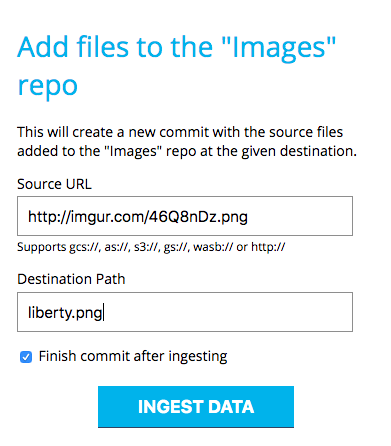
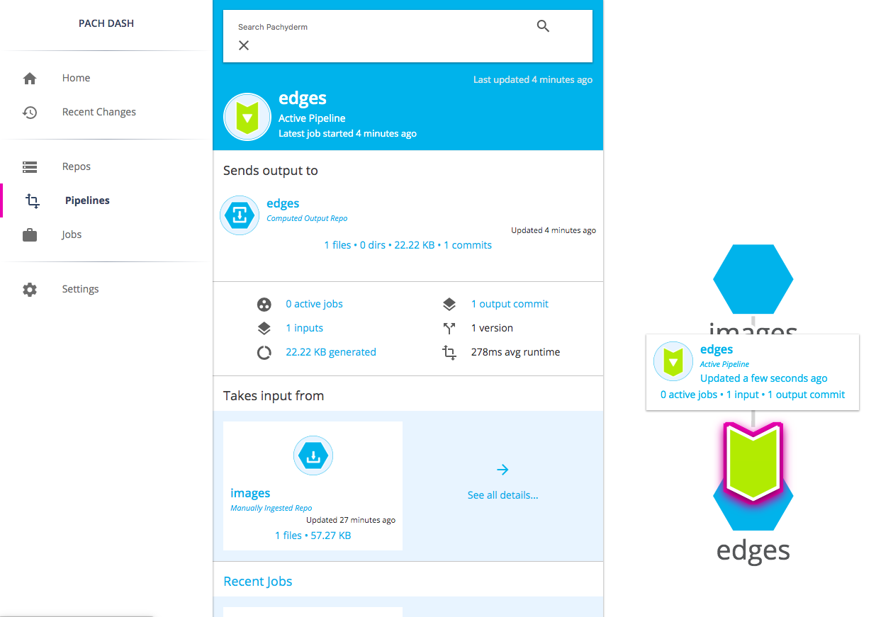

<!--
## Step 2: Create a Repository

 The Pachyderm Dashboard is the user interface in which you can create and
 manage your repositories and pipelines.

 A Pachyderm repository is a place where you upload your data for further
 processing. You can upload data from any object store, such as an Amazon®
 S3 bucket, Google® Cloud Platform, or Azure® Blob Storage.

 To create a repository, complete the following steps:

 1. In the bottom right corner, click **+**.
 1. Select **Create Repo**.
 1. In the **Repository name**, type the name of your repo. For example,
 *Images*.
 1. Proceed to [Step3](#step-3-load-your-data).

 ## Step 3: Load Your Data

 You can load data from all major object stores as there as hosted locations
 by using HTTP. The following protocols are supported:

 | Object Store/Protocol       | Syntax    |
 | --------------------------- | --------- |
 | Azure Blob Storage          | `as://`   |
 | Amazon S3                   | `s3://`   |
 | Google Cloud Storage        | `gs://`   |
 | Windows Azure Storage Blob  | `wasb://` |
 | HyperText Transfer Protocol | `http://` |

 To load your data into PacHub, complete the following steps:

 1. Click **Repos**.
 1. Select the repository that you have created in previous step.
 For example, *Images*.
 1. Click **Ingest Data**.
 1. In the **Source URL** field, paste a URL to your files that
 are stored in an object store or a web location.
 For example, `http://imgur.com/46Q8nDz.png`.
 1. In the **Destination Path**, type the filepath for the data
 to be uploaded. For example, to place a file in the
 root directory, type the name of the file, such as *liberty.png*. 

    

 1. Click **Ingest Data**.
 1. Check that your data has been successfully ingested by exploring the
 repo:

    

 1. Proceed to [Step 4](#step-4-create-a-pipeline).

 ## Step 4: Create a Pipeline

 An analysis pipeline runs your code that performs transformation with your
 data, such as trains your machine learning (ML) model, processes images,
 and others. You can write your code in any language of choice. In PacHub,
 you can create a pipeline either by using the
 pipeline form or by uploading a configuration file in the JSON format.

 For the image detection example, use this JSON file:

 ```json
 # edges.json
 {
   "pipeline": {
     "name": "edges"
   },
   "transform": {
     "cmd": [ "python3", "/edges.py" ],
     "image": "pachyderm/opencv"
   },
   "input": {
     "pfs": {
       "repo": "images",
       "glob": "/*"
     }
   }
 }
 ```

 The pipeline configuration above creates the `edges` pipeline that
 takes the image file that you have uploaded in [Step 2](#),
 applies the transformation code from the `edges.py` script provided
 within the specified Docker image, and uploads the result to the
 output repository by the same name as the pipeline—`edges`.
 PacHub creates this output repository automatically.

 ### Create a Pipeline from a Spec:

 1. Click **Create Pipeline from Spec**.
 1. Paste the `edges.json` code and click **Save**.


    You should now see the `edges` pipeline in the **Pipelines**
    section of the UI.

    

 ### Create a Pipeline by Using a Form

 I was NOT able to make this work.

 1. Type the pipeline name. For the edge detection example, type `edges`.
 1. Type the Docker image for your pipeline. For the edge detection example,
 type `pachyderm/opencv`
 1. Click **Continue**.
 1. Click **+** to create a new input data source.
 1. Select **Pachyderm Repo**.
 1. Type the Source Repo. For the edge detection example, type *Images*.
 1. Click **Continue**. -->

