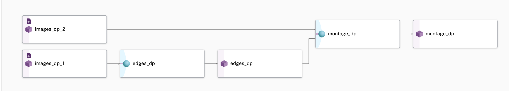
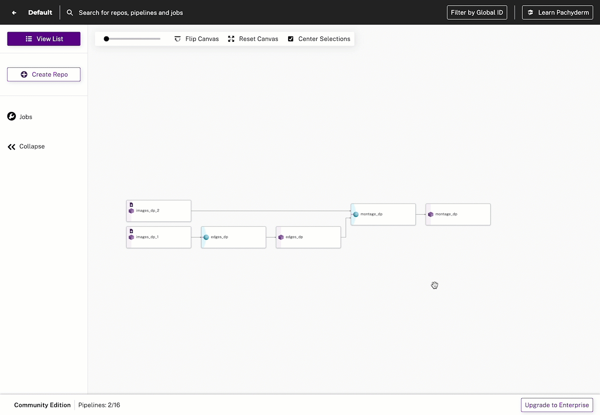

>  INFO Pachyderm 2.0 introduces profound architectual changes
> to the product. As a result, our examples pre and post 2.0 are kept in two separate branches:
>
> - Branch Master: Examples using Pachyderm 2.0 and later versions -
  > https://github.com/pachyderm/pachyderm/tree/master/examples
> - Branch 1.13.x: Examples using Pachyderm 1.13 and older versions -
  > https://github.com/pachyderm/pachyderm/tree/1.13.x/examples

# How to Use Deferred Processing With Transactions

Use [deferred processing](https://docs.pachyderm.com/latest/how-tos/deferred-processing/) to control
exactly _when_ data gets processed -- then, batch multiple operations (such as commits) using
[transactions]((https://docs.pachyderm.com/latest/how-tos/use-transactions-to-run-multiple-commands/))
to ensure that you trigger only a _single_ job so that the data from both repos gets processed
together.

## About This Example

In this example, we'll expand upon a previous example
([OpenCV](https://github.com/pachyderm/pachyderm/tree/master/examples/opencv)), which illustrates
two usage patterns for fine-grain control over pipeline job triggering.

### Quick Recap

In the OpenCV Example:

- Input images were stored in the `images` repository
- Input images were processed (traced) in the `edges` pipeline
- Output images (traces) were stored in the `edges` output repository

---

## Start Here

The following diagram demonstrates the DAG that is used in this example and can be found in the
Console UI:



The DAG shown extends upon the OpenCV example by adding:

- Suffixes to avoid collisions and denote these components utilize deferred processing
- Updates to the `edges_dp` pipeline spec:
  - The `output_branch` attribute was changed from `master` to `dev`
  - A `name` field was added to the `input` to avoid code changes
- A second `images_dp_2` input repository that does not go through edge detection
- Updates to the `montage_dp` pipeline spec where the montage uses images from the master branches
  of both `images_dp_1` and `images_dp_2`

Since `montage_dp` is subscribed to the **master** branch of `edges_dp`, jobs will not trigger when
the `edges_dp` pipeline outputs files to the `dev` branch. Instead, to trigger a montage job, we can
simply create a `master` branch attached to any commit in `edges_dp` to trigger the pipeline.

This configuration enables you to verify the files being processed by visually inspecting the
montage.

### 1. Download Example Materials

1. Clone the Pachyderm repository:

   ```
   git clone git@github.com:pachyderm/pachyderm.git
   ```
2. Change the directory to examples/deferred-processing/deferred_processing_plus_transactions:

   ```
   cd examples/deferred-processing/deferred_processing_plus_transactions
   ```

### 2. Set Up Deferred Processing

1. Run `sh setup.sh`. This script executes the following commands:

   ```shell
   pachctl create repo images_dp_1
   pachctl create repo images_dp_2
   pachctl create pipeline -f ./edges_dp.pipeline.json
   pachctl create pipeline -f ./montage_dp.pipeline.json
   pachctl put file images_dp_1@master -i ./images.txt
   pachctl put file images_dp_1@master -i ./images2.txt
   pachctl put file images_dp_2@master -i ./images3.txt
   ```

2. Check the commits in `edges_dp`; note that they belong to the `dev` branch with the exception of
   the initializing master branch commit:

   ```shell
   $  pachctl list commits edges_dp

    REPO     BRANCH COMMIT                           FINISHED               SIZE       ORIGIN DESCRIPTION
    edges_dp dev    3bee6c5e327e4ade9603e349f8873385 -                      ≤ 22.22KiB AUTO
    edges_dp dev    d941bcb118004d2a85ca44ea670f9bae Less than a second ago 22.22KiB   AUTO
    edges_dp master 6df52e27e20d40769d92383d680a19f1 9 seconds ago          0B         AUTO
    edges_dp dev    aff6af7211b04355a24c25b111d35791 4 seconds ago          0B         AUTO
   ```

3. List the branches in `edges_dp`:

   ```shell
   $ pachctl list branches edges_dp

    BRANCH HEAD                             TRIGGER
    master 6df52e27e20d40769d92383d680a19f1 -
    dev    3bee6c5e327e4ade9603e349f8873385 -
   ```
   Note that the `head` value for the `dev` branch matches the most recently finished `commitId`
   listed in the previous step.

4. View the list of jobs:

   ```shell
   $ pachctl list jobs -x

   PIPELINE   ID                               STARTED       DURATION           RESTART PROGRESS  DL       UL       STATE
   edges_dp   3bee6c5e327e4ade9603e349f8873385 5 minutes ago 4 seconds          0       2 + 1 / 3 181.1KiB 111.4KiB success
   edges_dp   d941bcb118004d2a85ca44ea670f9bae 5 minutes ago 3 seconds          0       1 + 0 / 1 57.27KiB 22.22KiB success
   montage_dp 6df52e27e20d40769d92383d680a19f1 5 minutes ago Less than a second 0       0 + 0 / 0 0B       0B       success
   edges_dp   aff6af7211b04355a24c25b111d35791 5 minutes ago Less than a second 0       0 + 0 / 0 0B       0B       success
   ```

   The 2 most recent jobs reflected here are on the `dev` branch of `edges_dp` which contain the
   datums passed from `sh setup.sh`; the last two jobs initialized the empty pipelines (`montage_dp`
   and `edges_dp`).

5. Commit a file to `images_dp_1`:

   ```shell
   $ pachctl put file images_dp_1@master:1VqcWw9.jpg -f http://imgur.com/1VqcWw9.jpg
   ```

6. View the list of jobs again to confirm that only one job was triggered:

   ```shell
   $ pachctl list job -x

   PIPELINE   ID                               STARTED        DURATION           RESTART PROGRESS  DL       UL       STATE
   edges_dp   9cc38e9a00434c7ab6cb0b9296c057c5 3 seconds ago  -                  0       1 + 3 / 4 175.1KiB 92.18KiB finishing
   edges_dp   3bee6c5e327e4ade9603e349f8873385 11 minutes ago 4 seconds          0       2 + 1 / 3 181.1KiB 111.4KiB success
   edges_dp   d941bcb118004d2a85ca44ea670f9bae 11 minutes ago 3 seconds          0       1 + 0 / 1 57.27KiB 22.22KiB success
   montage_dp 6df52e27e20d40769d92383d680a19f1 11 minutes ago Less than a second 0       0 + 0 / 0 0B       0B       success
   edges_dp   aff6af7211b04355a24c25b111d35791 11 minutes ago Less than a second 0       0 + 0 / 0 0B       0B       success
   ```

7. Create a `master` branch for `montage_dp`, using the `dev` branch as its head:

   ```shell
   $ pachctl create branch edges_dp@master --head dev
   ```

8. List jobs to show that a job got triggered on `montage_dp`:

   ```shell
   $ pachctl list job -x

   PIPELINE   ID                               STARTED        DURATION           RESTART PROGRESS  DL       UL       STATE
   montage_dp 9cc38e9a00434c7ab6cb0b9296c057c5 14 seconds ago Less than a second 0       0 + 0 / 0 0B       0B       success
   edges_dp   9cc38e9a00434c7ab6cb0b9296c057c5 3 minutes ago  3 seconds          0       1 + 3 / 4 175.1KiB 92.18KiB success
   edges_dp   3bee6c5e327e4ade9603e349f8873385 14 minutes ago 4 seconds          0       2 + 1 / 3 181.1KiB 111.4KiB success
   edges_dp   d941bcb118004d2a85ca44ea670f9bae 14 minutes ago 3 seconds          0       1 + 0 / 1 57.27KiB 22.22KiB success
   montage_dp 6df52e27e20d40769d92383d680a19f1 14 minutes ago Less than a second 0       0 + 0 / 0 0B       0B       success
   edges_dp   aff6af7211b04355a24c25b111d35791 14 minutes ago Less than a second 0       0 + 0 / 0 0B       0B       success
   ```

9. Commit more data to `images_dp_1` to further demonstrate how jobs are triggered:

   ```shell
   $ pachctl put file images_dp_1@master:2GI70mb.jpg -f http://imgur.com/2GI70mb.jpg
   $ pachctl list job -x

   PIPELINE   ID                               STARTED        DURATION           RESTART PROGRESS  DL       UL       STATE
   edges_dp   368f7f5ee9e848219cb1aded39374037 1 second ago   -                  0       0 + 0 / 0 0B       0B       running
   montage_dp 9cc38e9a00434c7ab6cb0b9296c057c5 2 minutes ago  Less than a second 0       0 + 0 / 0 0B       0B       success
   edges_dp   9cc38e9a00434c7ab6cb0b9296c057c5 5 minutes ago  3 seconds          0       1 + 3 / 4 175.1KiB 92.18KiB success
   edges_dp   3bee6c5e327e4ade9603e349f8873385 16 minutes ago 4 seconds          0       2 + 1 / 3 181.1KiB 111.4KiB success
   edges_dp   d941bcb118004d2a85ca44ea670f9bae 16 minutes ago 3 seconds          0       1 + 0 / 1 57.27KiB 22.22KiB success
   montage_dp 6df52e27e20d40769d92383d680a19f1 16 minutes ago Less than a second 0       0 + 0 / 0 0B       0B       success
   edges_dp   aff6af7211b04355a24c25b111d35791 16 minutes ago Less than a second 0       0 + 0 / 0 0B       0B       success
   ```

10. Move the `master` branch in `edges_dp` to again point to the `dev` branch as its head
    (triggering another job):

    ```shell
    $ pachctl create branch edges_dp@master --head dev
    $ pachctl list job -x

    PIPELINE   ID                               STARTED        DURATION           RESTART PROGRESS  DL       UL       STATE
    montage_dp 368f7f5ee9e848219cb1aded39374037 5 seconds ago  Less than a second 0       0 + 0 / 0 0B       0B       success
    edges_dp   368f7f5ee9e848219cb1aded39374037 2 minutes ago  3 seconds          0       1 + 4 / 5 204KiB   18.89KiB success
    montage_dp 9cc38e9a00434c7ab6cb0b9296c057c5 4 minutes ago  Less than a second 0       0 + 0 / 0 0B       0B       success
    edges_dp   9cc38e9a00434c7ab6cb0b9296c057c5 8 minutes ago  3 seconds          0       1 + 3 / 4 175.1KiB 92.18KiB success
    edges_dp   3bee6c5e327e4ade9603e349f8873385 19 minutes ago 4 seconds          0       2 + 1 / 3 181.1KiB 111.4KiB success
    edges_dp   d941bcb118004d2a85ca44ea670f9bae 19 minutes ago 3 seconds          0       1 + 0 / 1 57.27KiB 22.22KiB success
    montage_dp 6df52e27e20d40769d92383d680a19f1 19 minutes ago Less than a second 0       0 + 0 / 0 0B       0B       success
    edges_dp   aff6af7211b04355a24c25b111d35791 19 minutes ago Less than a second 0       0 + 0 / 0 0B       0B       success
    ```

### 3. Set Up Transactions

After you test deferred processing, you can explore how transactions work in combination with
deferred processing.

> **Scenario**: You want to run a particular set of data in `images_dp_2` against a particular
> branch of `edges_dp` without triggering two jobs (one for the new commit, and one for moving
> `edges_dp@master`).

1. Start a transaction:

   ```shell
   $ pachctl start transaction
   Started new transaction: 11fbbcbd-6cda-42fa-b1fe-cd63b292582e
   ```

2. Start all commits:

   ```shell
   $ pachctl start commit  images_dp_2@master
   Added to transaction: 11fbbcbd-6cda-42fa-b1fe-cd63b292582e
   de55d4856e814c41a65836321fe672fa
   ```

3. Create `master` branch pointing to `--head dev`:
   ```
   $ pachctl create branch edges_dp@master --head dev
   Added to transaction: 11fbbcbd-6cda-42fa-b1fe-cd63b292582e
   ```
4. Finish the transaction to group all of the commits and branches together:
   ```shell
   $ pachctl finish transaction
   Completed transaction with 2 requests: 11fbbcbd-6cda-42fa-b1fe-cd63b292582e
   ```

5. Commit a file:

   ```shell
   $ pachctl put file images_dp_2@master:9iIlokw.jpg -f http://imgur.com/9iIlokw.jpg
   ```
6. List jobs:

   ```shell
   $ pachctl list jobs -x
   PIPELINE   ID                               STARTED        DURATION           RESTART PROGRESS  DL       UL       STATE
   montage_dp ea6501f31cae4f7c874ec5c94393188e -              -                  0       0 + 0 / 0 0B       0B       starting
   montage_dp 368f7f5ee9e848219cb1aded39374037 33 minutes ago Less than a second 0       0 + 0 / 0 0B       0B       success
   edges_dp   368f7f5ee9e848219cb1aded39374037 35 minutes ago 3 seconds          0       1 + 4 / 5 204KiB   18.89KiB success
   montage_dp 9cc38e9a00434c7ab6cb0b9296c057c5 37 minutes ago Less than a second 0       0 + 0 / 0 0B       0B       success
   edges_dp   9cc38e9a00434c7ab6cb0b9296c057c5 41 minutes ago 3 seconds          0       1 + 3 / 4 175.1KiB 92.18KiB success
   edges_dp   3bee6c5e327e4ade9603e349f8873385 52 minutes ago 4 seconds          0       2 + 1 / 3 181.1KiB 111.4KiB success
   edges_dp   d941bcb118004d2a85ca44ea670f9bae 52 minutes ago 3 seconds          0       1 + 0 / 1 57.27KiB 22.22KiB success
   montage_dp 6df52e27e20d40769d92383d680a19f1 52 minutes ago Less than a second 0       0 + 0 / 0 0B       0B       success
   edges_dp   aff6af7211b04355a24c25b111d35791 52 minutes ago Less than a second 0       0 + 0 / 0 0B       0B       success
   ```

7. Finish the commit that you started during the transaction to start the job:

   ```
   $ pachctl finish commit images_dp_2@master
   $ pachctl list job -x
   montage_dp ea6501f31cae4f7c874ec5c94393188e 3 seconds ago  -                  0       0 + 0 / 0 0B       0B       running
   montage_dp 368f7f5ee9e848219cb1aded39374037 33 minutes ago Less than a second 0       0 + 0 / 0 0B       0B       success
   edges_dp   368f7f5ee9e848219cb1aded39374037 36 minutes ago 3 seconds          0       1 + 4 / 5 204KiB   18.89KiB success
   montage_dp 9cc38e9a00434c7ab6cb0b9296c057c5 38 minutes ago Less than a second 0       0 + 0 / 0 0B       0B       success
   edges_dp   9cc38e9a00434c7ab6cb0b9296c057c5 41 minutes ago 3 seconds          0       1 + 3 / 4 175.1KiB 92.18KiB success
   edges_dp   3bee6c5e327e4ade9603e349f8873385 52 minutes ago 4 seconds          0       2 + 1 / 3 181.1KiB 111.4KiB success
   edges_dp   d941bcb118004d2a85ca44ea670f9bae 52 minutes ago 3 seconds          0       1 + 0 / 1 57.27KiB 22.22KiB success
   montage_dp 6df52e27e20d40769d92383d680a19f1 52 minutes ago Less than a second 0       0 + 0 / 0 0B       0B       success
   edges_dp   aff6af7211b04355a24c25b111d35791 52 minutes ago Less than a second 0       0 + 0 / 0 0B       0B       success
   ```
8. List Files in `montage_dp@master`:

   ```shell
   pachctl list files montage_dp@master

    NAME         TYPE SIZE
    /montage.png file 720.3KiB
   ```

### 4. View Output

You can preview the output through the Console UI:



## Summary

Deferred processing with transactions in Pachyderm will give you fine-grained control of jobs and
datums while preserving Pachyderm's advantages of data lineage and incremental processing.
