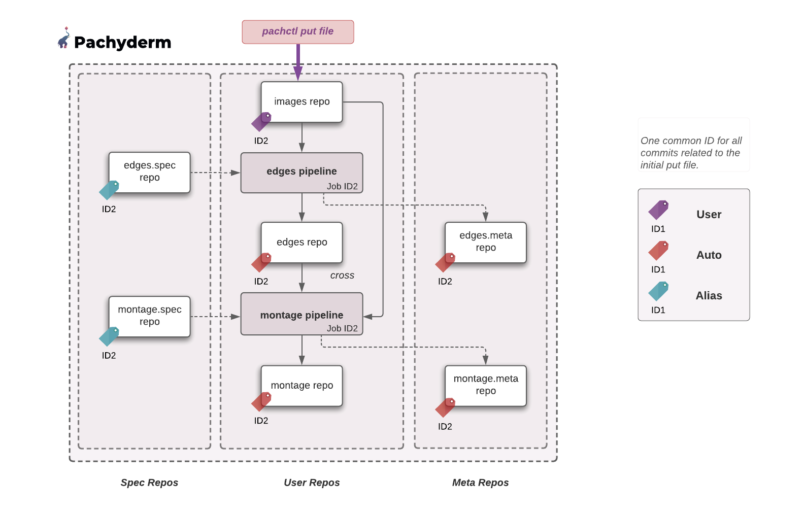
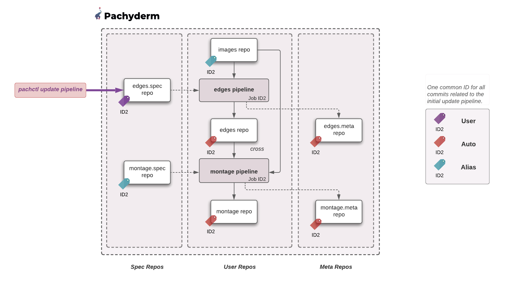
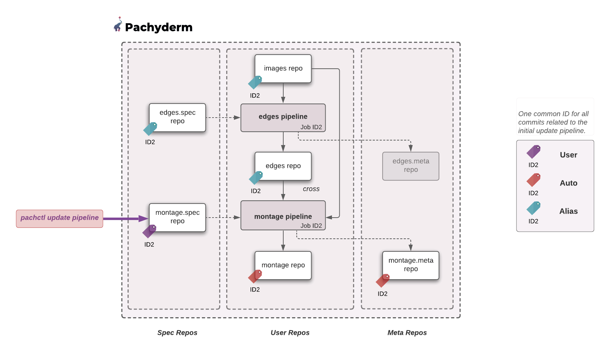

> INFO Pachyderm 2.0 introduces profound architectual changes to the product. As a result, our examples pre and post 2.0 are kept in two separate branches:
> - Branch Master: Examples using Pachyderm 2.0 and later versions - https://github.com/pachyderm/pachyderm/tree/master/examples
> - Branch 1.13.x: Examples using Pachyderm 1.13 and older versions - https://github.com/pachyderm/pachyderm/tree/1.13.x/examples

# Global ID - coming soon
> The Global Identifier is available in version **2.0 and higher**.

## Intro
Global ID can be seen as **a common TAG that marks all the commits and jobs created by your data-driven DAG when triggered by an initial change (a put file in a repo, an updated pipeline, a squash commit...)**. 

This example will walk you through 3 different user changes (put file, update pipeline edges, update pipeline montage) and illustrate how each of them affects the origin of the resulting commits.
The example is based on our openCV example.

## Getting ready
***Key concepts***
Note, as a reminder, that we have **3 types of repos**. 
Types other than `USER` indicate System Repos, which hold certain auxiliary information about pipelines. 

- `USER`: That keeps track of your data one commit at a time.
- `SPEC`: That keeps track of the pipeline's specification version used by a given job. 
- `META`: That holds the statistics of your transformation.

Each pipeline comes with one `SPEC` and one `META` repo. Every time a job commits the result of a transformation to a pipeline output commit, it also commits to the pipeline's meta repo. Deleting the output repo of a pipeline (which happens per default when deleting a pipeline) will also delete its `SPEC` and `META` repo.

`pachctl list repo --all` or `pachctl list repo --type=spec` will let you see all repos of all types or the spec system repo only respectively. By default, no flag will give you the list of all user repos.

Additionally, **commits have an "origin"**. You can see an origin as the answer to: **"What triggered the production of this commit"**. 
- `USER`: The commit is the result of a user change - This is the initial commit that will cascade into either one of the following:
- `AUTO`: the commit has been automatically triggered in your DAG's chain reaction by the arrival of an initial user commit.
- `ALIAS`: Neither `USER` nor `AUTO` - `ALIAS` commits are essentially empty commits. An `ALIAS` commit is a new global ID tag on a parent commit. 

Note that **every initial change is a `USER` change**.

Along with the introduction of GlobalID, we are introducing 2 new definitions:
- `commitset`: A commitset is the set of all commits (`USER`,`AUTO`, `ALIAS`) connected through provenance relationships. They share a common ID. Note that all jobs triggered by the initial `USER` commit ALSO share this same ID as jobID.
- `jobset`: Similarly, a jobset is the set of jobs created due to commits in a CommitSet. 

Find all these concepts in our documentation:

-[Repo](https://docs.pachyderm.com/latest/concepts/data-concepts/repo/)
-[Commit](https://docs.pachyderm.com/latest/concepts/data-concepts/commit/)
-[CommitID](https://docs.pachyderm.com/latest/concepts/advanced-concepts/globalID/)

***Prerequisite***
- A workspace on [Pachyderm Hub](https://docs.pachyderm.com/latest/pachhub/pachhub_getting_started/) (recommended) or Pachyderm running [locally](https://docs.pachyderm.com/latest/getting_started/local_installation/).
- [pachctl command-line ](https://docs.pachyderm.com/latest/getting_started/local_installation/#install-pachctl) installed, and your context created (i.e., you are logged in)

***Getting started***
- Clone this repo.
- Make sure Pachyderm is running. You should be able to connect to your Pachyderm cluster via the `pachctl` CLI. 
Run a quick:
```shell
$ pachctl version

COMPONENT           VERSION
pachctl             2.0.0
pachd               2.0.0
```
Ideally, have your pachctl and pachd versions match. At a minimum, you should always use the same major & minor versions of your pachctl and pachd. 

## Inititialization
We are basing this example on our [open CV](../opencv/README.md) example. 
In the `examples/globalID` directory, run the following targets: 
```shell
make clean
make init
```
## GlobalID - A unique ID to trace all of the commits and jobs that resulted from an initial change in your DAG
With GlobalID, all provenance-dependent commits share the same ID (commitset). 
You can list all commitset by running the following command:
```shell
pachctl list commitset
```
Or list all commits involved in a given commitset:
```shell
pachctl inspect commitset <commitID>
```
Note: Change `commitset` in `jobset` to list and inspect all jobs linked to your commitset.

### 1- Let our initial change be a `put file` in our `images` repository
You are going to discover how the entirety of the data and pipeline versions 
involved in all the changes resulting from the initial put file can be identified at once. 
This includes the 2 jobs triggered in the process, each of which will also share the same ID as their job ID.
- Add a file to your input repo `images`
    ```shell
    pachctl put file images@master -i data/images.txt
    ```	
    and notice that 2 jobs (one per pipeline) have been created with the same id.
    **Note:** The 2 initial jobs, which each processed no datum (bottom 2), are initialization jobs. Disregard.
    They will be of no use for our comprehension of Global ID.

    ```shell
    pachctl list job
    ```
    ```
    ID                               PIPELINE STARTED       DURATION           RESTART PROGRESS  DL       UL       STATE
    336f02bdbbbb446e91ba27d2d2b516c6 edges    4 seconds ago 2 seconds          0       1 + 0 / 1 57.27KiB 22.22KiB success
    336f02bdbbbb446e91ba27d2d2b516c6 montage  3 seconds ago 3 seconds          0       1 + 0 / 1 79.49KiB 381.1KiB success
    
    3141ea4783d8452c9e299717c3e0e0eb montage  3 seconds ago Less than a second 0       0 + 0 / 0 0B       0B       success
    1ec7f101f290445a8958b19da33b20a3 edges    4 seconds ago Less than a second 0       0 + 0 / 0 0B       0B       success
    ```

- list the commits in the `images` repo and notice that a commit ID of the same value exists in that repo:
    ```shell
    pachctl list commit images@master
    ```
    ```
    REPO   BRANCH COMMIT                           FINISHED           SIZE ORIGIN DESCRIPTION
  **images master 336f02bdbbbb446e91ba27d2d2b516c6 About a minute ago -    USER**
    
    images master 3141ea4783d8452c9e299717c3e0e0eb About a minute ago -    ALIAS
    images master 1ec7f101f290445a8958b19da33b20a3 About a minute ago -    AUTO
    ```
- list the commits in the `edges` and `montage` repos, and notice the same commit ID:
    ```
    REPO  BRANCH COMMIT                           FINISHED      SIZE ORIGIN DESCRIPTION
   **edges master 336f02bdbbbb446e91ba27d2d2b516c6 7 minutes ago -    AUTO**

    edges master 3141ea4783d8452c9e299717c3e0e0eb 7 minutes ago -     ALIAS
    edges master 1ec7f101f290445a8958b19da33b20a3 7 minutes ago -     AUTO
    ```
    ```
    REPO  BRANCH COMMIT                           FINISHED      SIZE ORIGIN DESCRIPTION
   **montage master 336f02bdbbbb446e91ba27d2d2b516c6 8 minutes ago -    AUTO**

    montage master 3141ea4783d8452c9e299717c3e0e0eb 8 minutes ago -    AUTO
    ```
- Inspect the commit of said ID (336f02bdbbbb446e91ba27d2d2b516c6) in the `images` repo - 
    The repo in which our change (`put file`) has originated:
    ```shell
    pachctl inspect commit images@336f02bdbbbb446e91ba27d2d2b516c6 --raw
    ```
    Note that this original commit if of "USER" origin.
    ```json
    "origin": {
    "kind": "USER"
     },
    ```
- Inspect the following commit (336f02bdbbbb446e91ba27d2d2b516c6) produced in the output repos of the edges pipelines:
    ```shell
    pachctl inspect commit edges@336f02bdbbbb446e91ba27d2d2b516c6 --raw
    ```

    Note that the origin of the commit is of kind **`AUTO`** as it has been trigerred by the arrival of a commit in the upstream repo `images`.
    ```json
    "origin": {
        "kind": "AUTO"
    },
    ```
- Repeat the same command on the montage repo and note the same origin of the commit.

- Now list the repos of all types to identify the edges and montages system repos.
    ```shell
    pachctl list repo --all
    ```
    ```shell
    NAME         CREATED        SIZE (MASTER) ACCESS LEVEL
    montage.spec 15 minutes ago 413B          [repoOwner]  Spec repo for pipeline montage.
    montage.meta 15 minutes ago 461.6KiB      [repoOwner]  Meta repo for pipeline montage
    montage      15 minutes ago 381.1KiB      [repoOwner]  Output repo for pipeline montage.
    edges        15 minutes ago 22.22KiB      [repoOwner]  Output repo for pipeline edges.
    edges.meta   15 minutes ago 80.15KiB      [repoOwner]  Meta repo for pipeline edges
    edges.spec   15 minutes ago 252B          [repoOwner]  Spec repo for pipeline edges.
    images       15 minutes ago 57.27KiB      [repoOwner]
    ```
- Run an inspect commit on `edges.spec` and `montage.spec` for the commit 336f02bdbbbb446e91ba27d2d2b516c6 :
    ```shell
    pachctl inspect commit edges.spec@336f02bdbbbb446e91ba27d2d2b516c6 --raw
    ```
    ```shell
    pachctl inspect commit montage.spec@336f02bdbbbb446e91ba27d2d2b516c6 --raw
    ```
    Note that in this case, 
    the same commit ID tags the version of each pipeline within their respective `.spec` repos.
    The tag keeps track of what version of the pipeline spec was involved in transforming the data. 
    Because they are not the result of a user change or the automatic cascade of following commits that ensues in the DAG,
    their type is **`ALIAS`**. 

- All the components (pipelines specs versions, pipeline jobs, and commits in all repos of the DAG) 
    now share one unique identifier as shown below:
    ```shell
    pachctl inpect commitset 336f02bdbbbb446e91ba27d2d2b516c6
    ```
    ```
    REPO         BRANCH COMMIT                           FINISHED      SIZE ORIGIN DESCRIPTION
    images       master 336f02bdbbbb446e91ba27d2d2b516c6 5 minutes ago -    USER
    edges.spec   master 336f02bdbbbb446e91ba27d2d2b516c6 5 minutes ago -    ALIAS
    montage.spec master 336f02bdbbbb446e91ba27d2d2b516c6 5 minutes ago -    ALIAS
    montage.meta master 336f02bdbbbb446e91ba27d2d2b516c6 4 minutes ago -    AUTO
    edges        master 336f02bdbbbb446e91ba27d2d2b516c6 5 minutes ago -    AUTO
    edges.meta   master 336f02bdbbbb446e91ba27d2d2b516c6 5 minutes ago -    AUTO
    montage      master 336f02bdbbbb446e91ba27d2d2b516c6 4 minutes ago -    AUTO
    ```
    The same commitset in a diagram:
    

### 2- Let our initial change now be an `update pipeline`
- Change the glog pattern in our edges.json from `/*' to `/` and update our pipeline:
    ```json
    "input": {
        "pfs": {
        "glob": "/",
        "repo": "images"
        }
    },
    ```
    ```shell
    pachctl update pipeline -f pipelines/edges.json --reprocess
    ```
    Note that a new ID bfa67f4300994dcb965789a5f83512de has been created for 2 jobs.
    The update of the pipeline `edges.json`, which created an initial commit of type "USER" in the `edges.spec`
    repo as we will see right after, 
    has triggered the reprocess of our data in the `images` repo by the pipelines edges and montages.
    `
    ``shell
    pachctl list job
    ```
    ```
    ID                               PIPELINE STARTED        DURATION           RESTART PROGRESS  DL       UL       STATE
    bfa67f4300994dcb965789a5f83512de edges    30 seconds ago 3 seconds          0       1 + 0 / 1 57.27KiB 22.22KiB success
    bfa67f4300994dcb965789a5f83512de montage  41 seconds ago 15 seconds         0       0 + 1 / 1 0B       0B       success

    336f02bdbbbb446e91ba27d2d2b516c6 montage  43 minutes ago 3 seconds          0       1 + 0 / 1 79.49KiB 381.1KiB success
    3141ea4783d8452c9e299717c3e0e0eb montage  43 minutes ago Less than a second 0       0 + 0 / 0 0B       0B       success
    ```
- Inspect the  commit (bfa67f4300994dcb965789a5f83512de) in `edges.spec` and note that its kind is indeed `USER`.
    ```shell
    pachctl inspect commit edges.spec@bfa67f4300994dcb965789a5f83512de --raw
    ```

    This original change triggers automatic downstream commits in the `edges` and `montage` repos as shown by their "AUTO" origin:

    ```shell
    pachctl inspect commit edges@bfa67f4300994dcb965789a5f83512de --raw
    ```
    ```shell
    pachctl inspect commit montage@bfa67f4300994dcb965789a5f83512de --raw
    ```
- Now inspect the commits in the `images` and the `montage.spec` repos which have contributed to the overall production of our "AUTO" commits above but have not been modified by any user change.
    You will notice that they carry the same global ID 
    (bfa67f4300994dcb965789a5f83512de) which, in this case, is of type `ALIAS`.

- An easier way to list all the commits, of all types, involved in this initial change:
    ```shell
    pachctl inspect commitset bfa67f4300994dcb965789a5f83512de
   ```
    The same commitset in a diagram:
    
### 3- What if our initial change is `update pipeline -f montage.json`?

- Let's modify `montage.json` to have the final montage written to montage2.png rather than montage.png.

    ```json
    "transform": {
        "cmd": [ "sh" ],
        "image": "dpokidov/imagemagick:7.0.10-58",
        "stdin": [ "montage -shadow -background SkyBlue -geometry 300x300+2+2 $(find /pfs -type f | sort) /pfs/out/montage2.png" ]
    }
    ```
    and update our pipeline by running:
    ```shell
    pachctl update pipeline -f pipelines/montage.json --reprocess
    ```
    A quick check at `montage.spec` (`pachctl list commit montage.spec@master`) shows the creation of a new commit (fd962b922c0e4efab3120f22cd065c9e) of type `USER`.

    As anticipated, the update of the pipeline triggered a new job resulting in a new commit in the montage output repo.
    Run  `pachctl inspect commit montage@fd962b922c0e4efab3120f22cd065c9e --raw` and notice that the commit is of type "AUTO". 
    Similarly, we will let you check that `montage.meta' is also of type "AUTO".


- What happens to all the other components of this DAG (images, edges, edges.spec, edges.meta)?
 
    Let's list all commitset `pachctl list commitset` and notice that our latest commitset (fd962b922c0e4efab3120f22cd065c9e) reports 6 commits.

    ```
    ID                               COMMITS PROGRESS CREATED        MODIFIED
    fd962b922c0e4efab3120f22cd065c9e 6       ▇▇▇▇▇▇▇▇ 14 minutes ago 14 minutes ago
    ```

    Let's list them all:
    ```shell
    pachctl inspect commitset fd962b922c0e4efab3120f22cd065c9e
    ```

    ```
    REPO         BRANCH COMMIT                           FINISHED       SIZE ORIGIN DESCRIPTION
    montage.spec master fd962b922c0e4efab3120f22cd065c9e 12 minutes ago -    USER
    montage      master fd962b922c0e4efab3120f22cd065c9e 12 minutes ago -    AUTO
    montage.meta master fd962b922c0e4efab3120f22cd065c9e 12 minutes ago -    AUTO
    images       master fd962b922c0e4efab3120f22cd065c9e 12 minutes ago -    ALIAS
    edges.spec   master fd962b922c0e4efab3120f22cd065c9e 12 minutes ago -    ALIAS
    edges        master fd962b922c0e4efab3120f22cd065c9e 12 minutes ago -    ALIAS

    ```
    The same commitset in a diagram:
    


    Note that one job, and one only, was triggered by the change of the pipeline `montage.json`:
    ```shell
    pachctl inspect jobset fd962b922c0e4efab3120f22cd065c9e
    ```
    ```
    ID                               PIPELINE STARTED        DURATION  RESTART PROGRESS  DL       UL       STATE
    fd962b922c0e4efab3120f22cd065c9e montage  12 minutes ago 4 seconds 0       1 + 0 / 1 371.9KiB 1.292MiB success
    ```

    Also, `edges.meta` is not in the provenance of any of the new data. As a result, it does not belong to the commitset.
