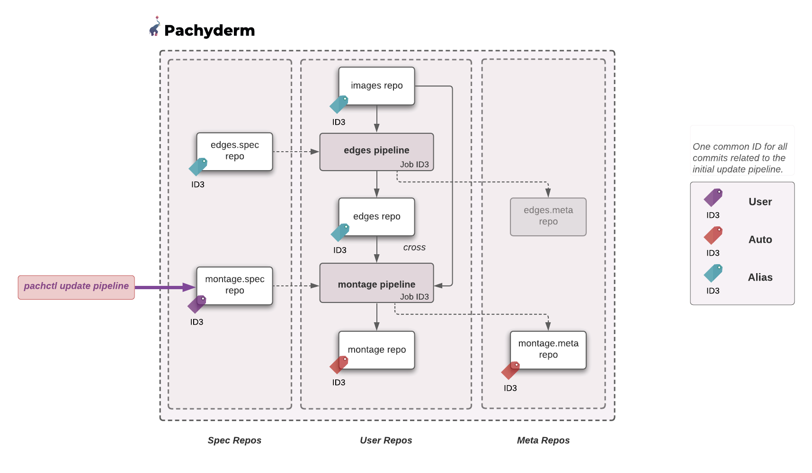

> INFO Pachyderm 2.0 introduces profound architectual changes to the product. As a result, our examples pre and post 2.0 are kept in two separate branches:
> - Branch Master: Examples using Pachyderm 2.0 and later versions - https://github.com/pachyderm/pachyderm/tree/master/examples
> - Branch 1.13.x: Examples using Pachyderm 1.13 and older versions - https://github.com/pachyderm/pachyderm/tree/1.13.x/examples

# Global ID 
> The Global Identifier is available in version **2.0 and higher**.

## Intro
Global ID can be seen as **a common TAG for all the commits and jobs created by your data-driven DAG when triggered by an initial change (a put file in a repo, an updated pipeline, a squash commit...)**. 

This example will walk you through 3 different user changes (put file, update pipeline edges, update pipeline montage) and illustrate how each of them affects the `origin` of the resulting commits.
The example is based on our openCV example.

## Getting ready
***Key concepts***
Note, as a reminder, that we have **3 types of repos**. 
Types other than `USER` indicate System Repos, which hold certain auxiliary information about pipelines. 

- `USER`: That keeps track of your data one commit at a time.
- `SPEC`: That keeps track of the pipeline's specification version used by a given job. 
- `META`: That holds the statistics of your transformation.

Each pipeline comes with one `SPEC` and one `META` repo. Every time a job commits the result of a transformation to a pipeline output commit, it also commits to the pipeline's meta repo. Deleting the output repo of a pipeline (which happens per default when deleting a pipeline) will also delete its `SPEC` and `META` repo.

`pachctl list repo --all` or `pachctl list repo --type=spec` will let you see all repos of all types or the spec system repo only respectively. By default, no flag will give you the list of all user repos.

Additionally, **commits have an "origin"**. You can see an origin as the answer to: **"What triggered the production of this commit"**. 
- `USER`: The commit is the result of a user change - This is the initial commit that will cascade into either one of the following:
- `AUTO`: the commit has been automatically triggered in your DAG's chain reaction by the arrival of an initial user commit.
- `ALIAS`: Neither `USER` nor `AUTO` - `ALIAS` commits are essentially empty commits. An `ALIAS` commit is a new global ID tag on a parent commit. 

Note that **every initial change is a `USER` change**.

With the introduction of GlobalID, we are adding 2 new definitions, or more precisely, a new scope for commits and jobs.
We knew commits at the repo level and jobs at the pipeline level. They now have an additional `global` scope:
- global `commit`: A global commit is the set of all commits (`USER`,`AUTO`, `ALIAS`) connected through provenance relationships. They share a common ID. Note that all jobs triggered by the initial `USER` commit ALSO share this same ID as jobID.
- global `job`: Similarly, a global job is the set of jobs created due to commits in a global commit. 

Find these concepts in our documentation:

-[Repo](https://docs.pachyderm.com/latest/concepts/data-concepts/repo/)
-[Commit](https://docs.pachyderm.com/latest/concepts/data-concepts/commit/)
-[Global ID](https://docs.pachyderm.com/latest/concepts/advanced-concepts/globalID/)

***Prerequisite***
- A workspace on [Pachyderm Hub](https://docs.pachyderm.com/latest/pachhub/pachhub_getting_started/) (recommended) or Pachyderm running [locally](https://docs.pachyderm.com/latest/getting_started/local_installation/).
- [pachctl command-line ](https://docs.pachyderm.com/latest/getting_started/local_installation/#install-pachctl) installed, and your context created (i.e., you are logged in)

***Getting started***
- Clone this repo.
- Make sure Pachyderm is running. You should be able to connect to your Pachyderm cluster via the `pachctl` CLI. 
Run a quick:
```shell
$ pachctl version

COMPONENT           VERSION
pachctl             2.0.0
pachd               2.0.0
```
Ideally, have your pachctl and pachd versions match. At a minimum, you should always use the same major & minor versions of your pachctl and pachd. 

## Inititialization
We are basing this example on our [open CV](../opencv/README.md) example. 
In the `examples/globalID` directory, run the following targets: 
```shell
make clean
make init
```
## GlobalID - A unique ID to trace all of the commits and jobs that resulted from an initial change in your DAG
With GlobalID, all provenance-dependent commits share the same ID (global commit). 
You can list all global commit by running the following command:
```shell
pachctl list commit
```
Or list all commits involved in a given global commit:
```shell
pachctl list commit <commitID>
```
Note: Change `commit` in `job` to list all jobs linked to your global commit.

### 1- Let our initial change be a `put file` in our `images` repository
You are going to discover how the entirety of the data and pipeline versions 
involved in the changes resulting from the initial put file can be identified at once. 
This includes the 2 jobs triggered in the process, each of which will also share the same ID as their job ID.
- Add a file to your input repo `images`
    ```shell
    pachctl put file images@master -i data/images.txt
    ```	
    and notice below, that 2 (sub)jobs (one per pipeline) have been created with the same id.
    **Note:** The 2 initial jobs, which each processed no datum (bottom 2), are initialization jobs. Disregard.
    They will be of no use for our comprehension of Global ID.

    ```shell
    pachctl list job
    ```
    ```
    ID                               SUBJOBS PROGRESS CREATED        MODIFIED
    1e5ceb1d28054da090e455f75b72b149 2       ▇▇▇▇▇▇▇▇ 6 seconds ago  6 seconds ago
    80e2d3d75aa74a4ba054e9025d93486b 1       ▇▇▇▇▇▇▇▇ 19 seconds ago 19 seconds ago
    62fb8bcd749345d9b6d270abb81a466e 1       ▇▇▇▇▇▇▇▇ 20 seconds ago 20 seconds ago
    ```
- Check the details of those 2 jobs by passing their jobID as an additional argument:
    ```shell
    pachctl list job 1e5ceb1d28054da090e455f75b72b149
    ```
    ```
    PIPELINE ID                               STARTED            DURATION  RESTART PROGRESS  DL       UL       STATE
    edges    1e5ceb1d28054da090e455f75b72b149 About a minute ago 2 seconds 0       1 + 0 / 1 57.27KiB 22.22KiB success
    montage  1e5ceb1d28054da090e455f75b72b149 About a minute ago 2 seconds 0       1 + 0 / 1 79.49KiB 381.1KiB success
    ```

- List the commits in the `images` repo and notice that a commit ID of the same value exists in that repo:
    ```shell
    pachctl list commit images@master --all
    ```
    ```
    REPO   BRANCH COMMIT                           FINISHED      SIZE     ORIGIN DESCRIPTION
    **images master 1e5ceb1d28054da090e455f75b72b149 9 minutes ago 57.27KiB USER**
    images master 80e2d3d75aa74a4ba054e9025d93486b 10 minutes ago 0B       ALIAS
    images master 62fb8bcd749345d9b6d270abb81a466e 9 minutes ago 0B       AUTO
    ```
- List the commits in the `edges` and `montage` repos, and notice the same commit ID:
    ```
    REPO  BRANCH COMMIT                           FINISHED       SIZE     ORIGIN DESCRIPTION
    **edges master 1e5ceb1d28054da090e455f75b72b149 16 minutes ago 22.22KiB AUTO**
    edges master 80e2d3d75aa74a4ba054e9025d93486b 16 minutes ago 0B       ALIAS
    edges master 62fb8bcd749345d9b6d270abb81a466e 16 minutes ago 0B       AUTO
    ```
    ```
    REPO    BRANCH COMMIT                           FINISHED       SIZE     ORIGIN DESCRIPTION
    **montage master 1e5ceb1d28054da090e455f75b72b149 17 minutes ago 381.1KiB AUTO**
    montage master 80e2d3d75aa74a4ba054e9025d93486b 18 minutes ago 0B       AUTO
    ```
- Inspect the commit of said ID (here `1e5ceb1d28054da090e455f75b72b149`) in the `images` repo - 
    The repo in which our change (`put file`) has originated:
    ```shell
    pachctl inspect commit images@1e5ceb1d28054da090e455f75b72b149 --raw
    ```
    Note that this original commit if of "USER" origin.
    ```json
    "origin": {
    "kind": "USER"
     },
    ```
- Inspect the commit (herev`1e5ceb1d28054da090e455f75b72b1491`) produced in the output repos of the edges pipelines:
    ```shell
    pachctl inspect commit edges@1e5ceb1d28054da090e455f75b72b149 --raw
    ```

    Note that the origin of the commit is of kind **`AUTO`** as it has been trigerred by the arrival of a commit in the upstream repo `images`.
    ```json
    "origin": {
        "kind": "AUTO"
    },
    ```
- Repeat the same command on the montage repo and note the same origin of the commit.

- Now list the repos of all types to identify the edges and montages system repos.
    ```shell
    pachctl list repo --all
    ```
    ```shell
    NAME         CREATED        SIZE (MASTER) ACCESS LEVEL
    montage      26 minutes ago ≤ 381.1KiB    [repoOwner]  Output repo for pipeline montage.
    montage.meta 26 minutes ago ≤ 461.5KiB    [repoOwner]  Meta repo for pipeline montage
    montage.spec 26 minutes ago ≤ 0B          [repoOwner]  Spec repo for pipeline montage.
    edges.spec   26 minutes ago ≤ 0B          [repoOwner]  Spec repo for pipeline edges.
    edges        26 minutes ago ≤ 22.22KiB    [repoOwner]  Output repo for pipeline edges.
    edges.meta   26 minutes ago ≤ 80.13KiB    [repoOwner]  Meta repo for pipeline edges
    images       26 minutes ago ≤ 57.27KiB    [repoOwner]
    ```
- Run an inspect commit on `edges.spec` and `montage.spec` for the commit 1e5ceb1d28054da090e455f75b72b1491:
    ```shell
    pachctl inspect commit edges.spec@1e5ceb1d28054da090e455f75b72b1491 --raw
    ```
    ```shell
    pachctl inspect commit montage.spec@1e5ceb1d28054da090e455f75b72b1491 --raw
    ```
    In this case, 
    the same commit ID tags the version of each pipeline within their respective `.spec` repos.
    The tag keeps track of what version of the pipeline spec was involved in transforming the data. 
    Because they are not the result of a user change or the automatic cascade of following commits that ensues in the DAG,
    their type is **`ALIAS`**. 

- All the components (pipelines specs versions, pipeline jobs, and commits in all repos of the DAG) 
    now share one unique identifier:
    ```shell
    pachctl list commit 1e5ceb1d28054da090e455f75b72b1491
    ```
    ```
    REPO         BRANCH COMMIT                           FINISHED       SIZE     ORIGIN DESCRIPTION
    edges.spec   master 1e5ceb1d28054da090e455f75b72b149 34 minutes ago 0B       ALIAS
    montage.spec master 1e5ceb1d28054da090e455f75b72b149 34 minutes ago 0B       ALIAS
    images       master 1e5ceb1d28054da090e455f75b72b149 34 minutes ago 57.27KiB USER
    edges        master 1e5ceb1d28054da090e455f75b72b149 34 minutes ago 22.22KiB AUTO
    edges.meta   master 1e5ceb1d28054da090e455f75b72b149 34 minutes ago 80.13KiB AUTO
    montage.meta master 1e5ceb1d28054da090e455f75b72b149 34 minutes ago 461.5KiB AUTO
    montage      master 1e5ceb1d28054da090e455f75b72b149 34 minutes ago 381.1KiB AUTO
    ```
    The same global commit in a diagram:
    

### 2- Let our initial change now be an `update pipeline`
- Change the glog pattern in our edges.json from `/*' to `/` and update the pipeline:
    ```json
    "input": {
        "pfs": {
        "glob": "/",
        "repo": "images"
        }
    },
    ```
    ```shell
    pachctl update pipeline -f pipelines/edges.json --reprocess
    ```
    Note that a new ID d804a08b08c44b6b8532fa9bdcb0bb86 has been created for 2 (sub)jobs.
    The update of the pipeline `edges.json`, which created an initial commit of type "USER" in the `edges.spec`
    repo as we will see right after, 
    has triggered the reprocess of our data by the pipelines edges and montages.
    
    ```shell
    pachctl list job
    ```
    ```
    ID                               SUBJOBS PROGRESS CREATED           MODIFIED
    d804a08b08c44b6b8532fa9bdcb0bb86 2       ▇▇▇▇▇▇▇▇ 28 seconds ago    28 seconds ago
    1e5ceb1d28054da090e455f75b72b149 2       ▇▇▇▇▇▇▇▇ About an hour ago About an hour ago
    80e2d3d75aa74a4ba054e9025d93486b 1       ▇▇▇▇▇▇▇▇ About an hour ago About an hour ago
    62fb8bcd749345d9b6d270abb81a466e 1       ▇▇▇▇▇▇▇▇ About an hour ago About an hour ago
    ```
    ```shell
    pachctl list job d804a08b08c44b6b8532fa9bdcb0bb86
    ```
    ```
    PIPELINE ID                               STARTED        DURATION  RESTART PROGRESS  DL       UL       STATE
    montage  d804a08b08c44b6b8532fa9bdcb0bb86 46 minutes ago 1 second  0       0 + 1 / 1 0B       0B       success
    edges    d804a08b08c44b6b8532fa9bdcb0bb86 46 minutes ago 5 seconds 0       1 + 0 / 1 57.27KiB 22.22KiB success
    ```
- Inspect the  commit (d804a08b08c44b6b8532fa9bdcb0bb86) in `edges.spec` and note that its kind is indeed `USER`.
    ```shell
    pachctl inspect commit edges.spec@d804a08b08c44b6b8532fa9bdcb0bb86 --raw
    ```
    This original change triggers automatic downstream commits in the `edges` and `montage` repos as shown by their "AUTO" origin:

    ```shell
    pachctl inspect commit edges@d804a08b08c44b6b8532fa9bdcb0bb86 --raw
    ```
    ```shell
    pachctl inspect commit montage@d804a08b08c44b6b8532fa9bdcb0bb86 --raw
    ```
- Now inspect the commits in the `images` and the `montage.spec` repos which have contributed to the overall production of our "AUTO" commits above but have not been modified by any user change.
    You will notice that they carry the same global ID 
    (d804a08b08c44b6b8532fa9bdcb0bb86) which, in this case, is of type `ALIAS`.

 The same global commit in a diagram:
    
### 3- What if our initial change is `update pipeline -f montage.json`?

- Let's modify `montage.json` to have the final montage written to montage2.png rather than montage.png.

    ```json
    "transform": {
        "cmd": [ "sh" ],
        "image": "dpokidov/imagemagick:7.0.10-58",
        "stdin": [ "montage -shadow -background SkyBlue -geometry 300x300+2+2 $(find /pfs -type f | sort) /pfs/out/montage2.png" ]
    }
    ```
    and update our pipeline by running:
    ```shell
    pachctl update pipeline -f pipelines/montage.json --reprocess
    pachctl list job
    ```
    A quick check at `montage.spec` (`pachctl inspect commit montage.spec@<new commit ID from list job> --raw`) shows the creation of a new commit of type `USER`.

    As anticipated, the update of the pipeline triggered a new job resulting in a new commit in the montage output repo.
    Run  `pachctl inspect commit montage@<new commit ID from list job> --raw` and notice that the commit is of type "AUTO". 
    Similarly, we will let you check that `montage.meta` is also of type "AUTO".


- What happens to all the other components of this DAG (images, edges, edges.spec, edges.meta)?
 
    Let's list the global commit (`pachctl list commit`) and notice that our latest commit reports 6 (sub)commits.

    ```
    ID                               SUBCOMMITS PROGRESS CREATED           MODIFIED
    e025c0fbae054488a18e1c379c196cff 6          ▇▇▇▇▇▇▇▇ 2 minutes ago     2 minutes ago
    ```

    Let's list them all:
    ```shell
    pachctl list commit e025c0fbae054488a18e1c379c196cff
    ```
    ```
    REPO         BRANCH COMMIT                           FINISHED      SIZE     ORIGIN DESCRIPTION
    montage.spec master e025c0fbae054488a18e1c379c196cff 2 minutes ago 0B       USER
    edges.spec   master e025c0fbae054488a18e1c379c196cff 2 minutes ago 0B       ALIAS
    images       master e025c0fbae054488a18e1c379c196cff 2 minutes ago 57.27KiB ALIAS
    montage.meta master e025c0fbae054488a18e1c379c196cff 2 minutes ago 461.5KiB AUTO
    montage      master e025c0fbae054488a18e1c379c196cff 2 minutes ago 381.1KiB AUTO
    edges        master e025c0fbae054488a18e1c379c196cff 2 minutes ago 22.22KiB ALIAS
    ```
    The same global commit in a diagram:
    


    Note that one job, and one only, was triggered by the change of the pipeline `montage.json`:
    ```shell
    pachctl list job e025c0fbae054488a18e1c379c196cff
    ```
    ```
    PIPELINE ID                               STARTED       DURATION  RESTART PROGRESS  DL       UL       STATE
    montage  e025c0fbae054488a18e1c379c196cff 3 minutes ago 5 seconds 0       1 + 0 / 1 79.49KiB 381.1KiB success
    ```

    Also, `edges.meta` is not in the provenance of any of the new data. As a result, it does not belong to the global commit.
