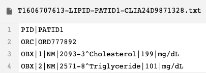
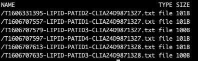
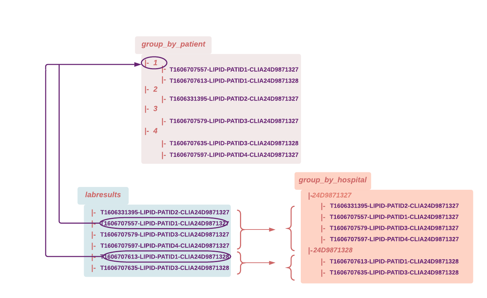
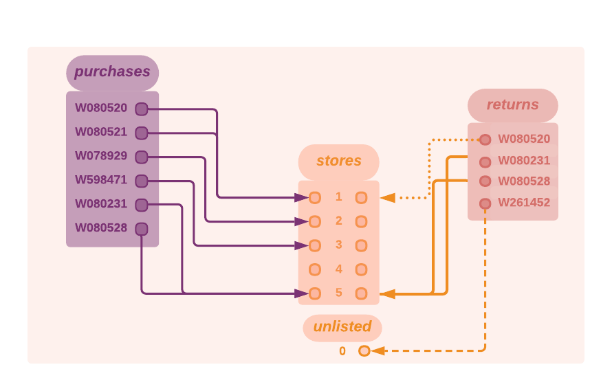
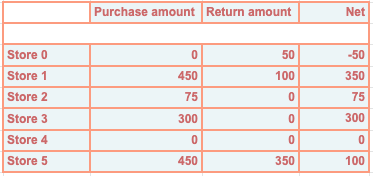
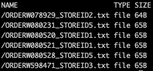
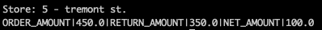

> INFO Each new minor version of Pachyderm introduces profound architectual changes to the product. For this reason, our examples are kept in separate branches:
> - Branch Master: Examples using Pachyderm 2.1.x versions - https://github.com/pachyderm/pachyderm/tree/master/examples
> - Branch 2.0.x: Examples using Pachyderm 2.0.x versions - https://github.com/pachyderm/pachyderm/tree/2.0.x/examples
> - Branch 1.13.x: Examples using Pachyderm 1.13.x versions - https://github.com/pachyderm/pachyderm/tree/1.13.x/examples

# Group Pipelines 
> The group functionality is available in version **1.12 and higher**.

## Intro

- Our first examples will walk you through the use of a group input applied to files living in a single repository. 
- Our second example will showcase a more complex setup where information is grouped across three repositories.

At the end of this page, you will understand how a group input aggregates the data and what their resulting datums look like. 

You configure a group in the [pipeline specification](https://docs.pachyderm.com/latest/reference/pipeline-spec/) file by adding a `group` input around the one or many pfs repositories you want to aggregate together. At each input repo level included in your group, you need to specify a `group_by` that will define the captured group (from your glob pattern) to consider when grouping your files. 

> Remember, in Pachyderm, the group operates at the file-path level, **not** the content of the files themselves. Therefore, the structure of your directories and file naming conventions are key elements when implementing your use cases in Pachyderm.

## Getting ready

***Key concepts***
For these examples, we recommend being familiar with the following concepts:

* [Group](https://docs.pachyderm.com/latest/concepts/pipeline-concepts/datum/group/) pipelines - execute your code on files that match a specific naming pattern in your group repo(s).
* [Glob patterns](https://docs.pachyderm.com/latest/concepts/pipeline-concepts/datum/glob-pattern/) - A "RegEx-like" string matching on file paths and names.

Additionally, make sure that you understand the concept of [datum](https://docs.pachyderm.com/latest/concepts/pipeline-concepts/datum/relationship-between-datums/). 

***Prerequisite***
- Pachyderm running [locally](https://docs.pachyderm.com/latest/getting-started/local-installation/).
- [pachctl command-line ](https://docs.pachyderm.com/latest/getting-started/local-installation/#install-pachctl) installed, and your context created (i.e., you are logged in)

***Getting started***
- Clone this repo.
- Make sure that Pachyderm is running. You should be able to connect to your Pachyderm cluster via the `pachctl` CLI. 
    Run a quick:
    ```shell
    $ pachctl version

    COMPONENT           VERSION
    pachctl             2.1.0
    pachd               2.1.0
    ```
    Ideally, have your pachctl and pachd versions match. At a minimum, you should always use the identical major & minor versions of your pachctl and pachd. 

## Example 1 - Simple group-by pipelines 
***Data structure and naming convention***

Our first example comes from a simple healthcare use case:

* A patient gets test results, each lab result can come from a different lab/hospital. Each of our files contains the test results from a particular lab/hospital for a given patient.

Let's take a look at the data structure and naming convention of our first example:  
* Repo: `labresults` - Our file names follow the following "-" separated pattern: 

1. **T** + {Time stamp}
2. Type of test (Here **LIPID** for all our files)
3. **PATID** + {Patient identifier}
4. **CLIA** + {Lab/Hospital identifier}

```
    └── T1606707557-LIPID-PATID1-CLIA24D9871327.txt
    └── T1606331395-LIPID-PATID2-CLIA24D9871327.txt
    └── T1606707613-LIPID-PATID1-CLIA24D9871328.txt
    └──  ...
```
For information, here is what the content of one of those txt files looks like. 



***Goal***

We want to aggregate our labresults by patient or by hospital. We will create two separate use cases out of the same input repository.

Following the 2 steps pattern described in our [datum processing documentation](https://docs.pachyderm.com/latest/concepts/pipeline-concepts/datum/relationship-between-datums/), we will need 2 pipelines:

- One performs a group by patient ID or lab/hospital ID (depending on the use case) then outputs one text file per match. We designed the source code of the pipeline to sort those text files into directories named after the patient ID or the hospital ID.

    1. **Pipeline input repository**: `labresults`. 
        - For group by patient: We group by PATID. 
        - For group by hospital: We group by CLIA.

    1. **Pipeline**: Executes a set of command lines creating a new directory named after each capture group and copying the files that match the given group. (See our 2 pipelines:[`lab_group_by_hospital.json`](./pipelines/lab/lab_group_by_hospital.json) and [`lab_group_by_patient.json`](./pipelines/lab/lab_group_by_patient.json)).

    1. **Pipeline output repository**: `group_by_hospital`or `group_by_patient` depending on which use case you run.

        Each output repo will contain a list of sub-directories named after each capture group and populated with a copy of their matching files.

- A following pipeline will "glob" all files in each directory, then merge their content into a final text file.

    1. Pipeline input repositories: The `group_by_hospital`or `group_by_patient` output repo becomes the input repo of the following pipeline.

    1. Pipeline: The `reduce_group_by_hospital.json` or `reduce_group_by_patient.json` pipeline "globs" each directory ("glob": "/*") and merge the content of all their file into one txt file named after the directory name.

    1. Pipeline output repository: The output repo `reduce_group_by_hospital` or `reduce_group_by_patient` will contain text files listing all lab results per lab/hospital or per patient.

***Example walkthrough***

1. Prepare your data:
 
    Let's create our mock dataset and populate our initial input repository.
    The setup target `setup-lab` of the `Makefile` in `pachyderm/examples/group` will create a directory (labresults) containing our example data.
    In the `examples/group` directory, run:
    ```shell
    make setup-lab
    ```
    Optionally, you can run a `ls labresults/` to check what the data look like.

1. Populate Pachyderm's repository and create your pipelines:

    In the `examples/joins` directory, run:
    ```shell
    make deploy-lab
    ```
    then: 
    ```shell
    make create-lab
    ```
    or run:
    ```shell
    pachctl create repo labresults
    pachctl put file -r labresults@master:/ -f labresults

    pachctl create pipeline -f pipelines/lab/lab_group_by_hospital.json 
	pachctl create pipeline -f pipelines/lab/lab_group_by_patient.json
	pachctl create pipeline -f pipelines/lab/reduce_group_by_hospital.json 
	pachctl create pipeline -f pipelines/lab/reduce_group_by_patient.json
    ```
    Have a quick look at your input repository: 
    ```shell
    pachctl list file labresults@master
    ```
    You should see the following files:

    

    The commit in your entry repository has triggered the execution of your pipelines (i.e., a job). 
    ```shell
    pachctl list pipeline
    ```    

2. Let's preview what our datums will look like by running the following command in the `examples/group` directory:

    ```shell
    pachctl list datum -f pipelines/lab/lab_group_by_hospital.json 
    ```
    or
    ```shell
    pachctl list datum -f pipelines/lab/lab_group_by_patient.json 
    ```
    For example, in the case of a "group by patient", note that one datum is created for each patient ID. Each datum containing all the lab results for this patient:
        
    | PATIENT ID| FILES IN DATUM |
    |-----------|----------------|                                    
    |PATID1| /T1606707557-LIPID-PATID1-CLIA24D9871327.txt <br> /T1606707613-LIPID-PATID1-CLIA24D9871328.txt |
    |PATID2|/T1606331395-LIPID-PATID2-CLIA24D9871327.txt |
    |PATID3|/T1606707579-LIPID-PATID3-CLIA24D9871327.txt <br> /T1606707635-LIPID-PATID3-CLIA24D9871328.txt |
    |PATID4|/T1606707597-LIPID-PATID4-CLIA24D9871327.txt|

3. Check the output repository of the first pipeline in both use cases. Our code has created one txt file per datum. Each datum has been placed in a directory named after its capture group:

    ```shell
    pachctl list file group_by_hospital@master
    ```
    or
    ```shell
    pachctl list file group_by_patient@master
    ```
    For visual confirmation of their content, run:
    ```shell
    pachctl list file group_by_patient@master:/1/
    ```

4. Now check the output repo of the second pipeline:
    ```shell
    pachctl list file reduce_group_by_hospital@master
    ```
    and notice the 2 text files /24D9871327.txt and /24D9871328.txt, one for each lab/hospital ID.

    You can check their content by running:
    ```shell
    pachctl get file  reduce_group_by_hospital@master:/24D9871327.txt
    ```
    and notice the list of all labresults coming from this lab ID in this txt file.

    Repeat for `pachctl list file reduce_group_by_patient@master`.

In the diagram below, we have mapped out the data of our example and the expected results in each case.
    

## Example 2 - Group pipeline on several repositories 
***Data structure and naming convention***

The second example is derived from a simplified retail use case: 
- Purchases and returns are made in given stores. 
- Those stores have a given location (here, a zip code). 
- There are 0 to many stores in a given zip code.

This dataset is shared with the "Join pipelines"' examples. Read about the [structure of the data and our file naming conventions](https://github.com/pachyderm/pachyderm/blob/master/examples/joins/README.md#2-data-structure-and-naming-convention).


***Goal***

We will group all purchases and returns for each store, then calculate the net amount of all transactions (net_amount = order_total - return_total) and save it to a text file named after the store identifier.

1. **Pipeline input repositories**: `stores` , `returns`, `purchases`. 
    We will apply a group by STOREID on all 3 repositories. 
    
    Each match (i.e., all purchases and returns having occurred at a given store along with the store information itself) will generate one datum.

1. **Pipeline**: Execute a python code reading the `purchases` and `returns` for each matching STOREID and writing the corresponding net_amount to a text file named after the STOREID. (See our pipeline: [`retail_group.json`](./pipelines/retail/retail_group.json))

1. **Pipeline output repository**: `group_store_revenue`. The output repo will contain a list of text files named after each storeID and containing its net amount.

In the diagram below, we have mapped out our data. 



The following table lists the expected result (the "net amount") for each store. 



***Example walkthrough***

1. Let's create your mock up data:

    In the `examples/group` directory, run:
    ```shell
    make setup-retail
    ```
    You just created 3 directories: stores, purchases, returns. Check them out.
    ```shell
    ls ./purchases
    ```
1. Populate Pachyderm’s repository and create your pipeline:

    In the `examples/group` directory, run:
    ```shell
    make deploy-retail
    ```
    then:
    ```shell
    make create-pipeline-retail
    ```

    or run:
    ```shell
    pachctl create repo stores
    pachctl create repo purchases
    pachctl create repo returns
    pachctl put file -r stores@master:/ -f stores
    pachctl put file -r purchases@master:/ -f purchases
    pachctl put file -r returns@master:/ -f returns
    pachctl create pipeline -f pipelines/retail/retail_group.json
    ```
    Check your repositories:
    ```shell
    pachctl list file stores@master
    pachctl list file purchases@master
    pachctl list file returns@master	
    ```
    For example, here is the list of the files in the purchases repo:

    

    Make sure that your pipeline ran successfully:
    ```shell
    pachctl list pipeline
    ```
2. Let's preview what our datums will look like by running the following command in the `examples/group` directory:

    ```shell
    pachctl list datum -f retail_group.json 
    ```
    Note that one datum is created for each store ID. Each datum contains all the purchases and returns made at a given store:

    |STORE ID| DATUM | 
    |---------|---------|
    |0|ORDERW261452_STOREID0.txt|
    |1|STOREID1.txt <br> ORDERW080520_STOREID1.txt<br> ORDERW080521_STOREID1.txt<br> ORDERW080520_STOREID1.txt | 
    |2| STOREID2.txt <br> ORDERW078929_STOREID2.txt |
    |3| STOREID3.txt <br> ORDERW598471_STOREID3.txt|
    |4| STOREID4.txt|
    |5| STOREID4.txt<br> ORDERW080231_STOREID5.txt<br> ORDERW080528_STOREID5.txt<br> ORDERW080231_STOREID5.txt <br>ORDERW080528_STOREID5.txt|
1. Take a look at your final product:

    Once it has fully and successfully run, have a look at your output repository to confirm that it looks like what we expect.
    ```shell
    pachctl list file group_store_revenue@master
    ```
    For visual confirmation of the content of each specific file:
    ```shell
    pachctl get file group_store_revenue@master:/5.txt
    ```
    It should look like this:

    

