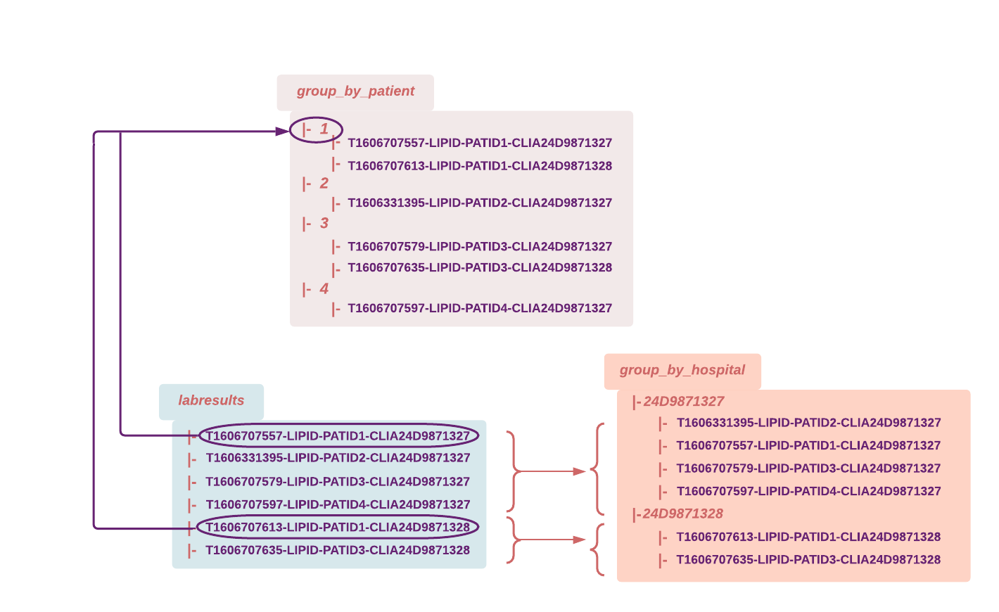

# Group Pipelines 
> The group functionality is available in version **1.12 and higher**.


## Intro
You configure a group in the [pipeline specification](https://docs.pachyderm.com/latest/reference/pipeline_spec/) file by adding a `group` input around the one or many pfs repositories you want to aggregate together. At each input repo level included in your group, you then need to specify a `group_by` that will define the capture group from your glob pattern that you want to consider to group your files. 


- Our first examples will walk you through a simple use of group applied to the files of a single repository. 
- Our second example will showcase a more complex group setting where information is grouped accross 3 repositories. 

> Remember, in Pachyderm, the group operates at the file-path level, **not** the content of the files themselves. Therefore, the structure of your directories and file naming conventions are key elements when implementing your use cases in Pachyderm.


## Getting ready
***Key concepts***
- [Group](https://docs.pachyderm.com/latest/concepts/pipeline-concepts/datum/group/) pipelines - execute your code on files that match a specific naming pattern in your group repo(s).
- [glob patterns](https://docs.pachyderm.com/latest/concepts/pipeline-concepts/datum/glob-pattern/) - for "RegEx-like" string matching on file paths and names.

You might also want to brush up your [datum](https://docs.pachyderm.com/latest/concepts/pipeline-concepts/datum/relationship-between-datums/) knowledge. 

***Prerequisite***
- A workspace on [Pachyderm Hub](https://docs.pachyderm.com/latest/pachhub/pachhub_getting_started/) (recommended) or Pachyderm running [locally](https://docs.pachyderm.com/latest/getting_started/local_installation/).
- [pachctl command-line ](https://docs.pachyderm.com/latest/getting_started/local_installation/#install-pachctl) installed, and your context created (i.e., you are logged in)

***Getting started***
- Clone this repo.
- Make sure Pachyderm is running. You should be able to connect to your Pachyderm cluster via the `pachctl` CLI. 
Run a quick:
```shell
$ pachctl version

COMPONENT           VERSION
pachctl             1.12.0
pachd               1.12.0
```
Ideally, have your pachctl and pachd versions match. At a minimum, you should always use the same major & minor versions of your pachctl and pachd. 

## Example 1 - Simple group-by pipelines 
***Data structure and naming convention***

Our first example comes from a simple healthcare use case:

* A patient gets test results, each of which can come from a different lab. Each of our files contains the test results from a particular lab for a given patient.

Let's have a look at the data structure and naming convention of our first example:  
* Repo: `labresults` - Our file names follow the following "-" separated pattern: 

1. **T** + {Time stamp}
2. Type of test (Here **LIPID** for all our files)
3. **PATID** + {Patient identifier}
4. **CLIA** + {Lab/Hospital identifier}

```shell
    └── T1606707557-LIPID-PATID1-CLIA24D9871327.txt
    └── T1606331395-LIPID-PATID2-CLIA24D9871327.txt
    └── T1606707613-LIPID-PATID1-CLIA24D9871328.txt
    └──  ...
```
For information, here is what the content of those txt files looks like. 


***Goal***
We  want to aggregate our labresults by patient or by hospital. We will create two separate pipelines out of the same repository, one for each case.

1. **Pipeline input repository**: `labresults` 
    - Group by patient: the group will be done by PATID 
    - Group by hospital: the group will be done by CLIA

1. **Pipeline**: Executes a set of command lines creating a new directory named after each capture group and copying the files that match the given group. (See our 2 pipelines:[`lab_group_by_hospital.json`](./lab_group_by_hospital.json) and [`lab_group_by_patient.json`](./lab_group_by_patient.json)).

1. **Pipeline output repository**: `group_by_hospital`or `group_by_patient` depending on which use case you run - Each output repo will contain a list or sub-directories named after each capture group and populated with a copy of their matching files.
In the diagram below, we have mapped out the data of our example and the expected results in each case.


***Example walkthrough***

1. Prepare your data:
 
    Let's first create our mock dataset and create/populate our repository.
    The setup target `setup-lab` of the `Makefile` in `pachyderm/examples/group` will create a directory (labresults) with our example data.
    In the `examples/group` directory, run:
    ```shell
    $ make setup-lab
    ```
1. Create/populate Pachyderm's repository and create your pipelines:

    In the `examples/joins` directory, run:
    ```shell
    $ make deploy-lab
    ```
    or run:
    ```shell
    $ pachctl create repo labresults
    $ pachctl put file -r labresults@master:/ -f labresults
    $ pachctl create pipeline -f lab_group_by_hospital.json 
    $ pachctl create pipeline -f lab_group_by_patient.json
    ```
    Have a quick look at your repositories: 
    ```shell
    $ pachctl list file labresults@master
    ```
    You should see the following files:

    

    The commit in your entry repository has triggered the execution of your pipeline (i.e., a job). Have a quick check at your pipeline's status:
    ```shell
    $ pachctl list pipeline
    ```
    Once it has run successfully, you should see something like this:

    

1. Let's have a look at our final product: 

    Check the output repository of your pipeline.
    ```shell
    $ pachctl list file group_by_patient@master
    $ pachctl list file group_by_hospital@master
    ```
    You should see your expected sub repositories. 

    Check one testresult for patient 1:
    ```shell
    $ pachctl get file group_by_patient@master:/1/T1606707613-LIPID-PATID1-CLIA24D9871328.txt
    ```

## Example 2 - Group pipeline on several repositories 
***Data structure and naming convention***

The second example is derived from a simplified retail use case: 
- Purchases and returns are made in given stores. 
- Those stores have a given location (here, a zip code). 
- There are 0 to many stores in a given zip code.

This dataset is shared with the "Join pipelines"' examples. Read about the [structure of the data and naming conventions](https://github.com/pachyderm/pachyderm/blob/master/examples/joins/README.md#2-data-structure-and-naming-convention).


***Goal***
For each store, we are going to calculate the net amount of all transactions (net_amount = order_total - return_total) and save it to a text file named after the store identifier.

1. **Pipeline input repositories**: `stores` , `returns`, `purchases` 
    - Group by STOREID on all 3 repositories. 
    
    Each match (i.e., all transactions - purchases and returns - having occured at a given store along with the store information itself) will generate one datum.
2. **Pipeline**: Executes a python code reading the `purchases` and `returns` for each matching STOREID and writing the corresponding net_amount to a text file named after the STOREID. (See our pipeline: [`retail_group.json`](./retail_group.json))
3. **Pipeline output repository**: `group_store_revenue` - list of text files named after the STOREID. 

In the diagram below, we have mapped out our data. 


The following table lists the expected result (the "net amount") for each store. 


***Example walkthrough***

1. Let's create your new data:

    In the `examples/group` directory, run:
    ```shell
    $ make setup-retail
    ```
    You just created 3 directories: stores, purchases, returns. Check them out.
    ```shell
    $ ls ./purchases
    ```

1. Create/populate Pachyderm’s repository and create your pipelines:

    In the `examples/group` directory, run:
    ```shell
    $ make deploy-retail
    ```
    or run:
    ```shell
    $ pachctl create repo stores
    $ pachctl create repo purchases
    $ pachctl create repo returns
    $ pachctl put file -r stores@master:/ -f stores
    $ pachctl put file -r purchases@master:/ -f purchases
    $ pachctl put file -r returns@master:/ -f returns
    $ pachctl create pipeline -f retail_group.json
    ```
    check your repositories:
    ```shell
    $ pachctl list file stores@master
    $ pachctl list file purchases@master
    $ pachctl list file returns@master	
    ```
    and your pipeline:
    ```shell
    $ pachctl list pipeline
    ```

1. Have a look at your final product:

    Once it has fully and successfully run, have a look at your output repository to confirm that it looks like what we expect.
    ```shell
    $ pachctl list file group_store_revenue@master
    ```
    Now for a visual confirmation of the content of each specific file:
    ```shell
    $ pachctl get file group_store_revenue@master:/5.txt
    ```
    It should look like this:

    

