> INFO - Pachyderm 2.0 introduces profound architectural changes to the product. As a result, our examples pre and post 2.0 are kept in two separate branches:
> - Branch Master: Examples using Pachyderm 2.0 and later versions - https://github.com/pachyderm/pachyderm/tree/master/examples
> - Branch 1.13.x: Examples using Pachyderm 1.13 and older versions - https://github.com/pachyderm/pachyderm/tree/1.13.x/examples

# Inner and Outer Join Inputs
> The outer join input is available in version **1.12 and higher**.

- In our first example, we will create a pipeline whose input datums result from a simple `inner join` between 2 repos.
- In our second example, we will showcase 3 variations of `outer join` pipelines between 2 repos, and outline how they differ from inner join and each other.

At the end of this page, you will understand the fundamental difference between the datums produced by an inner join and those created by an outer join.

***Table of Contents***

- [1. Getting ready](#1-getting-ready)
- [2. Data structure and naming convention](#2-data-structure-and-naming-convention)
- [3. Data preparation](#3-data-preparation)
- [4. Example 1 : An Inner Join pipeline creation](#4-example-1--an-inner-join-pipeline-creation)
- [5. Example 2 : Outer Join pipeline creation](#5-example-2--outer-join-pipeline-creation) 
    - [***Case 1*** Outer join on the Returns repo only](#case-1-outer-join-on-the-returns-repo-only)
    - [***Case 2*** Outer join on the Stores repo only](#case-2-outer-join-on-the-stores-repo-only)
    - [***Case 3*** Outer join on both the Stores and Returns repos](#case-3-outer-join-on-both-the-stores-and-returns-repos)

***Key concepts***

For these examples, we recommend to be familiar with the following concepts:

- [Join](https://docs.pachyderm.com/1.13.x/concepts/pipeline-concepts/datum/join/) pipelines - execute your code on files that match a specific naming pattern in your joined repos.
- [Glob patterns](https://docs.pachyderm.com/1.13.x/concepts/pipeline-concepts/datum/glob-pattern/) - for "RegEx-like" string matching on file paths and names.

Additionally, you might want to check [datum](https://docs.pachyderm.com/1.13.x/concepts/pipeline-concepts/datum/relationship-between-datums/). 

## 1. Getting ready
***Prerequisite***
- A workspace on [Pachyderm Hub](https://docs.pachyderm.com/1.13.x/pachhub/pachhub_getting_started/) (recommended) or Pachyderm running [locally](https://docs.pachyderm.com/1.13.x/getting_started/local_installation/).
- [pachctl command-line ](https://docs.pachyderm.com/1.13.x/getting_started/local_installation/#install-pachctl) installed, and your context created (i.e. you are logged in)

***Getting started***
- Clone this repo.
- Make sure Pachyderm is running. You should be able to connect to your Pachyderm cluster via the `pachctl` CLI. 
Run a quick:
```shell
$ pachctl version

COMPONENT           VERSION
pachctl             1.12.0
pachd               1.12.0
```
Ideally, have your pachctl and pachd versions match. At a minimum, you should always use the same major & minor versions of pachctl and pachd. 
## 2. Data structure and naming convention

> Remember, in Pachyderm, the join operates at the file-path level, **not** the files' content. Therefore, the structure of your directories and file naming conventions are key elements when implementing your use cases in Pachyderm.

We have derived our examples from simplified retail use cases: 
- Purchases and Returns are made in given Stores. 
- Those Stores have a given location (here, a zip code). 
- There are 0 to many Stores for a given zip code.

Let's take a look at our data structure and naming convention. 
We will create 3 repos:
* Repo: `stores` - Each store data are JSON files named after the storeID.
```shell
    └── STOREID1.txt
    └── STOREID2.txt
    └── STOREID3.txt
    └──  ...
```
To further these examples beyond the datum creation, we have added some simple processing at the code level. We will use the `zipcode` property to aggregate our data. 

This is what the content of one of those STOREIDx.txt file looks like.
```shell
    {
        "storeid":"4",
        "name":"mariposa st.",
        "address":{
            "zipcode":"94107",
            "country":"US"
        }
    }
```

* Repo: `purchases` - Each purchase info is kept in a file named by concatenating the purchase's order number and its store ID.
```shell
    └── ORDERW080520_STOREID1.txt
    └── ORDERW080521_STOREID1.txt
    └── ORDERW078929_STOREID2.txt
    └── ...
```
* Repo: `returns` - Same naming convention as purchases.
```shell
    └── ORDERW080528_STOREID5.txt
    └── ODERW080520_STOREID1.txt
    └── ...
```
## 3. Data preparation
Let's start by creating our mock data and populate our repositories.
This preparatory step will allow you to experiment with the inner and outer join examples in any order.

***Step 1*** - Prepare your data

The setup target of the `Makefile` in `pachyderm/examples/joins` will create 3 directories (stores, purchases, and returns) containing our example data.
In the `examples/joins` directory, run:
```shell
$ make setup
```
***Step 2*** - Create and populate Pachyderm's repositories from the directories above.

In the `examples/joins` directory, run:
```shell
$ make create
```
or run:
```shell
$ pachctl create repo stores
$ pachctl create repo purchases
$ pachctl create repo returns
$ pachctl put file -r stores@master:/ -f stores
$ pachctl put file -r purchases@master:/ -f purchases
$ pachctl put file -r returns@master:/ -f returns
```

Have a look at the content of your repositories: 
```shell
$ pachctl list file stores@master
$ pachctl list file purchases@master
$ pachctl list file returns@master
```
You should see the following files in each repo:
- Purchases:


- Stores:


- Returns:

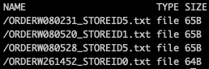
 
 You are ready to run any of the following examples.
## 4. Example 1 : An Inner Join pipeline creation 

***Goal***

We are going to list all purchases by zip code and understand what datums are created by our `inner join` input in the process. 
Quick overview of our pipeline:

1. **Pipeline input repositories**: The `purchases` and `stores` repos are joined (`inner join`) on the STOREID of their file name.

    | Purchases | Stores |
    |-----------|--------|
    | ||

2. **Pipeline**: The [inner_join.json](./inner_join.json) pipeline will first create input datums following its `glob` pattern and `"join_on": "$1"` values, then execute some Python code reading the `zipcode` in their STOREIDx.txt file. 
3. **Pipeline output repository**: The output repo `inner_join` will contain a list of text files named after the stores' zip codes. Each will list all purchases made in a specific zip code. 

    We will expect the 2 following files in the output repository of our `inner_join` pipeline: 
    ```shell
        └── 02108.txt
        └── 90210.txt
    ```
    Each should contain 3 purchases.

***Step 1*** - Before we create our `inner join` pipeline, we can preview what our datums will look like by running the following command in the `examples/joins` directory:

```shell
$ pachctl list datum -f inner_join.json
```
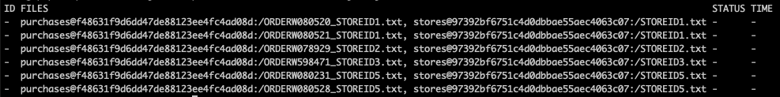

Note that no purchase was made at the STOREID4; therefore **no datum was created**. See diagram below. This is a characteristic of an `inner join`. We only see the stores in which purchases were made.

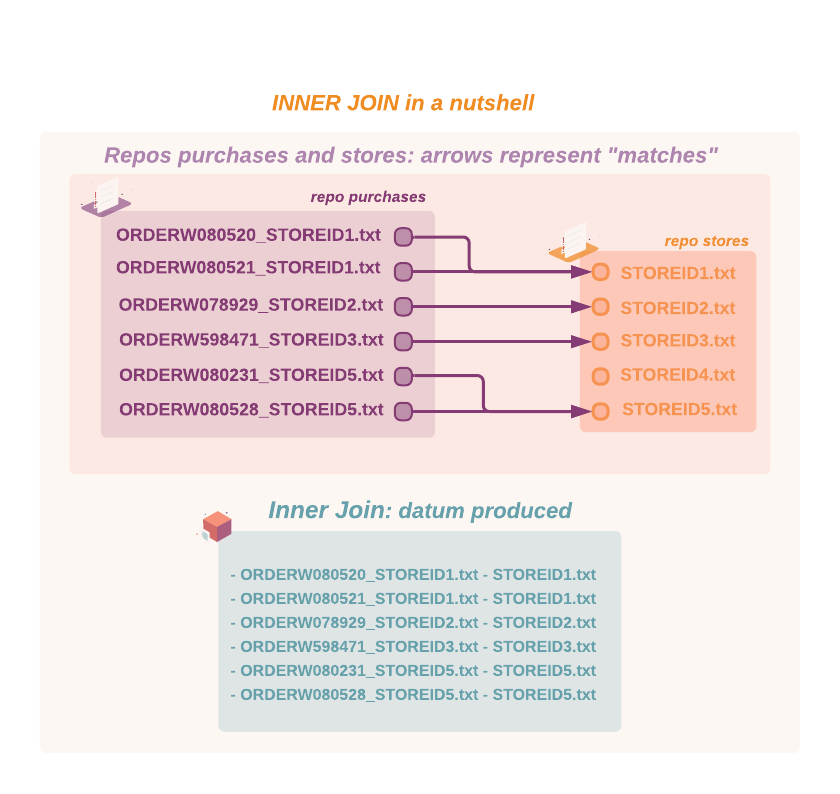

***Step 2*** - Let's now create our pipeline and see it in action. 

Because unprocessed data are awaiting in our input repositories, the pipeline creation will automatically trigger a job.
In the `examples/joins` directory, run:
```shell
$ pachctl create pipeline -f inner_join.json
```

Check your pipeline's status:
```shell
$ pachctl list pipeline
```

***Step 3*** - Check the output repository of the pipeline, now that our code has aggregated those datums per zip code: 

```shell
$ pachctl list file inner_join@master
```
You should see our 2 expected text files. 


For a visual confirmation of their content, run:

```shell
$ pachctl get file inner_join@master:/02108.txt
```
The following table lists the expected results for this scenario:

|/02108.txt|/90210.txt|
|----------|----------|
|Purchase at store: 1  ... ORDER W080520|Purchase at store: 3 ... ORDER W598471|
|Purchase at store: 1 ... ORDER W080521|Purchase at store: 5 ... ORDER W080528| 
|Purchase at store: 2 ... ORDER W078929 |Purchase at store: 5 ... ORDER W080231| 

> Want to take this example to the next level? Practice using joins AND [groups](https://docs.pachyderm.com/1.13.x/concepts/pipeline-concepts/datum/group/). You can create a 2-step pipeline that will group Returns and Purchases by storeID then join the output repo with Stores to aggregate by location. 

## 5. Example 2 : Outer Join pipeline creation 
> You specify an [outer join](#case-1-outer-join-on-the-returns-repo-only) by adding an "outer_join" boolean property to an input repo in the `join` section of your pipeline spec. 

***Goal***

We are going to list all returns by zip code and understand the datums created by our  `outer join` when setting the `"outer_join": true` on:

1. `returns` only
2. `stores` only
3. both our repos `stores` and `returns`

These 3 cases will create 3 different sets of datums that we will explain further. A quick overview of our pipeline: 

1. **Pipeline input repositories**: The `stores` and `returns` repos are joined (See 3 cases of outer join above) on the STOREID of their file name.
    | Returns | Stores |
    |-----------|--------|
    |||
2. **Pipeline**: Our [outer_join.json](./outer_join.json) pipeline will first create input datums following its `glob` pattern, `"join_on": "$1"`, and `"outer_join"` values, then execute some Python code that processes each store and matched return (if any).

3. **Pipeline output repository**: The output repo `outer_join` will contain a list of text files named after the stores' zip code. The detail of each will depend on where the 'outer join' was put.

We have listed all the possible outcomes in the following cheat sheet. Each particular case will be further explained:
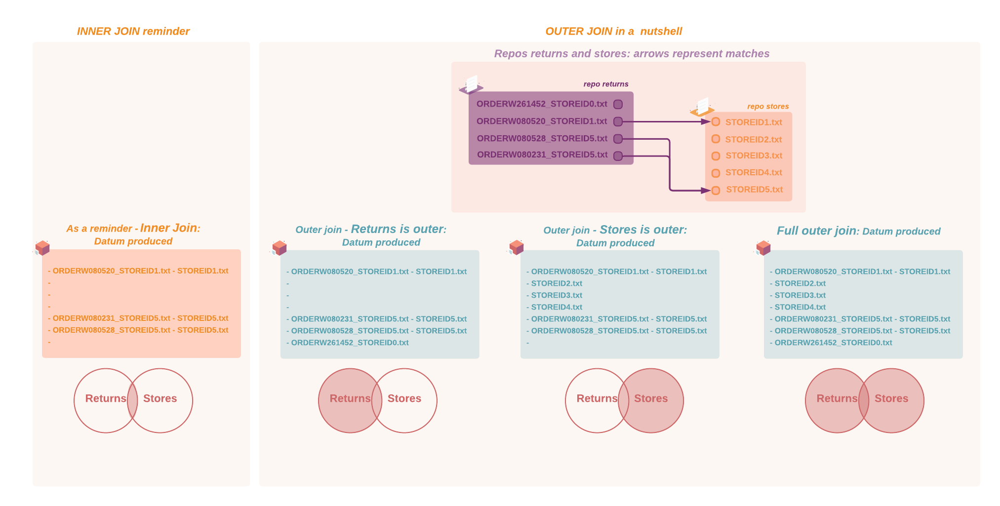


### ***Case 1*** Outer join on the Returns repo only
1. In the `examples/joins` directory, edit the pipeline's specification `outer_join.json` and set `"outer_join" :true` on the repo `returns`:
    ```shell
    "input": {
        "join": [
        {
            "pfs": {
            "repo": "stores",
            "branch": "master",
            "glob": "/STOREID(*).txt",
            "join_on": "$1",
            "outer_join": false
            }
        },
        {
        "pfs": {
            "repo": "returns",
            "branch": "master",
            "glob": "/*_STOREID(*).txt",
            "join_on": "$1",
            "outer_join": true
        }
        }
    ]
    },
    ```
1. Before we create our `outer join` pipeline, let's preview the datums that will be created. In the `examples/joins` directory, run:

    ```shell
    $ pachctl list datum -f outer_join.json
    ```
    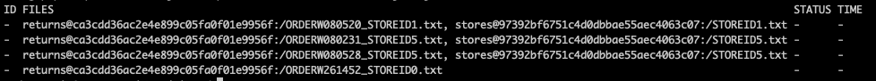
 
 
    What you are noticing is that all your 4 returns are showing in a datum. 
    > Note that one return was made in a store **not** listed in our repo (STOREID0). There was no match on any STOREID for this specific return file, however; **a datum was created**, containing only the return file. By setting the returns repo as `"outer_join":true`, you are requesting to see ALL of the repo's files reflected in datums, whether there is a match or not.
1. In the `examples/joins` directory, let's now create our pipeline by running:
    ```shell
    $ pachctl create pipeline -f outer_join.json
    ```
1. Check the pipeline's status:
    ```shell
    $ pachctl list pipeline
    ```


1. Have a look at our output repo, now that our code has aggregated those datums per zip code:

    Notice that an UNKNOWN.txt file shows up listing the return without matching store.

    ```shell
    $ pachctl list file outer_join@master
    ```
    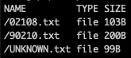

1. Visual confirmation: run the following command and validate that your files contain the returns that you are expecting:
    ```shell
    $ pachctl get file outer_join@master:/02108.txt
    ```
    The following table lists the expected results for this scenario:

    |/02108.txt|/90210.txt|/UNKNOWN.txt|
    |----------|----------|------------|
    |Return at store: 1 ... ORDER W080520|Return at store: 5 ... ORDER W080528|This return store does not exist ... ORDER W261452 |
    | | Return at store: 5 ... ORDER W080231| |
    | | | |

### ***Case 2*** Outer join on the Stores repo only
1. In the `examples/joins` directory, set `"outer_join" :true` on the `stores` repo in `outer_join.json`:

    ```shell
    "input": {
        "join": [
        {
            "pfs": {
            "repo": "stores",
            "branch": "master",
            "glob": "/STOREID(*).txt",
            "join_on": "$1",
            "outer_join": true
            }
        },
        {
        "pfs": {
            "repo": "returns",
            "branch": "master",
            "glob": "/*_STOREID(*).txt",
            "join_on": "$1",
            "outer_join": false
        }
        }
    ]
    },
    ```
1. Preview all the datums again: 

    In the `examples/joins` directory, run:
    ```shell
    $ pachctl list datum -f outer_join.json
    ```
    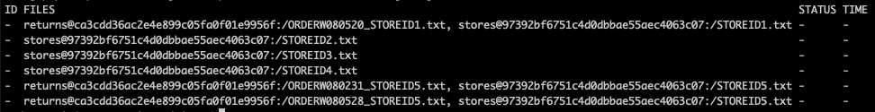
 
 
    >Note that **all** of the stores files are showing up in the datums: some are associated with a matched return, some are not, yet, **a datum is created**. Additionally, the return made to STOREID0 did **not** generate a datum since there is no STOREID0.txt in the Stores repo.

1. Update your pipeline. In the `examples/joins` directory, run:

    ```shell
    $ pachctl update pipeline -f outer_join.json --reprocess
    ```

1. Check the output repository of your pipeline and notice that a 94107.txt file now shows up (STOREID4 has a different zip code 94107).

    ```shell
    $ pachctl list file outer_join@master
    ```
    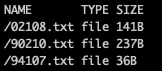

1. Visualize their content:

    ```shell
    $ pachctl get file outer_join@master:/02108.txt
    ```
    Expected results for this scenario:

    |/02108.txt|/90210.txt|/94107.txt|
    |----------|----------|------------|
    |Return at store: 2 ... NONE|Return at store: 5 ... ORDER W080231|Return at store: 4 ... NONE|
    |Return at store: 1 ... ORDER W080520| Return at store: 3 ... NONE| |
    | |Return at store: 5 ... ORDER W080528| |

### ***Case 3*** Outer join on both the Stores and Returns repos
1. Set `"outer_join" :true` on both repos `returns` and `stores` in `outer_join.json`.
1. Preview your datums then create/update your pipeline: 

    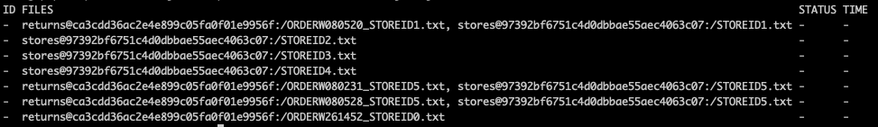
 
 
    > Note that in this last case, the datums contain all of the returns (with or without a matching store) **and** all of the stores (with or without a matching return).


1. Check the output repository of your pipeline and notice that all the zipcode.txt files now show up, including the UNKNOWN.txt.

    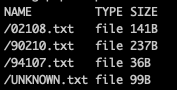

1. Expected results for this scenario:

    |/02108.txt|/90210.txt|/94107.txt|UNKNOWN.txt|
    |----------|----------|------------|-----------|
    |Return at store: 2 ... NONE|Return at store: 5 ... ORDER W080231|Return at store: 4 ... NONE| This return store does not exist ... ORDER W261452|
    |Return at store: 1 ... ORDER W080520| Return at store: 3 ... NONE| | |
    | |Return at store: 5 ... ORDER W080528| | |


> **Side note**: We could also aggregate the files by STOREID using a [group input](https://docs.pachyderm.com/1.13.x/concepts/pipeline-concepts/datum/group/). In that case, the datums produced would be bigger. Each datum would contain one STOREIDx.txt file and ALL of the matching files for this given storeID in the grouped repos. The choice between group and join is an architectural choice to optimize your pipelines' parallelization and processing time.
       
We encourage you to run our [group example](https://github.com/pachyderm/pachyderm/tree/1.13.x/examples/group) to understand more of the differences between join and group. Look for the `retail_group.json` pipeline.

You can also follow those quick steps:
```shell
$ cd ../group
$ pachctl list datum -f retail_group.json
```

In this last pipeline, we have grouped `purchases`, `returns`, and `stores` repos on STOREID. Look at the datums created.

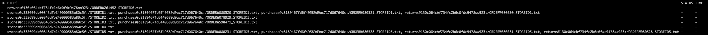


