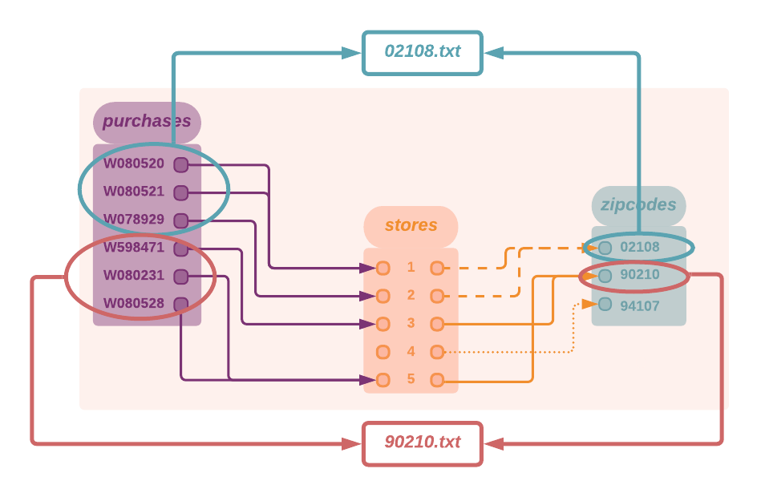
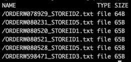
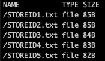
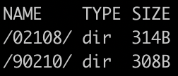

# Inner and Outer Join Pipelines 
> The outer join functionality is available in version **1.12 and higher**.
- Our first example will walk you through a typical inner join case. In a similar way to SQL, "inner-join" pipelines run your code **only** on the pairs of files that match a specific naming pattern (i.e., ***match your glob pattern/capture groups***). 
- Our second example will showcase 3 variations of "outer-join" pipelines and outline how they differ from the first. 

> Remember, in Pachyderm, the join operates at the file-path level, **not** the content of the files themselves. Therefore, the structure of your directories and file naming conventions are key elements when implementing your use cases in Pachyderm.

## 1. Getting ready
***Key concepts***
- [Join](https://docs.pachyderm.com/latest/concepts/pipeline-concepts/datum/join/) pipelines - execute your code on files that match a specific naming pattern.
- [glob patterns](https://docs.pachyderm.com/latest/concepts/pipeline-concepts/datum/glob-pattern/) - your RegExp-like search pattern. Works in pair with Join.

***Pre-requisite***
- A workspace on [Pachyderm Hub](https://docs.pachyderm.com/latest/pachhub/pachhub_getting_started/) (recommended) or Pachyderm running [locally](https://docs.pachyderm.com/latest/getting_started/local_installation/).
- [pachctl command-line ](https://docs.pachyderm.com/latest/getting_started/local_installation/#install-pachctl) installed, and your context created (i.e., you are logged in)

***Getting started***
- Clone this repo.
- Make sure Pachyderm is running. You should be able to connect to your Pachyderm cluster via the `pachctl` CLI. 
Run a quick:
```shell
$ pachctl version
COMPONENT           VERSION
pachctl             1.12.0
pachd               1.12.0
```

## 2. Data structure and naming convention
We have derived our examples from simplified retail use cases: 
- Purchases and Returns are made in given Stores. 
- Those Stores have a given location (here, a zip code). 
- There are 0 to many Stores in a given Zipcode.

Let's have a look at our data structure and naming convention. 
* `stores` - In these examples, store data are JSON files named after the store's identifier.
```shell
    └── STOREID1.txt
    └── STOREID2.txt
    └── STOREID3.txt
    └──  ...
```
We will ultimately want to list purchases by `zipcode.` Let's have a look at the content of one of those STOREIDx.txt files.
```shell
    {
        "storeid":"4",
        "name":"mariposa st.",
        "address":{
            "zipcode":"94107",
            "country":"US"
        }
    }
```

> If you did not need the location info(zip) in the content of the Store file, and, say, just wanted to list purchases by STOREID, a [group](#Add the link to group) would be best suited. One can argue that, in this example, the Zipcode could be part of the naming convention of the file, making the group the best option. True. This is an oversimplified example, ok?

Think of it that way: 
- Do you need to access the content of the matched files? -> you probably need to use the *Join* option
- No access to  - A fine naming convention is enough? -> *Group* 

* `purchases` - Each purchase info is kept in a file named by concatenating the purchase's order number and its store ID.
```shell
    └── ORDERW080520_STOREID1.txt
    └── ORDERW080521_STOREID1.txt
    └── ORDERW078929_STOREID2.txt
    └── ...
```
* `returns` - Same naming convention as purchases.
```shell
    └── ORDERW080528_STOREID5.txt
    └──  ODERW080520_STOREID1.txt
    └── ...
```
## 3. Example 1 - An Inner-Join pipeline creation 
***Goal***
List all purchases by zip code.
1. **Pipeline input repositories**: `stores` and `purchases` - Inner join by STOREID.
2. **Pipeline**: Executes a python code reading the `zipcode` in the matching STOREIDx.txt file and appending the matched purchase file's content to a text file named after the zip code.
3. **Pipeline output repository**: `inner_join`- list of text files named after the stores' zip codes in which purchases have been made and containing the list of said purchases. 

In the diagram below, we have mapped out the data of our example. We will expect the 2 following files in the output repository of our `inner_join` pipeline: 
```shell
    └── 02108.txt
    └── 90210.txt
```
Each should contain 3 purchases.


***Step 1*** - Prepare your data
The setup target of the `Makefile` in `pachyderm/examples/joins` will create 3 directories (stores, purchases, and returns) and populate them with adequate data.
In the `examples/joins` directory, run:
```shell
$ make setup
```

***Step 2*** - Create Pachyderm's repositories and pipeline, inject your data into your new repositories, and trigger the pipeline's job.
In the `examples/joins` directory, run:
```shell
$ make inner_join
```
or run:
```shell
$ pachctl create repo stores
$ pachctl create repo purchases
$ pachctl create pipeline -f inner_join.json
$ pachctl put file -r stores@master:/ -f stores
$ pachctl put file -r purchases@master:/ -f purchases
```
Have a quick look at your repositories: 
```shell
$ pachctl list file stores@master
$ pachctl list file purchases@master
```
You should see the following files:
- Stores:



- Purchases:




Now a quick check at your pipeline status:
```shell
$ pachctl list pipeline
```
It should have run successfully by now.


> You will notice two pipelines (inner_join and inner_join_build). We only created one.  This comes from the use of a [Python builder](https://docs.pachyderm.com/latest/how-tos/developer-workflow/build-pipelines/#python-builder). The builder builds your own container (including your python file `./src/inner/main.py`) on top of a Docker *base image*. It is instrumental in development mode as it allows you to modify your code without having to build, tag, and push your image each time.

See the `transform.build.language` field in our pipeline's (inner_join.json) specifications :
```shell
    "transform": {
        "build": { 
        "language":"python",
        "path": "./src/inner"
        }
    }
```
A more classic way, once 'production-ready,' would be to reference your [built Docker image](https://docs.pachyderm.com/latest/how-tos/developer-workflow/working-with-pipelines/#step-2-build-your-docker-image) as in the example below:
```shell
    "transform": {
        "cmd": [ "python3", "/edges.py" ],
        "image": "pachyderm/opencv"
    }
```

***Step 3*** - Let's have a look at our final product: Check the output repository of your pipeline.
```shell
$ pachctl list file inner_join@master
```
You should see our 2 expected text files. 



Now for a visual confirmation of their content:
```shell
$ pachctl get file inner_join@master:/02108.txt
```