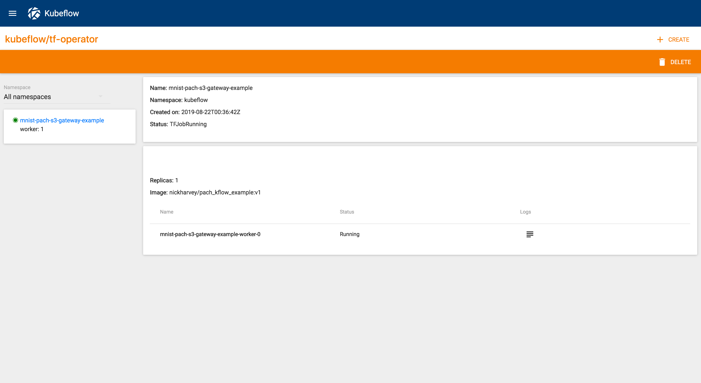

## Step 1 - Install and deploy both Kubeflow and Pachyderm
Part of what makes [Pachyderm](https://pachyderm.com/) and [Kubeflow](https://www.kubeflow.org/) work so well together is that they're built on [Kubernetes](https://kubernetes.io/), which means they can run virtually anywhere. While both Pachyderm and Kubeflow have their own deployment instructions for various infrastructures, this instructional will be based on my personal favorite, GKE. Before continuing, make sure you have the following installed on your local machine. 

#### Prerequisites:
  - [Pachyderm cli](http://docs.pachyderm.com/en/latest/getting_started/local_installation.html#install-pachctl) 
  - [Kubeflow cli](https://www.kubeflow.org/docs/started/getting-started/#installing-command-line-tools)
  - [Kubectl cli](https://kubernetes.io/docs/tasks/tools/install-kubectl/)  
  - [gcloud cli](https://cloud.google.com/sdk/gcloud/) 
  - [docker](https://docs.docker.com/install/)

#### Deploy:
To make it simple, we created a simple [bash script](github.com/pachyderm/pachyderm/examples/kubeflow/mnist_with_tfjob/gcp-kubeflow-pachyderm-setup.sh) specifically for this post, and you can use it to deploy Pachyderm and Kubeflow together on GKE in no time. However, If you prefer to do this all on your local machine, or any other infrastructure, please refer to the links below.

  - [Pachyderm Install Docs](http://docs.pachyderm.com/en/latest/getting_started/local_installation.html)
  - [Kubeflow Install Docs](https://www.kubeflow.org/docs/started/getting-started/#installing-kubeflow)

#### Working setup check
1. `kubectl get pods -n kubeflow` returns running pods.
2. `pachctl version` returns *both* pachctl and pachd versions.
3. `pachctl enterprise get-state` returns: `Pachyderm Enterprise token state: ACTIVE` (If it doesn't, [Register Pachyderm](http://docs.pachyderm.com/en/latest/enterprise/deployment.html#activate-via-the-dashboard)) 

## Step 2 - Checking in our data 
Just like every other data science project, we begin by getting the data. In a blank directory on your local machine run:  

`➜ curl -O https://storage.googleapis.com/tensorflow/tf-keras-datasets/mnist.npz`

Next, let's setup a Pachyderm repo called `inputrepo`:   

`➜ pachctl create repo inputrepo`

And one called `outputrepo`

`➜ pachctl create repo outputrepo`

With our repos set, it's time to check our data in:

`pachctl put file inputrepo@master:/data/mnist.npz -f mnist.npz`

This will copy the minst dataset from your local machine to your Pachyderm repo `inputrepo` which will generate a commit ID. Congrats! Your data now has a `HEAD` commit and Pachyderm has begun version-controlling the data! You can verify that with:

`pachctl list file outputrepo@master:/data/ --history all` _(the `--history` flag tells pachyderm to show the commit information)_

```
➜ pachctl list file inputrepo@master:/data/ --history all
COMMIT                           NAME            TYPE COMMITTED    SIZE     
a1a45ecc348a4e41bfddb2ce32df1475 /data/mnist.npz file 1 minute ago 10.96MiB
```

## Step 3 - Deploying code to work with MNIST
Now that our data is checked in, it's time to deploy some code. In the same directory run the following:

`git clone https://github.com/pachyderm/pachyderm.git && cd pachyderm/examples/kubeflow/mnist-tfjob`

Next, let's take a look at how things are working under the hood. Below is a snippet of `tfjob.py`

```
# this is the Pachyderm repo & branch we'll copy files from
input_bucket = os.getenv('INPUT_BUCKET', 'master.inputrepo')
# this is the Pachyderm repo & branch  we'll copy the files to
output_bucket  = os.getenv('OUTPUT_BUCKET', "master.outputrepo")
# this is local directory we'll copy the files to
data_dir  = os.getenv('DATA_DIR', "/data")

def main(_):
  # Declaring Pachyderm S3 Gateway input and output repos.
  input_url = 's3://' + args.inputbucket + "/data/"
  output_url = 's3://' + args.outputbucket + "/data/"
  
  os.makedirs(args.datadir)

  # first, we copy files from pachyderm into a convenient
  # local directory for processing.  The files have been
  # placed into the inputpath directory in the s3path bucket.
  print("walking {} for copying files".format(input_url))
  for dirpath, dirs, files in file_io.walk(input_url, True):
    for file in files:
      uri = os.path.join(dirpath, file)
      newpath = os.path.join(args.datadir, file)
      print("copying {} to {}".format(uri, newpath))
      file_io.copy(uri, newpath, True)

  path = '/tmp/data/mnist.npz'
  (train_images, train_labels), (test_images, test_labels) = tf.keras.datasets.mnist.load_data(path)

  <<<< .... MNIST example below ..... >>>>
```
The comments in the code provide a pretty good description of what's going on line by line. However a quick breakdown is this:  

We're copying mnist.npz from our Pachyderm repo inputrepo@master via the [S3 Gateway](http://docs.pachyderm.com/en/latest/enterprise/s3gateway.html#using-the-s3-gateway) into a local directory in the container (`/tmp/data/`). Then we tell [TensorFlow](https://www.tensorflow.org/) to load that data and start training. 

#### Mnist. Mnist. Mnist.  

Once our code trains the model, it needs to save it somewhere. Just like we copied data into the container we can copy it back out again, all the while still maintaining some provenance. If you take a look at the `tfjob_mist.py` and scroll towards the bottom you'll see that we're just crawling the same `/tmp/data/` directory and copying it to the Pachyderm S3 Gateway output `url:s3://<pachyderminstance>/master.outputrepo:/data/`


```
print("walking {} for copying to {}".format(args.datadir, output_url))
  for dirpath, dirs, files in os.walk(args.datadir, topdown=True):   
    for file in files:
      uri = os.path.join(dirpath, file)
      newpath = output_url + file
      print("copying {} to {}".format(uri, newpath))
      file_io.copy(uri, newpath, True)
```

Next, let's move onto how we deploy our code. Start by taking a look at the `tf_job_s3_gateway.yaml`:

```
apiVersion: "kubeflow.org/v1beta2"
kind: "TFJob"
metadata:
  name: "mnist-pach-s3-gateway-example"
  namespace: kubeflow 
spec:
  cleanPodPolicy: None 
  tfReplicaSpecs:
    Worker:
      replicas: 1 
      restartPolicy: Never
      template:
        spec:
          containers:
            - name: tensorflow
              image: nickharvey/pach_kflow_example:v1
              env:
                # This endpoint assumes that the pachd service was deployed
                # in the namespace pachyderm.
                # You may replace this with pachd.<namespace> if you deployed
                # pachyderm in another namespace. For example, if deployed
                # in default it would be pachd.default. You may also
                # hard code in the pachd CLUSTER-IP address you obtain from
                # kubectl get services -n <namespace>
                - name: S3_ENDPOINT
                  value: "pachd.pachyderm:600"
                - name: S3_USE_HTTPS
                  value: "0"
                - name: S3_VERIFY_SSL
                  value: "0"
              command:
                - "python3"
                - "tfjob.py"
                - "-i"
                - "master.inputrepo"
                - "-o"
                - "master.outputrepo"
                - "-d"
                - "/tmp/data/"
```
The 'mnist_tf_job_s3_gateway.yaml' is our spec file that Kubeflow and Kubernetes will use to deploy our code. You can find out everything you need to know about this spec file in the [Kubeflow TFjobs Docs](https://www.kubeflow.org/docs/components/training/tftraining/). Notice the Pachyderm repos, branches, and tmp location are being declared at the bottom.  

To deploy just run the following:
`kubectl create -f mnist_tf_job_s3_gateway.yaml`

#### A few moments later...  

We can check on things by going to the  and click on TFJob Dasboard. You should see something like:



## Step 4 - Trust but verify
You know the old saying, always trust but verify too. Let's confirm that we actually  trained our model and that we maintained data provenance as we worked our way down the pipeline. 

```
➜ pachctl list file outputrepo@master:/data/ --history all
COMMIT                           NAME              TYPE COMMITTED   SIZE     
a0f654c7a65f42f69e8bddd1a2035a7e /data/mnist.npz   file 7 hours ago 10.96MiB 
eb7e51147b4d42cfbcd555c84be778d2 /data/my_model.h5 file 7 hours ago 4.684MiB 
```
Perfect, the data is exactly where wanted it to go. Now, lets see how Pachyderm can show us where it came from before it got moved. Simply run the following:

```
➜ pachctl inspect commit outputrepo@eb7e51147b4d42cfbcd555c84be778d2
Commit: outputrepo@eb7e51147b4d42cfbcd555c84be778d2
Original Branch: master
Parent: a0f654c7a65f42f69e8bddd1a2035a7e
Started: 7 hours ago
Finished: 7 hours ago
Size: 15.64MiB
```

How cool is that? Our `my_model.h5` (commit: eb7e51147b4d42cfbcd555c84be778d2) has a _parent_ of `a0f654c7a65f42f69e8bddd1a2035a7e` which is the commit id of `mnist.npz` file we checked in earlier.  

Now when anyone asks "What data was used to train that model?" you can tell them with just one command.

### And that's a wrap! 
Great work! You started down the road to better data control and laid the groundwork for mastering  data lineage.  

Of course, that’s just the start and there's more work to be done. A [true data lineage](https://www.pachyderm.io/dsbor.html) solution gives users a complete understanding of the entire journey of data, model and code from top to bottom. Everything gets versioned and tracked as it changes, including the relationships between all three of those key pieces of every data science project.  

What we did here was take our first few steps by introducing version-control for the data alone. Don't worry though, Pachyderm and the Kubeflow community are on it and we're collaborating to create the best possible solution for every AI infrastructure team to get a handle on their pipelines from start to finish.  

And for those of you  wondering, "How would this work in a pipeline?" don't worry, we've got a seperate post on just that so stay tuned!  

If you're interested in exploring data lineage and more, please go to [Pachyderm.com](https://pachyderm.com) or check us out on [github](https://github.com/pachyderm/pachyderm) and be sure to join our [Slack](http://slack.pachyderm.io/) if you need help getting going fast.