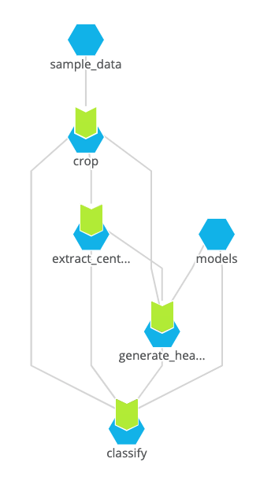

# Breast Cancer Detection
This example shows the application and parallelization of a state-of-the-art computer vision architecture applied to radiology images taken during breast cancer scans.

The underlying code and model comes from [this repo](https://github.com/nyukat/breast_cancer_classifier), developed by a team at NYU. There are different ways to scale inference pipelines and deep learning models. Here we decided to separate out the CPU-based preprocessing and GPU-related tasks. By separating the inference tasks, pipelines can be updated independently, allowing ease of model deployment and collaboration.


## Running the Example
This example takes an existing repo and runs it on pachyderm. There are many ways to structure the data and models, so we decided to show two different implementations with the same outcome. A single pipeline and a parallelized pipeline. 

### Single Pipeline
This pipeline executes the `run.sh` script as the entrypoint and instead of reading everything from the local file system, it reads and writes to the Pachyderm file system (PFS). This single pipeline implementation doesn’t provide scaling, but rather, moves the computation to Kubernetes, showing how easy it can be to convert an existing repository to Pachyderm.

The data inputs for the simple pipeline are organized into 2 groups: models and image data. These inputs are "crossed" which tells pachyderm to rerun the computation whenever the input changes. This is beneficial when models change, however it would re-predict on all scans whenever a new one is added. We’ll parallelize this in the next section.

To deploy the single pipeline example, we only need to run the following: 

```bash
pachctl create repo models
pachctl create repo sample_data
pachctl put file -r models@master:/ -f models/
pachctl put file -r sample_data@master:/ -f sample_data/single-batch/
pachctl create pipeline -f pachyderm/single_stage/bc_classification.json
```

Note: There are also CPU versions of the pipeline if GPUs are not available.

### Parallelized

Now that we have a proof-of-concept that runs in a single pipeline, let’s split it into multiple that can be scaled individually and take advantage of Pachyderm’s parallelism.

Pachyderm allows for parallelism based on the data model that is instituted. We will treat each exam (4 images and a list file) as a single datum, allowing us to parallelize computation for each exam that is added. the file structure for the `sample_data` will be organized as follows: 

```
sample_data/
├── <unique_exam_id>
│   ├── L_CC.png
│   ├── L_MLO.png
│   ├── R_CC.png
│   ├── R_MLO.png
│   └── gen_exam_list_before_cropping.pkl
├── <unique_exam_id>
│   ├── L_CC.png
│   ├── L_MLO.png
│   ├── R_CC.png
│   ├── R_MLO.png
│   └── gen_exam_list_before_cropping.pkl
...
```

Note: The `gen_exam_list_before_cropping.pkl` is a pickled version of the image list, a requirement of the underlying library being used. 


For simplicity in development, we split the original run script into the four stages already present in it:

- Crop
- Extract Centers
- Generate Heatmaps
- Classify

The final pipeline graph (directed acyclic graph, or DAG) is shown in the image below.

<p align="center">
  
</p>

Creating the entire DAG can be done with the following commands:

```bash
pachctl create repo models
pachctl create repo sample_data
pachctl put file -r models@master:/ -f models/
pachctl put file -r sample_data@master:/ -f sample_data/multi-processed/
pachctl create pipeline -f pachyderm/multi-stage/crop.json
pachctl create pipeline -f pachyderm/multi-stage/extract_centers.json
pachctl create pipeline -f pachyderm/multi-stage/generate_heatmaps.json
pachctl create pipeline -f pachyderm/multi-stage/classify.json
```

Once this DAG of pipelines is set up, running new data only requires you to upload the images from the scan. Pachyderm automatically detects that there is a new datum present and starts the classification process. 

The pipeline system is so sophisticated that if we changed one of the models in the `models` repository, everything that depended on the input from that repository would know that it needed to update and automatically queue jobs to classify the new scan. 


## Citations

**Deep Neural Networks Improve Radiologists' Performance in Breast Cancer Screening**\
Nan Wu, Jason Phang, Jungkyu Park, Yiqiu Shen, Zhe Huang, Masha Zorin, Stanisław Jastrzębski, Thibault Févry, Joe Katsnelson, Eric Kim, Stacey Wolfson, Ujas Parikh, Sushma Gaddam, Leng Leng Young Lin, Kara Ho, Joshua D. Weinstein, Beatriu Reig, Yiming Gao, Hildegard Toth, Kristine Pysarenko, Alana Lewin, Jiyon Lee, Krystal Airola, Eralda Mema, Stephanie Chung, Esther Hwang, Naziya Samreen, S. Gene Kim, Laura Heacock, Linda Moy, Kyunghyun Cho, Krzysztof J. Geras\
IEEE Transactions on Medical Imaging\
2019
