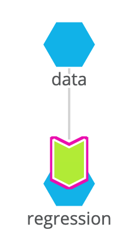
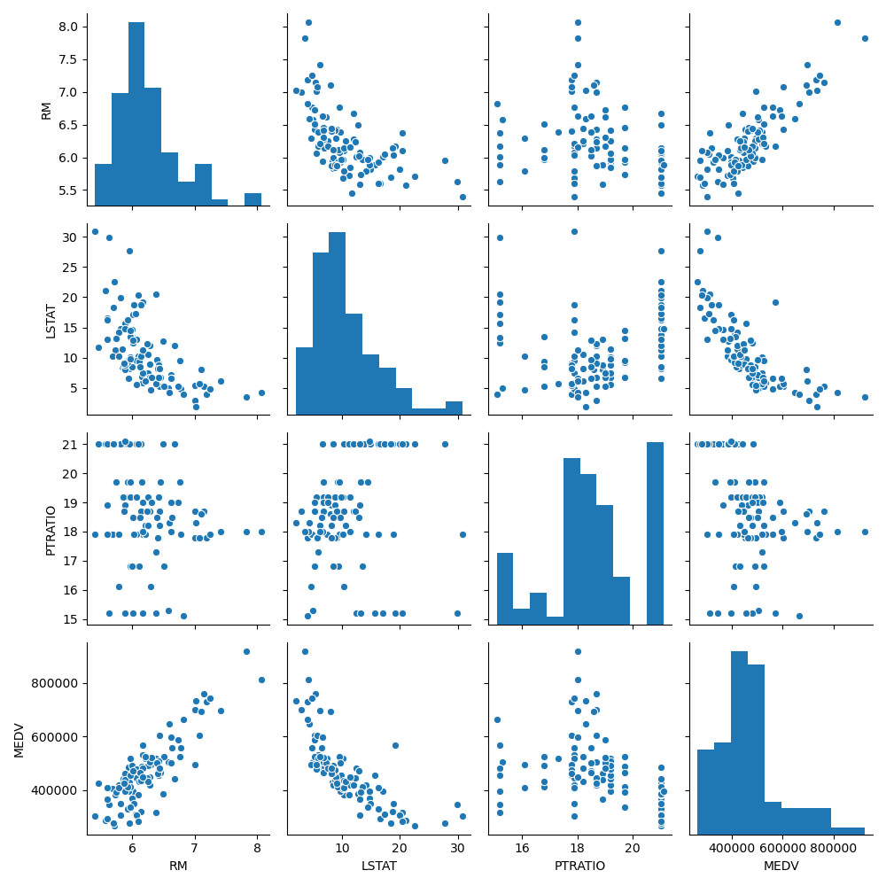
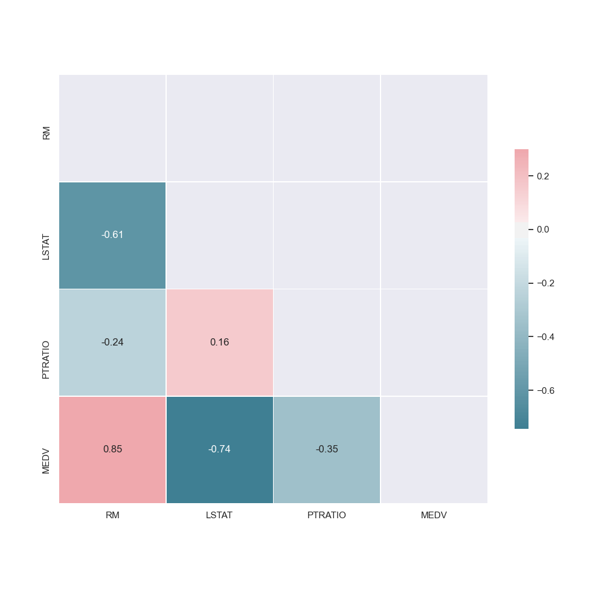
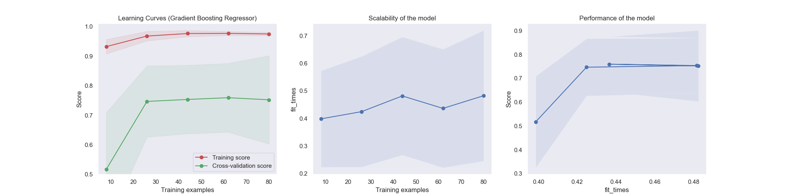
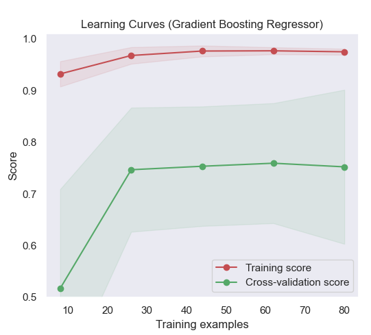
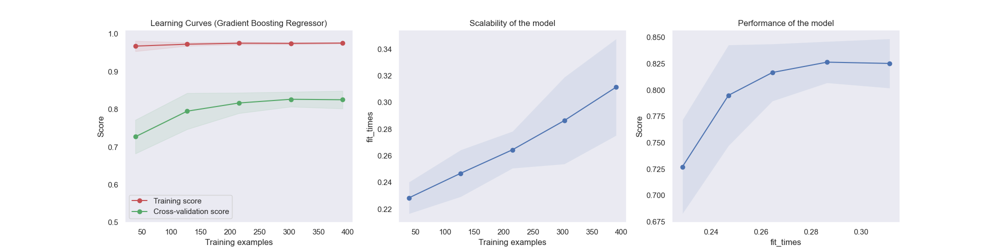

# Boston Housing Prices

This example creates a simple machine learning pipeline in Pachyderm to train a regression model on the Boston Housing Dataset to predict the value of homes in Boston. The pipeline itself is written in Python, though a Pachyderm pipeline could be written in any language.

<p align="center">
  
</p>

The Pachyderm pipeline performs the following actions:

1. Imports the structured dataset (`.csv`) with `pandas`.
2. Performs data analysis with `scikit-learn`.
3. Trains a regression model to predict housing prices.
4. Generates a learning curve and performance metrics to estimate the quality of the model.

Outline of this Example: 

- [Boston Housing Prices](#boston-housing-prices)
  - [Housing prices datasets](#housing-prices-datasets)
  - [Getting Started](#getting-started)
  - [Python code](#python-code)
    - [Data Analysis](#data-analysis)
    - [Train a regression model](#train-a-regression-model)
    - [Evaluate the model](#evaluate-the-model)
  - [Pachyderm Pipeline](#pachyderm-pipeline)
    - [TLDR; Just give me the code](#tldr-just-give-me-the-code)
    - [Step 1: Create input data repository](#step-1-create-input-data-repository)
    - [Step 2: Create the regression pipeline](#step-2-create-the-regression-pipeline)
    - [Step 3: Add the housing dataset to the repo](#step-3-add-the-housing-dataset-to-the-repo)
    - [Step 4: Download files once the pipeline has finished](#step-4-download-files-once-the-pipeline-has-finished)
    - [Step 5: Update Dataset](#step-5-update-dataset)

## Housing prices datasets

The housing prices dataset used for this example is a reduced version of the original, focusing on a subset of the features. It contains three input features (RM, LSTST, and PTRATIO) and the output, or target (MEDV) that we are learning to predict.
|Feature| Description|
|---|---|
|RM |       Average number of rooms per dwelling|
|LSTAT |    Percent lower status of the population|
|PTRATIO |  Pupil-teacher ratio by town|
|MEDV |     Median value of owner-occupied homes in $1000's|

Sample:
|RM   |LSTAT|PTRATIO|MEDV|
|-----|----|----|--------|
|6.575|4.98|15.3|504000.0|
|6.421|9.14|17.8|453600.0|
|7.185|4.03|17.8|728700.0|
|6.998|2.94|18.7|701400.0|

## Getting Started

This example requires a running Pachyderm deployment. You can deploy a cluster on [PacHub](hub.pachyderm.com) or deploy locally as described here:

- [Pachyderm Getting Started](https://docs.pachyderm.com/latest/getting_started/)

Once everything is up, we can check the setup by running:

1. `kubectl get all` to ensure all the pods are up.
2. `pachctl version` which will show both the `pachctl` and `pachd` versions.

Next, clone this repo and follow the steps below.


## Python Code

The `regression.py` Python file contains the machine learning code for the example. We will give a brief description of it here, but full knowledge of it is not required for the example. 

```
$ python regression.py --help

usage: regression.py [-h] [--input INPUT] [--target-col TARGET_COL]
                     [--output DIR]

Structured data regression

optional arguments:
  -h, --help            show this help message and exit
  --input INPUT         csv file with all examples
  --target-col TARGET_COL
                        column with target values
  --output DIR          output directory
  ```

The regression code performs the following actions:

1. Analyses the data.
2. Trains a regressor.
3. Evaluates the model.

### Data Analysis
The first step in the pipeline creates a pairplot showing the relationship between features. By seeing what features are positively or negatively correlated to the target value (or each other), it can helps us understand what features may be valuable to the model.
<p align="center">
  
</p>

We can represent the same data in color form with a correlation matrix. The darker the color, the higher the correlation (+/-).

<p align="center">
  
</p>

### Train a regression model
To train the regression model using scikit-learn. In our case, we will train a Random Forest Regressor ensemble. After splitting the data into features and targets (`X` and `y`), we can fit the model to our parameters.  

### Evaluate the model
After the model is trained we output some visualizations to evaluate its effectiveness of it using the learning curve and other statistics.
<p align="center">
  
</p>


## Pachyderm Pipeline
Now we'll deploy this python code with Pachyderm. 
### TLDR; Just give me the code

```bash
# Step 1: Create input data repository
pachctl create repo housing_data

# Step 2: Create the regression pipeline
pachctl create pipeline -f regression.json

# Step 3: Add the housing dataset to the repo
pachctl put file housing_data@master:housing-simplified.csv -f data/housing-simplified-1.csv

# Step 4: Download files once the pipeline has finished
pachctl get file --recursive regression@master

# Step 5: Update dataset with more data
pachctl put file housing_data@master:housing-simplified.csv -f data/housing-simplified-2.csv --overwrite
```

### Step 1: Create an input data repository

Once the Pachyderm cluster is running, create a data repository called `housing_data` where we will put our dataset.

```bash
$ pachctl create repo housing_data
$ pachctl list repo
NAME                CREATED             SIZE
housing_data        3 seconds ago       0 B
```

### Step 2: Create the regression pipeline

We can now connect a pipeline to watch the data repo. Pipelines are defined in `json` format. Here is the one that we'll be used for the regression pipeline: 
```json
# regression.json
{
    "pipeline": {
        "name": "regression"
    },
    "description": "A pipeline that trains produces a regression model for housing prices.",
    "input": {
        "pfs": {
            "glob": "/*",
            "repo": "housing_data"
        }
    },
    "transform": {
        "cmd": [
            "python",
            "regression.py",
            "--input",
            "/pfs/housing_data/",
            "--target-col",
            "MEDV",
            "--output",
            "/pfs/out/"
        ],
        "image": "jimmywhitaker/housing-prices"
    }
}
```

For the pipeline **input** we can define what data repo(s) our pipeline is connected to and what [glob pattern](https://docs.pachyderm.com/latest/concepts/pipeline-concepts/datum/glob-pattern/) to use. A glob pattern tells the pipeline how to map data into a job, here we have it create a new job for each datum in the `housing_data` repository.

The **image** defines what Docker image will be used for the pipeline, and the **transform** is the command run once a pipeline job starts.

Once this pipeline is created, it watches for any changes to its input, and if detected, it starts a new job to train given the new dataset.

```bash
$ pachctl create pipeline -f regression.json
```

The pipeline writes the output to a PFS repo (`/pfs/out/` in the pipeline json) created with the same name as the pipeline.

### Step 3: Add the housing dataset to the repo
Now we can add the data, which will kick off the processing automatically. If we update the data with a new commit, then the pipeline will automatically re-run. 

```bash
$ pachctl put file housing_data@master:housing-simplified.csv -f data/housing-simplified-1.csv
```

We can inspect that the data is in the repository by looking at the files in the repository.

```bash
$ pachctl list file housing_data@master
NAME                    TYPE SIZE
/housing-simplified.csv file 12.14KiB
```

We can see that the pipeline is running by looking at the status of the job(s). 

```bash
$ pachctl list job
ID                               PIPELINE   STARTED        DURATION   RESTART PROGRESS  DL       UL      STATE
299b4f36535e47e399e7df7fc6ee2f7f regression 23 seconds ago 18 seconds 0       1 + 0 / 1 2.482KiB 1002KiB success
```

### Step 4: Download files once the pipeline has finished
Once the pipeline is completed, we can download the files that were created.

```bash
$ pachctl list file regression@master
NAME               TYPE SIZE
/housing-simplified_corr_matrix.png   file 18.66KiB
/housing-simplified_cv_reg_output.png file 62.19KiB
/housing-simplified_final_model.sav   file 1.007KiB
/housing-simplified_pairplot.png      file 207.5KiB

$ pachctl get file regression@master:/ --recursive --output .
```

When we inspect the learning curve, we can see that there is a large gap between the training score and the validation score. This typically indicates that our model could benefit from the addition of more data. 

<p align="center">
  
</p>

Now let's update our dataset with additional examples.

### Step 5: Update Dataset
Here's where Pachyderm truly starts to shine. To update our dataset we can run the following command (note that we could also append new examples to the existing file, but in this example we're simply overwriting our previous file to one with more data):

```bash
$ pachctl put file housing_data@master:housing-simplified.csv -f data/housing-simplified-2.csv --overwrite
```

The new commit of data to the `housing_data` repository automatically kicks off a job on the `regression` pipeline without us having to do anything. 

When the job is complete we can download the new files and see that our model has improved, given the new learning curve. 
<p align="center">
  
</p>
