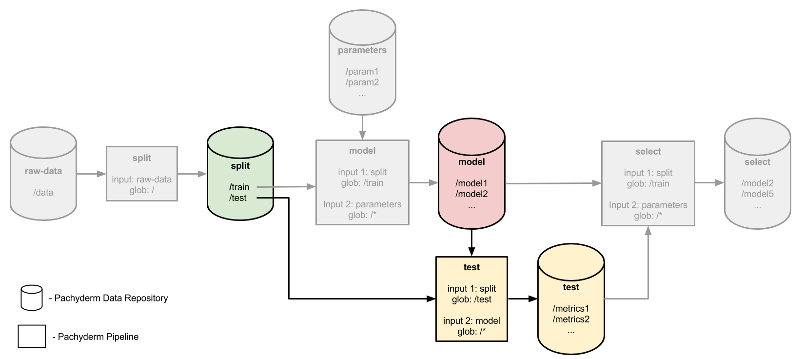
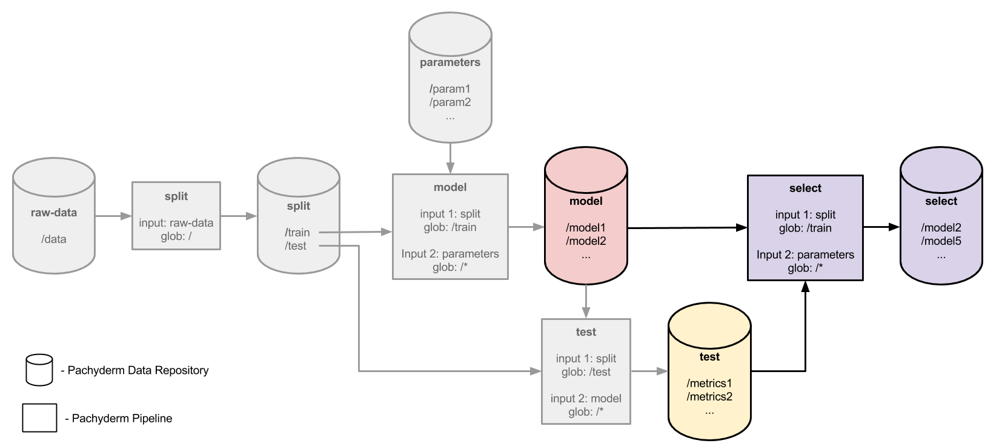

# Distributed hyperparameter tuning

This example demonstrates how you can evaluate a model or function in a distributed manner on multiple sets of parameters.  In this particular case, we will evaluate many machine learning models, each configured uses different sets of parameters (aka hyperparameters), and we will output only the best performing model or models.

The models trained and evaluated in the example will attempt to predict the species of iris flowers using the iris data set, which is often used to demonstrate ML methods.  The different sets of parameters used in the example are the *C* and *Gamma* parameters of an SVM machine learning model.  If you aren't familiar with that model or those parameters, don't worry about them too much.  The point here is that *C* and *Gamma* are parameters of this model, and we want to search over many combinations of *C* and *Gamma* to determine which combination best predicts iris flower species.

The example assumes that you have:

- A Pachyderm cluster running - see [Local Installation](https://docs.pachyderm.com/latest/getting_started/local_installation/) to get up and running with a local Pachyderm cluster in just a few minutes.
- The `pachctl` CLI tool installed and connected to your Pachyderm cluster - see [any of our deploy docs](https://docs.pachyderm.com/latest/deploy-manage/deploy/) for instructions.

## The pipelines

The example uses 4 pipeline stages to accomplish this distributed hyperparameter tuning/search.  First we will split our iris data set into a training and test data set.  The training set will be used to train or fit our model with the various sets of parameters and the test set will be used later to evaluate each trained model.


Next, we will train a model for each combination of *C* and *Gamma* parameters in a `parameters` repo.  The trained models will be serialized and output to the `model` repo.


In a `test` stage we will pair each trained/fit model in `model` with our test data set.  Using the test data set we will generate an evaluation metric, or score, for each of the train models.



Finally, in a `select` stage we will determine which of the evaluate metrics in `test` is the best, select out the models corresponding to those metrics, and output them to the `select` repo.



## Preparing the input data

The two input data repositories for this example are `raw-data` containing the raw iris data set and `parameters` containing all of our *C* and *Gamma* parameters.  First let's create these repositories:

```sh
$ pachctl create repo raw_data
$ pachctl create repo parameters
$ pachctl list repo
NAME                CREATED             SIZE                
parameters          47 seconds ago      0B                  
raw-data            52 seconds ago      0B
```

Then, we can put our iris data set into `raw-data`.  We are going to use a version of the iris data set that includes a little bit of noise to make the classification problem more difficult.  This data set is included under [data/noisy_iris.csv](data/noisy_iris.csv).  To commit this data set into Pachyderm:

```sh
$ cd data 
$ pachctl put file raw_data@master:iris.csv -f noisy_iris.csv 
$ pachctl list file raw_data@master
NAME                TYPE                SIZE                
iris.csv            file                10.29KiB
```

The *C* and *Gamma* parameters that we will be searching over are included in [data/parameters](data/parameters) under two respective files.  In order to process each combination of these parameters in parallel, we are going to use Pachyderm's built in splitting capability to split each parameter value into a separate file:

```sh
$ cd parameters 
$ pachctl put file parameters@master -f c_parameters.txt --split line --target-file-datums 1 
$ pachctl put file parameters@master -f gamma_parameters.txt --split line --target-file-datums 1
$ pachctl list file parameters@master
NAME                   TYPE                SIZE                
c_parameters.txt       dir                 81B                 
gamma_parameters.txt   dir                 42B                 
$ pachctl list file parameters@master:c_parameters.txt
NAME                                TYPE                SIZE                
c_parameters.txt/0000000000000000   file                6B                  
c_parameters.txt/0000000000000001   file                6B                  
c_parameters.txt/0000000000000002   file                6B                  
c_parameters.txt/0000000000000003   file                6B                  
c_parameters.txt/0000000000000004   file                6B                  
c_parameters.txt/0000000000000005   file                7B                  
c_parameters.txt/0000000000000006   file                8B                  
c_parameters.txt/0000000000000007   file                8B                  
c_parameters.txt/0000000000000008   file                9B                  
c_parameters.txt/0000000000000009   file                9B                  
c_parameters.txt/000000000000000a   file                10B                 
$ pachctl list file parameters@master:gamma_parameters.txt
NAME                                    TYPE                SIZE                
gamma_parameters.txt/0000000000000000   file                6B                  
gamma_parameters.txt/0000000000000001   file                6B                  
gamma_parameters.txt/0000000000000002   file                6B                  
gamma_parameters.txt/0000000000000003   file                6B                  
gamma_parameters.txt/0000000000000004   file                6B                  
gamma_parameters.txt/0000000000000005   file                6B                  
gamma_parameters.txt/0000000000000006   file                6B
``` 

As you can see, each of the parameter files has been split into a file per line, and thus a file per parameter.  This can be seen by looking at the file contents:

```sh
$ pachctl get file parameters@master:c_parameters.txt/0000000000000000
0.031
$ pachctl get file parameters@master:c_parameters.txt/0000000000000001
0.125
$ pachctl get file parameters@master:c_parameters.txt/0000000000000002
0.500
```

For more information on splitting data files, see our [splitting data for distributed processing](https://docs.pachyderm.com/latest/how-tos/splitting-data/splitting/).

## Creating the pipelines

To create the four pipelines mentioned and illustrated above:

```sh
$ cd ../../
$ pachctl create pipeline -f split.json 
$ pachctl create pipeline -f model.json
$ pachctl create pipeline -f test.json 
$ pachctl create pipeline -f select.json
```

Once the pipelines are up an running you should be able to see their corresponding workers in kubernetes:

```sh
$ kubectl get pods
NAME                       READY     STATUS    RESTARTS   AGE
etcd-2142892294-nzb39      1/1       Running   0          1h
pachd-776177201-ww198      1/1       Running   0          1h
pipeline-model-v1-htphr    2/2       Running   0          7m
pipeline-select-v1-240bt   2/2       Running   0          7m
pipeline-split-v1-9lwkn    2/2       Running   0          7m
pipeline-test-v1-h47lw     2/2       Running   0          7m
```

And, after waiting a few minutes, you should see the successful jobs that did our distributed hyperparameter tuning:

```sh
$ pachctl list job
ID                                   OUTPUT COMMIT                           STARTED            DURATION           RESTART PROGRESS    DL       UL       STATE            
e2b75a61-13e2-4067-88b7-adec4d32f830 select/f38eae7cea574fc6a90adda706d4714e 18 seconds ago     Less than a second 0       1 + 0 / 1   243.2KiB 82.3KiB  success 
4116af2b-efa5-405e-ba04-f850a656e25d test/1e379911118c4492932a2dd9eb198e9a   About a minute ago About a minute     0       77 + 0 / 77 400.3KiB 924B     success 
f628028e-2c88-439e-8738-823fe0441e1b model/6a877b93e3e2445e92a11af8bde6dddf  3 minutes ago      About a minute     0       77 + 0 / 77 635.1KiB 242.3KiB success 
a2ba2024-db12-4a78-9383-82adba5a4c3d split/04955ad7fda64a66820db5578478c1d6  5 minutes ago      Less than a second 0       1 + 0 / 1   10.29KiB 10.29KiB success
```

## Looking at the results

If we look at the models that were trained based on our training data, we will see one model for each of the combinations of *C* and *Gamma* parameters:

```sh
$ pachctl list file model@master
NAME                        TYPE                SIZE                
model_C0.031_G0.001.pkl     file                6.908KiB            
model_C0.031_G0.004.pkl     file                6.908KiB            
model_C0.031_G0.016.pkl     file                6.908KiB            
model_C0.031_G0.063.pkl     file                6.908KiB            
model_C0.031_G0.25.pkl      file                6.908KiB            
model_C0.031_G1.0.pkl       file                6.908KiB            
model_C0.031_G4.0.pkl       file                6.908KiB            
model_C0.125_G0.001.pkl     file                4.85KiB             
model_C0.125_G0.004.pkl     file                4.85KiB             
model_C0.125_G0.016.pkl     file                4.85KiB             
model_C0.125_G0.063.pkl     file                4.85KiB             
model_C0.125_G0.25.pkl      file                4.85KiB             
model_C0.125_G1.0.pkl       file                4.85KiB
etc...
``` 

There should be 77 of these models:

```sh
$ pachctl list file model@master | wc -l
78
```

But not all of these models are ideal for making our predictions. Our `select` pipeline stage automatically selected out the best of these models (based on the evaluation metrics generated by the `test` stage). We can see which of the models are ideal for our predictions as follows:

```sh
$ pachctl list file select@master | wc -l
36
$ pachctl list file select@master
NAME                      TYPE                SIZE
model_C0.031_G0.001.pkl   file                5.713KiB
model_C0.031_G0.004.pkl   file                5.713KiB
model_C0.031_G0.016.pkl   file                5.713KiB
model_C0.031_G0.063.pkl   file                5.713KiB
model_C0.031_G0.25.pkl    file                5.713KiB
model_C0.031_G1.0.pkl     file                5.713KiB
model_C0.031_G4.0.pkl     file                5.713KiB
etc...
``` 

*Note* - Here, 36 of the 77 models were selected as ideal. Due to the fact that we are randomly shuffling our training/test data, your results may vary slightly.

*Note* - The pipeline we've built here is very easy to generalize for any sort of parameter space exploration. As long as you break up your parameters into individual files (as shown above), you can test the whole parameter space in a massively distributed way and simply pick out the best results. 
