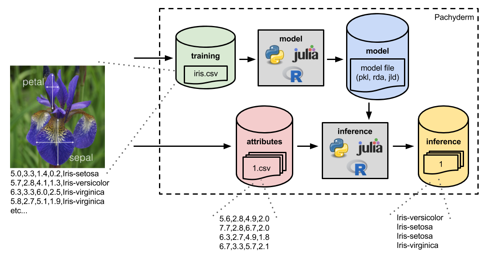

> INFO Each new minor version of Pachyderm introduces profound architectual changes to the product. For this reason, our examples are kept in separate branches:
> - Branch Master: Examples using Pachyderm 2.1.x versions - https://github.com/pachyderm/pachyderm/tree/master/examples
> - Branch 2.0.x: Examples using Pachyderm 2.0.x versions - https://github.com/pachyderm/pachyderm/tree/2.0.x/examples
> - Branch 1.13.x: Examples using Pachyderm 1.13.x versions - https://github.com/pachyderm/pachyderm/tree/1.13.x/examples
# ML pipeline for Iris Classification - R, Python, or Julia



This machine learning pipeline implements a "hello world" ML pipeline that trains a model to predict the species of Iris flowers (based on measurements of those flowers) and then utilizes that trained model to perform predictions. The pipeline can be deployed with R-based components, Python-based components, or Julia-based components.  In fact, you can even deploy an R-based pipeline, for example, and then switch out the R pipeline stages with Julia or Python pipeline stages.  This illustrates the language agnostic nature of Pachyderm's containerized pipelines.

1. [Make sure Pachyderm is running](README.md#1-make-sure-pachyderm-is-running)
2. [Create the input "data repositories"](README.md#2-create-the-input-data-repositories)
3. [Commit the training data set into Pachyderm](README.md#3-commit-the-training-data-set-into-pachyderm)
4. [Create the training pipeline](README.md#4-create-the-training-pipeline)
5. [Commit input attributes](README.md#5-commit-input-attributes)
6. [Create the inference pipeline](README.md#6-create-the-inference-pipeline)
7. [Examine the results](README.md#7-examine-the-results)

Bonus:

8. [Parallelize the inference](README.md#8-parallelize-the-inference)
9. [Update the model training](README.md#9-update-the-model-training)
10. [Update the training data set](README.md#10-update-the-training-data-set)
11. [Examine pipeline provenance](README.md#11-examine-pipeline-provenance)

Finally, we provide some [Resources](README.md#resources) for you for further exploration.

## Getting Started

- Clone this repo.
- Install Pachyderm as described in [Local Installation](https://docs.pachyderm.com/latest/getting-started/local-installation/).

## 1. Make sure Pachyderm is running

You should be able to connect to your Pachyderm cluster via the `pachctl` CLI.  To verify that everything is running correctly on your machine, you should be able to run the following with similar output:

```
 pachctl version
COMPONENT           VERSION
pachctl             1.7.0
pachd               1.7.0
```

## 2. Create the input data repositories

On the Pachyderm cluster running in your remote machine, we will need to create the two input data repositories (for our training data and input iris attributes).  To do this run:

```
 pachctl create repo training
 pachctl create repo attributes
```

As a sanity check, we can list out the current repos, and you should see the two repos you just created:

```
 pachctl list repo
NAME                CREATED             SIZE
attributes          5 seconds ago       0 B
training            8 seconds ago       0 B
```

## 3. Commit the training data set into pachyderm

We have our training data repository, but we haven't put our training data set into this repository yet.  The training data set, `iris.csv`, is included here in the [data](data) directory.

To get this data into Pachyderm, navigate to this directory and run:

```
 cd data
 pachctl put file training@master -f iris.csv
```

Then, you should be able to see the following:

```
 pachctl list repo
NAME                CREATED             SIZE
training            3 minutes ago       4.444 KiB
attributes          3 minutes ago       0 B
 pachctl list file training@master
NAME                TYPE                SIZE
iris.csv            file                4.444 KiB
```

## 4. Create the training pipeline

Next, we can create the `model` pipeline stage to process the data in the training repository. To do this, we just need to provide Pachyderm with a JSON pipeline specification that tells Pachyderm how to process the data. This `model` pipeline can be specified to train a model with R, Python, or Julia and with a variety of types of models.  The following Docker images are available for the training:

- `pachyderm/iris-train:python-svm` - Python-based SVM implemented in [python/iris-train-python-svm/pytrain.py](python/iris-train-python-svm/pytrain.py)
- `pachyderm/iris-train:python-lda` - Python-based LDA implemented in [python/iris-train-python-lda/pytrain.py](python/iris-train-python-lda/pytrain.py)
- `pachyderm/iris-train:rstats-svm` - R-based SVM implemented in [rstats/iris-train-r-svm/train.R](rstats/iris-train-r-svm/train.R)
- `pachyderm/iris-train:rstats-lda` - R-based LDA implemented in [rstats/iris-train-r-lda/train.R](rstats/iris-train-r-lda/train.R)
- `pachyderm/iris-train:julia-tree` - Julia-based decision tree implemented in [julia/iris-train-julia-tree/train.jl](julia/iris-train-julia-tree/train.jl)
- `pachyderm/iris-train:julia-forest` - Julia-based random forest implemented in [julia/iris-train-julia-forest/train.jl](julia/iris-train-julia-forest/train.jl)

You can utilize any one of these images in your model training by using specification corresponding to the language of interest, `<julia, python, rstats>_train.json`, and making sure that the particular image is specified in the `image` field.  For example, if we wanted to train a random forest model with Julia, we would use [julia_train.json](julia_train.json) and make sure that the `image` field read as follows:

```
  "transform": {
    "image": "pachyderm/iris-train:julia-forest",
    ...
```

Once you have specified your choice of modeling in the pipeline spec (the below output was generated with the Python images, but you would see similar output with the Julia/R equivalents), create the training pipeline:

```
 cd ..
 pachctl create pipeline -f <julia, python, rstats>_train.json
```

Immediately you will notice that Pachyderm has kicked off a job to perform the model training:

```
 pachctl list job
ID                               SUBJOBS PROGRESS CREATED            MODIFIED
9fa51a87127a4079a4112eab9e3e0314 1       ▇▇▇▇▇▇▇▇ About a minute ago About a minute ago 
```

This job should run for about a minute (it will actually run much faster after this, but we have to pull the Docker image on the first run).  After your model has successfully been trained, you should see:

```s
pachctl list file model@master
NAME       TYPE SIZE     
/model.pkl file 3.448KiB 
/model.txt file 226B  
```

(This is the output for the Python code. Julia and R will have similar output, but the file types will be different.)

## 5. Commit input attributes

Great! We now have a trained model that will infer the species of iris flowers.  Let's commit some iris attributes into Pachyderm that we would like to run through the inference.  We have a couple examples under [test](data/test).  Feel free to use these, find your own, or even create your own.  To commit our samples (assuming you have cloned this repo on the remote machine), you can run:

```
 cd data/test/
 pachctl put file attributes@master -r -f .
```

You should then see:

```
 pachctl list file attributes@master
NAME                TYPE                SIZE
1.csv               file                16 B
2.csv               file                96 B
```

## 6. Create the inference pipeline

We have another JSON blob, `<julia, python, rstats>_infer.json`, that will tell Pachyderm how to perform the processing for the inference stage.  This is similar to our last JSON specification except, in this case, we have two input repositories (the `attributes` and the `model`) and we are using a different Docker image.  Similar to the training pipeline stage, this can be created in R, Python, or Julia.  However, you should create it in the language that was used for training (because the model output formats aren't standardized across the languages). The available docker images are as follows:

- `pachyderm/iris-infer:python` - Python-based inference implemented in [python/iris-infer-python/infer.py](python/iris-infer-python/pyinfer.py)
- `pachyderm/iris-infer:rstats` - R-based inferenced implemented in [rstats/iris-infer-rstats/infer.R](rstats/iris-infer-r/infer.R)
- `pachyderm/iris-infer:julia` - Julia-based inference implemented in [julia/iris-infer-julia/infer.jl](julia/iris-infer-julia/infer.jl)

Then, to create the inference stage, we simply run:

```
 cd ../../
 pachctl create pipeline -f <julia, python, rstats>_infer.json
```

where `<julia, python, rstats>` is replaced by the language you are using.  This will immediately kick off an inference job, because we have committed unprocessed reviews into the `reviews` repo.  The results will then be versioned in a corresponding `inference` data repository:

```s
pachctl list job 
ID                               SUBJOBS PROGRESS CREATED       MODIFIED
881fcbccb7584f538c12eb6b356a752a 1       ▇▇▇▇▇▇▇▇ 9 seconds ago 9 seconds ago 
9fa51a87127a4079a4112eab9e3e0314 1       ▇▇▇▇▇▇▇▇ 3 minutes ago 3 minutes ago 

pachctl list repo
NAME       CREATED        SIZE (MASTER) DESCRIPTION                         
inference  46 seconds ago ≤ 100B        Output repo for pipeline inference. 
model      4 minutes ago  ≤ 3.669KiB    Output repo for pipeline model.     
attributes 5 minutes ago  ≤ 112B                                            
training   5 minutes ago  ≤ 4.444KiB 
```

## 7. Examine the results

We have created results from the inference, but how do we examine those results?  There are multiple ways, but an easy way is to just "get" the specific files out of Pachyderm's data versioning:

```
 pachctl list file inference@master
NAME TYPE SIZE 
/1   file 15B  
/2   file 85B 
 pachctl get file inference@master:1
Iris-virginica
 pachctl get file inference@master:2
Iris-versicolor
Iris-virginica
Iris-virginica
Iris-virginica
Iris-setosa
Iris-setosa
```

Here we can see that each result file contains a predicted iris flower species corresponding to each set of input attributes.

## Bonus exercises

### 8. Parallelize the inference

You may have noticed that our pipeline specs included a `parallelism_spec` field.  This tells Pachyderm how to parallelize a particular pipeline stage.  Let's say that in production we start receiving a huge number of attribute files, and we need to keep up with our inference.  In particular, let's say we want to spin up 10 inference workers to perform inference in parallel.

This actually doesn't require any change to our code.  We can simply change our `parallelism_spec` in `<julia, python, rstats>_infer.json` to:

```
  "parallelism_spec": {
    "constant": "5"
  },
```

Pachyderm will then spin up 5 inference workers, 
each running our same script, 
to perform inference in parallel.

You can edit the pipeline in-place and then examine the pipeline to see how many workers it has.

`pachctl edit` will use your default editor, 
which can be customized using the `EDITOR` environment variable,
to edit a pipeline specification in place.
Run this command and change the `parallelism_spec` from `1` to `5`.

```
 pachctl edit pipeline inference
```

Then inspect the pipeline to see how many workers it has.
Here's an example of a python version of the inference pipeline.
See that `Workers Available` is `5/5`.

```
 pachctl inspect pipeline inference 
Name: inference
Description: An inference pipeline that makes a prediction based on the trained model by using a Python script.
Created: 57 seconds ago 
State: running
Reason: 
Workers Available: 5/5
Stopped: false
Parallelism Spec: constant:5 


Datum Timeout: (duration: nil Duration)
Job Timeout: (duration: nil Duration)
Input:
{
  "cross": [
    {
      "pfs": {
        "name": "attributes",
        "repo": "attributes",
        "branch": "master",
        "glob": "/*"
      }
    },
    {
      "pfs": {
        "name": "model",
        "repo": "model",
        "branch": "master",
        "glob": "/"
      }
    }
  ]
}


Output Branch: master
Transform:
{
  "image": "pachyderm/iris-infer:python",
  "cmd": [
    "python3",
    "/code/pyinfer.py",
    "/pfs/model/",
    "/pfs/attributes/",
    "/pfs/out/"
  ]
}
```

If you have Kubernetes access to your cluster, 
you can use a variation of `kubectl get pods` to also see all 5 workers.

### 9. Update the model training

Let's now imagine that we want to update our model from random forest to decision tree, SVM to LDA, etc. To do this, modify the image tag in `train.json`.  For example, to run a Julia-based decision tree instead of a random forest:

```
"image": "pachyderm/iris-train:julia-tree",
```

Once you modify the spec, you can update the pipeline by running `pachctl update pipeline ...`. By default, Pachyderm will then utilize this updated model on any new versions of our training data. However, let's say that we want to update the model and reprocess the training data that is already in the `training` repo. To do this we will run the update with the `--reprocess` flag:

```
 pachctl update pipeline -f <julia, python, rstats>_train.json --reprocess
```

Pachyderm will then automatically kick off new jobs to retrain our model with the new model code and update our inferences:

```
 pachctl list job
ID                               OUTPUT COMMIT                              STARTED        DURATION           RESTART PROGRESS  DL       UL       STATE
95ffe60f94914522bccfff52e9f8d064 inference/be361c6b2c294aaea72ed18cbcfda644 6 seconds ago  -                  0       0 + 0 / 0 0B       0B       starting
81cd82538e584c3d9edb901ab62e8f60 model/adb293f8a4604ed7b081c1ff030c0480     6 seconds ago  -                  0       0 + 0 / 1 0B       0B       running
aee1e950a22547d8bfaea397fc6bd60a inference/2e9d4707aadc4a9f82ef688ec11505c4 6 seconds ago  Less than a second 0       0 + 2 / 2 0B       0B       success
cffd4d2cbd494662814edf4c80eb1524 inference/ef0904d302ae4116aa8e44e73fa2b541 4 minutes ago  17 seconds         0       0 + 2 / 2 0B       0B       success
5f672837be1844f58900b9cb5b984af8 inference/5bbf6da576694d2480add9bede69a0af 4 minutes ago  17 seconds         0       0 + 2 / 2 0B       0B       success
a139434b1b554443aceaf1424f119242 inference/15ef7bfe8e7d4df18a77f35b0019e119 9 minutes ago  2 minutes          0       2 + 0 / 2 99.83KiB 100B     success
1a8225537992422f87c8468a16d0718b model/6e7cf823910b4ae68c8d337614654564     16 minutes ago About a minute     0       1 + 0 / 1 4.444KiB 49.86KiB success
```

### 10. Update the training data set

Let's say that one or more observations in our training data set were corrupt or unwanted.  Thus, we want to update our training data set.  To simulate this, go ahead and open up `iris.csv` (e.g., with `vim`) and remove a couple of the rows (non-header rows).  Then, let's replace our training set (`-o` tells Pachyderm to overwrite the file):

```
 pachctl put file training@master -o -f ./data/iris.csv
```

Immediately, Pachyderm "knows" that the data has been updated, and it starts new jobs to update the model and inferences.

### 11. Examine pipeline provenance

Let's say that we have updated our model or training set in one of the above scenarios (step 11 or 12).  Now we have multiple inferences that were made with different models and/or training data sets.  How can we know which results came from which specific models and/or training data sets?  This is called "provenance," and Pachyderm gives it to you out of the box.

Suppose we have run the following jobs:

```
 pachctl list job
95ffe60f94914522bccfff52e9f8d064 inference/be361c6b2c294aaea72ed18cbcfda644 3 minutes ago  3 minutes          0       2 + 0 / 2 72.61KiB 100B     success
81cd82538e584c3d9edb901ab62e8f60 model/adb293f8a4604ed7b081c1ff030c0480     3 minutes ago  About a minute     0       1 + 0 / 1 4.444KiB 36.25KiB success
aee1e950a22547d8bfaea397fc6bd60a inference/2e9d4707aadc4a9f82ef688ec11505c4 3 minutes ago  Less than a second 0       0 + 2 / 2 0B       0B       success
cffd4d2cbd494662814edf4c80eb1524 inference/ef0904d302ae4116aa8e44e73fa2b541 7 minutes ago  17 seconds         0       0 + 2 / 2 0B       0B       success
5f672837be1844f58900b9cb5b984af8 inference/5bbf6da576694d2480add9bede69a0af 7 minutes ago  17 seconds         0       0 + 2 / 2 0B       0B       success
a139434b1b554443aceaf1424f119242 inference/15ef7bfe8e7d4df18a77f35b0019e119 12 minutes ago 2 minutes          0       2 + 0 / 2 99.83KiB 100B     success
1a8225537992422f87c8468a16d0718b model/6e7cf823910b4ae68c8d337614654564     19 minutes ago About a minute     0       1 + 0 / 1 4.444KiB 49.86KiB success
```

If we want to know which model and training data set was used for the latest inference, commit id `be361c6b2c294aaea72ed18cbcfda644`, we just need to inspect the particular commit:

```
 pachctl inspect commit inference@be361c6b2c294aaea72ed18cbcfda644
Commit: inference/be361c6b2c294aaea72ed18cbcfda644
Parent: 2e9d4707aadc4a9f82ef688ec11505c4
Started: 3 minutes ago
Finished: 39 seconds ago
Size: 100B
Provenance:  attributes/2757a902762e456a89852821069a33aa  model/adb293f8a4604ed7b081c1ff030c0480  spec/d64feabfc97d41db849a50e8613816b5  spec/91e0832aec7141a4b20e832553afdffb  training/76e4250d5e584f1f9c2505ffd763e64a
```

The `Provenance` tells us exactly which model and training set was used (along with which commit to attributes triggered the inference).  For example, if we wanted to see the exact model used, we would just need to reference commit `adb293f8a4604ed7b081c1ff030c0480` to the `model` repo:

```
 pachctl list file model@adb293f8a4604ed7b081c1ff030c0480
NAME                TYPE                SIZE
model.pkl           file                3.448KiB
model.txt           file                226B
```

We could get this model to examine it, rerun it, revert to a different model, etc.

## Resources

- Join the [Pachyderm Slack team](http://slack.pachyderm.io/) to ask questions, get help, and talk about production deploys.
- Follow [Pachyderm on Twitter](https://twitter.com/pachyderminc),
- Find [Pachyderm on GitHub](https://github.com/pachyderm/pachyderm), and
- [Spin up Pachyderm](https://docs.pachyderm.com/latest/getting-started/) by running just a few commands to try this and [other examples](https://docs.pachyderm.com/latest/examples/examples/) locally.
