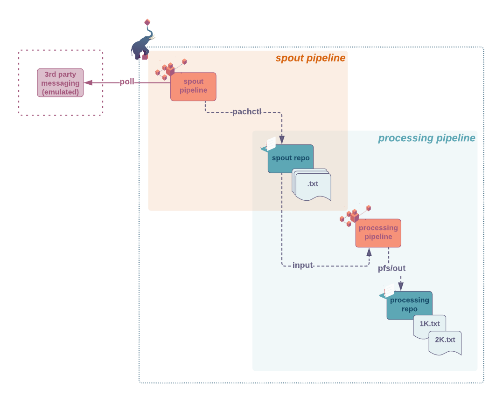
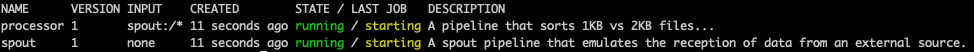
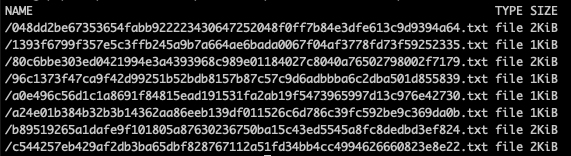
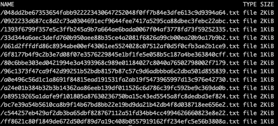
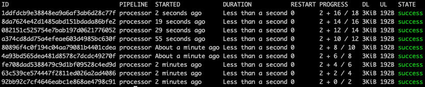
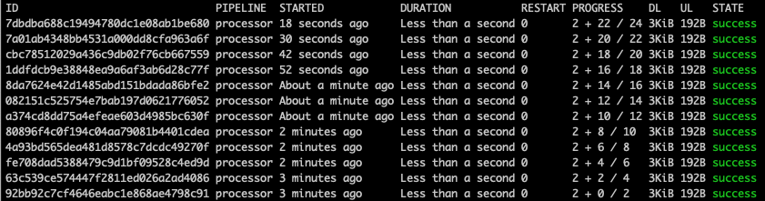
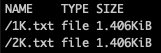
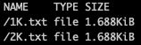

# Spout Pipelines 
> This new implementation of the spout functionality is available in version **1.12 and higher**.


## Intro
A spout is a type of pipeline that ingests 
streaming data (message queue, database transactions logs,
event notifications... ). 
See spout pipelines as a bridge
between an external stream of data and Pachyderm's repo.
In Martin Fowler's enterprise integration patterns' terms,
a Pachyderm spout is a 
*[Polling Consumer](https://www.enterpriseintegrationpatterns.com/patterns/messaging/PollingConsumer.html)* 
(actively polls for a message, processes it, then polls for another).

Generally, you use spouts for situations 
when the interval between new data generation
is large or sporadic, but the latency requirement
to start the processing is short. 
Therefore, a regular pipeline with a cron input
that polls for new data might not be an optimal solution.

A spout pipeline has three major differences from regular pipelines:
- it runs continuously
- it does not take an input repo. Instead, it consumes messages from a third-party messaging system.
- `pfs/out` is not directly accessible. You will need to use `pachctl put file` to write into your output repo. In this example, we have used the `pachyderm-python` library. 


You configure a spout in the 
[pipeline specification](https://docs.pachyderm.com/latest/reference/pipeline_spec/)
file by adding a `spout` section after its pipeline section.
At a minimum, a spout pipeline will need a pipeline name,
an empty spout section, and a transform section
where you will specify the transformation you want
to operate on the messages consumed.

> Note that the use
of the [build pipelines](https://docs.pachyderm.com/latest/how-tos/developer-workflow/build-pipelines/) has not been made available
in the 1.12.0 version of Pachyderm. Stay tuned.


In this example, we have emulated the reception 
of messages from a third-party messaging system
to focus on the specificities of the spout pipeline. 

Feel free to explore more of our examples
to discover how we used spout to listen
for new S3 objects notifications via an Amazon™ SQS queue
or connected to an IMAP email account
to analyze the polarity of its emails.


## Getting ready
***Key concepts***
- [Spout](https://docs.pachyderm.com/latest/concepts/pipeline-concepts/pipeline/spout/) concept.
- [Spout](https://docs.pachyderm.com/latest/reference/pipeline_spec/#spout-optional) configuration 

***Prerequisite***
- A workspace on [Pachyderm Hub](https://docs.pachyderm.com/latest/pachhub/pachhub_getting_started/) (recommended) or Pachyderm running [locally](https://docs.pachyderm.com/latest/getting_started/local_installation/).
- [pachctl command-line ](https://docs.pachyderm.com/latest/getting_started/local_installation/#install-pachctl) installed, and your context created (i.e., you are logged in)

***Getting started***
- Clone this repo.
- Make sure Pachyderm is running. You should be able to connect to your Pachyderm cluster via the `pachctl` CLI. 
Run a quick:
```shell
$ pachctl version

COMPONENT           VERSION
pachctl             1.12.0
pachd               1.12.0
```
Ideally, have your pachctl and pachd versions match. At a minimum, you should always use the same major & minor versions of your pachctl and pachd. 

## Example - Spout 101 
***Goal***
In this example,
we will keep generating two random strings, 
one of 1KB and one of 2KB,
at intervals varying between 10s and 30s. 
A spout pipeline will actively poll those data,
then commit them to its output repo -
in the form of a text file - using the **pachctl put** command. 
A second pipeline will process those commits
and log an entry in a separate log file
depending on their size.


1. **Pipeline input repository**: None

1. **Spout and processing pipelines**: [`spout.json`](./pipelines/spout.json) polls and commits to its output repo using `pachctl put file` from the pachyderm-python library.  [`processor.json`](./pipelines/processor.json) then reads the files from its spout input repo and log their content separately depending on their size.

    > Have a quick look at the source code of our spout pipeline in [`./src/consumer/main.py`](./src/consumer/main.py) and notice that we used `client = python_pachyderm.Client()` to connect to pachd and `client.put_file_bytes` to write file to the spout output repo.


1. **Pipeline output repository**: `spout` will contain one commit per set of received messages. Each message has been written to a txt file named after its hash (for uniqueness).`processor` will contain two files (1K.txt and 2K.txt) listing the messages received according to their size.


***Example walkthrough***

1. If you are using a local version of Pachyderm/minikube, 
    let's start by building/deploying your image
    on the local Docker repository used by minikube: 

    In the `examples/spouts/spout101` directory, run:
    ```shell
    $ make build-minikube
    ```
    > Hub users, we will let you build, tag, and deploy your image (See [Dockerfile](./Dockerfile) in this directory). Need a refresher? Have a look at this [how-to](https://docs.pachyderm.com/latest/how-tos/developer-workflow/working-with-pipelines/).

1. Let's deploy our spout and processing pipelines: 

    In the `examples/spouts/spout101` directory, run:
    ```shell
	$ pachctl create pipeline -f ./pipelines/spout.json
	$ pachctl create pipeline -f ./pipelines/processor.json
    ```
    Or, run the following target: 
    ```shell
    $ make deploy
    ```
    Your pipelines  should all be running:
      

1. Now that the spout pipeline is up, check its output repo once or twice. 
    You should be able to see that new commits are coming in.
    
    ```shell
    $ pachctl list file spout@master
    ```
    

    and a little later...

    
    
    Each of those commits triggers a job in the `processing` pipeline:

    

    and...

    

1. Take a look at the output repository of your second pipeline: `processor`:
    ```shell
    $ pachctl list file processor@master
    ```

    

    New entry keep being added to each of the two log files:
    
    

    Or for a zoom into one of them:
    ```shell
    $ pachctl get file processor@master:/1K.txt
    ```
    

    ...

       

1. When you are done, think about deleting your pipelines.
Remember, a spout pipeline keeps running: 

    In the `examples/spouts/spout101` directory, run:.
    ```shell
    $ pachctl delete all
    ```
    You will be prompted to make sure the delete is intentional. Yes it is. A final check to your pipelines: the list should be empty. You are good to go.
    ```shell
    $ pachctl list pipeline
    ```

   