> INFO Each new minor version of Pachyderm introduces profound architectual changes to the product. For this reason, our examples are kept in separate branches:
> - Branch Master: Examples using Pachyderm 2.1.x versions - https://github.com/pachyderm/pachyderm/tree/master/examples
> - Branch 2.0.x: Examples using Pachyderm 2.0.x versions - https://github.com/pachyderm/pachyderm/tree/2.0.x/examples
> - Branch 1.13.x: Examples using Pachyderm 1.13.x versions - https://github.com/pachyderm/pachyderm/tree/1.13.x/examples

# How to Use Transactions in Pachyderm

Use transactions to optimize the use of your resources by postponing pipeline runs until all commits within the transaction are finished.


## About This Example

In this example, we'll expand upon a previous example that used a machine learning technique known as **Hyperparameter tuning**. This technique narrows down a set of parameters to an optimal number for training  a learning algorithm. For an in-depth look at how this computation works in Pachyderm, see the [Hyperparameter Tuning Example](https://github.com/pachyderm/pachyderm/tree/master/examples/ml/hyperparameter).

In the Hyperparameter Tuning Example, data processing only took seconds -- meaning that you could run its operations for every commit *without* worrying about resource consumption. However, at scale, data processing can take a significant amount of time. To optimize, you should rely on transactions to run the pipeline against specific commits to its `raw_data` and `parameters` repositories. 

### Quick Review

In the Hyperparameter Tuning Example:

- Training data is submitted to the `raw_data` repository
- Parameters are stored in the `parameters` repository


---

## Start Here

To demonstrate the benefits of using transactions, we will use transactions on the `model` pipeline step from the [Hyperparameter Tuning Example](https://github.com/pachyderm/pachyderm/tree/master/examples/ml/hyperparameter). In this transaction example, we omit the splitting step and have just the `model` pipeline that consumes commits from the `raw_data` and `parameters` repositories and outputs the result to the `model` repository. You can adapt this example to your pipelines as needed.

The following diagram describes the pipeline structure:
  


###  1. Download Example Materials 

1. Clone the Pachyderm repository:

   ```shell
   $ git clone git@github.com:pachyderm/pachyderm.git
   ```

2. Change the directory to `examples/transactions`:

   ```shell
   $ cd examples/transactions/
   ```

3. Create the `model` pipeline:

   ```shell
   $ pachctl create pipeline -f model.json
   ```

4. Verify that the pipeline has been created:

   ```shell
   $ pachctl list pipeline
   NAME       VERSION INPUT                                                                                      CREATED        STATE / LAST JOB
   model      1       (parameters:/c_parameters.txt/* ⨯ parameters:/gamma_parameters.txt/* ⨯ raw_data:/iris.csv) 12 seconds ago running / starting
   ```

### 2. Prepare Input Files 

Add the data to the parameters repository by splitting each line into a separate file:

   ```shell
   mkdir c_parameters
   cd c_parameters
   split -l 1 ../c_parameters.txt
   cd ..
   mkdir gamma_parameters 
   cd gamma_parameters
   split -l 1 ../gamma_parameters.txt
   cd ..
   ```

   ```shell
   pachctl list file parameters@master
   NAME                  TYPE SIZE
   /c_parameters/        dir  81B  
   /gamma_parameters/    dir  42B 
   ```

### 3. Create Repositories

1. Create the `raw_data` repository:

   ```shell
   pachctl create repo raw_data
   ```

2. Create the `parameters` repository:

   ```shell
   pachctl create repo parameters
   ```

3. Verify that the repositories were successfully created:

   ```shell
   pachctl list repo
   NAME       CREATED        SIZE (MASTER)
   parameters 44 minutes ago 123B
   raw_data   44 minutes ago 6.858KiB
   ```
4. Put the data from the inputs files:

      ```
      pachctl put file -r parameters@master -f c_parameters
      pachctl put file -r parameters@master -f gamma_parameters
      ```

Optionally, you can use the **Glboal ID** to track provenance and inspect commits.

   ```
   pachctl inspect commits parameters@master

   Commit: parameters@bf082449b6c1445198aab768261739b1
   Original Branch: master
   Parent: 2d1555a61d024c2aa9a1e5e5f53f3b37
   Started: 2 minutes ago
   Finished: 2 minutes ago
   Size: 123B
   ```

### 4. Run the Transaction

1. Start a Transaction:

   ```shell
   pachctl start transaction
   Started new transaction: 854e8503-6e5d-4542-805c-a73a39200bf8
   ```
2. Start Two Commits:
   - Commit to the `raw_data` repository:

   ```shell
   pachctl start commit raw_data@master
   Added to transaction: 854e8503-6e5d-4542-805c-a73a39200bf8
   42b893e48e7d40f1bb5ed770526a9a07
   ```

   - Commit to the `parameters` repository:

   ```shell
   pachctl start commit parameters@master
   Added to transaction: 854e8503-6e5d-4542-805c-a73a39200bf8
   c4dc446b25e54a938a67a5e913b3f9a4
   ```
3. Finish the Transaction:

   ```shell
   pachctl finish transaction
   Completed transaction with 2 requests: 854e8503-6e5d-4542-805c-a73a39200bf8
   ```

   **Note:**  If you run `pachctl list job --pipeline=model --no-pager`,  you'll see two jobs:
   -  The initial no-op job that sets up the pipeline (in a `success` state)
   -  The transaction's job (in a `starting` state) that's waiting until you close both commits to update to a `running` state

   ```shell
   pachctl list job --pipeline=model --no-pager
   PIPELINE ID                               STARTED       DURATION RESTART PROGRESS  DL UL STATE
   model    ae5097e3777947d9905125e91c666b1f -             -        0       0 + 0 / 0 0B 0B starting
   model    dec07fe84d7b44dc9e609bd5b4b43b02 3 minutes ago 1 second 0       0 + 0 / 0 0B 0B successs
   ```

4. Add the data to the `raw_data` repository:

   ```shell
   pachctl put file raw_data@master:iris.csv -f iris.csv
   ```

5. Close the commit to the `raw_data` repository:

   ```shell
   pachctl finish commit raw_data@master
   ```

6. Close the commit to the `parameters` repository:

   ```shell
   pachctl finish commit parameters@master
   ```

   After finishing both commits, the transaction job is permitted to start and enter a `running` state:

   ```shell
   pachctl list job --pipeline=model --no-pager
   PIPELINE ID                               STARTED                DURATION RESTART PROGRESS  DL UL STATE
   model    ae5097e3777947d9905125e91c666b1f Less than a second ago -        0       0 + 0 / 0 0B 0B running
   model    dec07fe84d7b44dc9e609bd5b4b43b02 3 minutes ago          1 second 0       0 + 0 / 0 0B 0B success
   ```

7. View the contents of the model output repo:

   ```shell
   pachctl list file model@master
   NAME                      TYPE SIZE
   /model_C0.031_G0.001.pkl  file 5.713KiB
   /model_C0.031_G0.004.pkl  file 5.713KiB
   /model_C0.031_G0.016.pkl  file 5.713KiB
   /model_C0.031_G0.063.pkl  file 5.713KiB
   ...
   ```


Pipelines that take a lot of time to run may benefit from using transactions, which enable you to accumulate your changes in input repositories and postpone runs until *after* the commits are closed. 