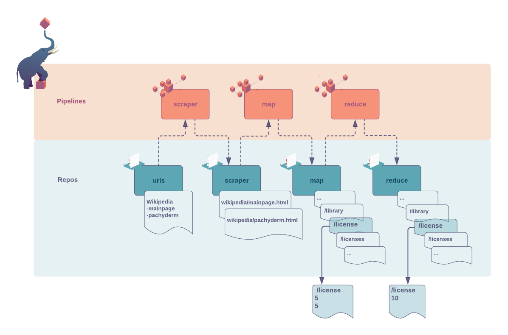

> INFO Pachyderm 2.0 introduces profound architectual changes to the product. As a result, our examples pre and post 2.0 are kept in two separate branches:
> - Branch Master: Examples using Pachyderm 2.0 and later versions - https://github.com/pachyderm/pachyderm/tree/master/examples
> - Branch 1.13.x: Examples using Pachyderm 1.13 and older versions - https://github.com/pachyderm/pachyderm/tree/1.13.x/examples
# Pachyderm Word Count - Map/Reduce 101
> New to Pachyderm? Start with the [beginner tutorial](https://docs.pachyderm.com/latest/getting_started/beginner_tutorial/).

In this guide, we will write a classic MapReduce word count application in Pachyderm.A MapReduce job typically splits your input data into independent chunks that are seamlessly processed by a `map` pipeline in a parallel manner. The outputs of the maps are then input to a `reduce` pipeline which creates an aggregated content. 

- In the first part of this example, we will: 
    - **Map**: Extract a list of words occurring in given web pages and create a list of text files named after each word. One line in that file represents the occurrence of the word on a page. 
    - **Reduce**: Aggregate those numbers to display the total occurrence for each word in all pages considered. 
- In our second example, we add an additional web page and witness how the map/reduce pipelines manage our additional words.

***Table of Contents***
- [1. Getting ready](#1-getting-ready)
- [2. Pipelines setup](#2-pipelines-setup)
- [3. Example part one](#3-example-part-one)
    - [***Step 1*** Create and populate Pachyderm's entry repo and pipelines](#step-1-create-and-populate-pachyderms-entry-repo-and-pipelines)
    - [***Step 2*** Now, let's take a closer look at their content](#step-2-now-lets-take-a-closer-look-at-their-content)
- [4. Expand on the example](#4-expand-on-the-example)


***Key concepts***
For this example, we recommend being familiar with the following concepts:
- The original Map/Reduce word count example.
- Pachyderm's [file appending strategy](https://docs.pachyderm.com/latest/concepts/data-concepts/file/#file-processing-strategies) - 
When you put a file into a Pachyderm repository and a file by the same name already exists, Pachyderm appends the new data to the existing file by default, unless you add an `override` flag to your instruction.
- [Parallelism](https://docs.pachyderm.com/latest/concepts/advanced-concepts/distributed_computing/) and [Glob Pattern](https://docs.pachyderm.com/latest/concepts/pipeline-concepts/datum/glob-pattern/) to fine tune your performances.

## 1. Getting ready
***Prerequisite***
- A workspace on [Pachyderm Hub](https://docs.pachyderm.com/latest/hub/hub_getting_started/) (recommended) or Pachyderm running [locally](https://docs.pachyderm.com/latest/getting_started/local_installation/).
- [pachctl command-line ](https://docs.pachyderm.com/latest/getting_started/local_installation/#install-pachctl) installed, and your context created (i.e. you are logged in)

***Getting started***
- Clone this repo.
- Make sure Pachyderm is running. You should be able to connect to your Pachyderm cluster via the `pachctl` CLI. 
    Run a quick:
    ```shell
    $ pachctl version

    COMPONENT           VERSION
    pachctl             1.12.0
    pachd               1.12.0
    ```
    Ideally, have your pachctl and pachd versions match. At a minimum, you should always use the same major & minor versions of pachctl and pachd. 
- You can run this example as is. You can also decide to build, tag, and push your own image to your Docker Hub. 
If so, make sure to update `CONTAINER_TAG` in the `Makefile` accordingly 
as well as your pipelines' specifications,
then run `make docker-image`.

## 2. Pipelines setup
***Goal***
In this example, we will have three successive processing stages (`scraper`, `map`, `reduce`) defined by three pipelines:



1. **Pipeline input repositories**: The `urls` in which we will commit files containing URLS.
Each file is named for the site we want to scrape with the content being the URLs of the pages considered.

1. **Pipelines**: 
    - [scraper.json](./pipelines/scraper.json) will first retrieve the .html content of the pages linked to the given urls.
    - [map](./pipelines/map.json) will then tokenize the words from each page in parallel and extract each word occurrence.
    - finally,[reduce](./pipelines/reduce.json) will aggregate the total counts for each word across all pages.

    3 pipelines, including `reduce`, can be run in a distributed fashion to maximize performance. 

1. **Pipeline output repository**: The output repo `reduce` will contain a list of text files named after the words identified in the pages and their cumulative occurrence. 

## 3. Example part one
### ***Step 1*** Create and populate Pachyderm's entry repo and pipelines

In the `examples/word_count` directory, run:
```shell
$ make wordcount
```
or create the entry repo `urls`, add the Wikipedia file:
```shell
$	pachctl create repo urls
$	cd data && pachctl put file urls@master -f Wikipedia
```
The input data [`Wikipedia`](./data/Wikipedia) contains 2 URLs refering to 2 Wikipedia pages. 

... then create your 3 pipelines:
```shell
$	pachctl create pipeline -f pipelines/scraper.json
$	pachctl create pipeline -f pipelines/map.json
$	pachctl create pipeline -f pipelines/reduce.json
```

The entry repository of the first pipeline already contains data to process.
Therefore, the pipeline creation will trigger a list of 3 jobs.

You should be able to see your jobs running: 
```shell
$   pachctl list job
```
```shell
ID                               PIPELINE  STARTED        DURATION           RESTART PROGRESS     DL       UL       STATE

ba77c94678ae401db1a2b58528b74d78 reduce    42 seconds ago -                  0       0 + 0 / 1488 0B       0B       running
7e2ed8e0a8dd49a18f1e45d62942c7ee map       43 seconds ago Less than a second 0       2 + 0 / 2    5.218MiB 4.495KiB success
bc3031c8076c4f91aa1d8e6ba450b096 map_build 50 seconds ago 2 seconds          0       1 + 0 / 1    1.455KiB 2.557MiB success
badd3d81d3ce46358d91bedbb34dd0ed scraper   59 seconds ago 16 seconds         0       1 + 0 / 1    81B      103.4KiB success
```

Let's have a look at your repos and check that all entry/output repos have been created:
```shell 
$   pachctl list repo
```
```shell
NAME       CREATED        SIZE (MASTER) DESCRIPTION

reduce     13 minutes ago 4.62KiB       Output repo for pipeline reduce.
map        13 minutes ago 4.495KiB      Output repo for pipeline map.
scraper    13 minutes ago 103.4KiB      Output repo for pipeline scraper.
urls       13 minutes ago 81B
```

### ***Step 2*** Now, let's take a closer look at their content
- Scraper content
    ```shell
    $ pachctl list file scraper@master
    ```
    ```shell
    NAME       TYPE SIZE
    /Wikipedia dir  103.4KiB
    ```
    ```shell          
    $ pachctl list file scraper@master:/Wikipedia     
    ```
    ```shell
    NAME                      TYPE SIZE
    /Wikipedia/Main_Page.html file 77.53KiB
    /Wikipedia/Pachyderm.html file 25.88KiB
    ```
We have successfully retrieved 2 .html pages corresponding to the 2 URLs provided.

- Map content 

    The `map` pipeline counts the number of occurrences of each word it encounters in each of the scraped webpages (see [map.go](./src/map.go)). 
    The filename for each word is the name of the word itself. 

    ```shell
    $ pachctl list file map@master
    ```
    ```shell
    NAME          TYPE SIZE
    ...
    /liberated   file 2B
    /librarians  file 2B
    /library     file 2B
    /license     file 4B
    /licenses    file 4B
    ...
    ```
    For every word on those pages, there is a separate file. 
    Each file contains the numeric value for how many times that word appeared for each page. 

    ```shell
    $ pachctl get file map@master:/license
    5
    5
    ```
    It looks like the word `license` appeared 5 times on each of the 2 pages considered.

    By default, Pachyderm will spin up the same number of workers as the number of nodes in your cluster.
    This can be changed. 
    For more info on controlling the number of workers, check the [Distributed Computing](https://docs.pachyderm.com/latest/concepts/pipeline-concepts/distributed_computing/#controlling-the-number-of-workers) page.

- Reduce content

    The final pipeline, `reduce`, aggregates the total count per word. 
    Take a look at the words counted:

    ```shell
    $ pachctl list file reduce@master
    ```
    ```shell
    NAME         TYPE SIZE  
    ...                                                
    /liberated   file 2B
    /librarians  file 2B
    /library     file 2B
    /license     file 3B
    /licenses    file 2B
    ...
    ```
    For the word `license`, let's confirm that the total occurrence is the sum of the 2 previous numbers above 5+5.

    ```shell          
    $ pachctl get file reduce@master:/license
    10
    ```
## 4. Expand on the example

Now that we have a full end-to-end scraper and word count use case set up, let's add more to it. Go ahead and add one more site to scrape. 

```shell
$ cd data && pachctl put file urls@master -f Github
```
Your scraper should automatically get started pulling the new site (it won't scrape Wikipedia again). 
That will then automatically trigger the `map` and `reduce` pipelines
to process the new data and update the word counts for all the sites combined.

- Scraper content
    ```shell
    $ pachctl list file scraper@master
    ```
    ```shell
    NAME       TYPE SIZE
    /Github    dir  195.1KiB
    /Wikipedia dir  103.4KiB
    ```
    ```shell          
    $ pachctl list file scraper@master:/Github      
    ```
    ```shell
    NAME                      TYPE SIZE
    /Github/pachyderm.html file 195.1KiB
    ```
The scraper has added one additional .html page following the URL provided in the new Github file.

- Map content 
     ```shell
    $ pachctl list file map@master
    ```
    | Then | **NOW** |
    |------|-----|
    |NAME - TYPE - SIZE|NAME - TYPE - SIZE|   
    |...|...|
    |/liberated   file 2B|/liberated   file 2B|
    |/librarians  file 2B|/librarians  file 2B|
    | |**/libraries   file 2B**|
    |/library     file 2B|/library     file 2B|
    |/license     file 4B|/license     file **7B**|
    |/licenses    file 4B|/licenses     file 4B|
    |...|...|
    

    We have highlighted the newcomer (the new word `libraries`) and the change in the size of the `license` file.

    ```shell
    $ pachctl get file map@master:/license
    23
    5
    5
    ```
    It looks like the word `license` appeared 23 times on our new github page.

 - Reduce content

    ```shell
    $ pachctl list file reduce@master
    ```
    ```shell
    NAME         TYPE SIZE  
    ...                                                
    /liberated   file 2B
    /librarians  file 2B
    /libraries   file 2B
    /library     file 2B
    /license     file 3B
    /licenses    file 2B
    ...
    ```
    Let's see if the total sum of all occurrences in now  23+5+5 = 33.

    ```shell          
    $ pachctl get file reduce@master:/license
    33
    ```


> By default, pipelines spin up one worker for each node in your cluster,
but you can choose to set a [different number of workers](https://docs.pachyderm.com/latest/concepts/advanced-concepts/distributed_computing/) in your pipeline specification. 
Further, 
the pipelines are already configured to spread computation across the various workers with `"glob": "/*/*"`. Check out our [Glob Pattern](https://docs.pachyderm.com/latest/concepts/pipeline-concepts/datum/glob-pattern/) to learn more.


